<div align="center">

<h1 style="font-size: 6em; font-weight: 900; margin-bottom: 0.2em; letter-spacing: 0.1em;">元</h1>
<p style="font-size: 1.2em; color: #7c3aed; font-weight: 600; margin-top: 0;">META_KIM</p>
<p style="color: #dc2626; font-weight: 700; margin-bottom: 0.5em;">⚠️ BETA — 開発中</p>

<p>
  <a href="README.md">English</a> |
  <a href="README.zh-CN.md">简体中文</a> |
  <a href="README.ja-JP.md">日本語</a> |
  <a href="README.ko-KR.md">한국어</a>
</p>

<p>
  
  
  
  
  
</p>

**AI コーディング支援のためのガバナンス層です。複雑なタスクを「正しく」進めるため、Claude Code・Codex・OpenClaw の三ランタイムで同じ規律を貫きます。**

多くのツールはいきなりコードを書き始めます。Meta_Kim はその手前に、要件の明確化・役割分担・レビューという段を置きます。

その結果、マルチファイル変更の破綻を減らし、エージェントの責務をはっきりさせ、一度きりのハックではなく再利用できる型を残します。

> **正典（最新・最長）**: 英語は [README.md](README.md)、中文は [README.zh-CN.md](README.zh-CN.md)。本書は日本語読者向けの対訳・要約です。

</div>

## ひと目で

- 公開エントリは一つ、その背後に 8 つのメタ／元エージェント
- **一つのガバナンス規律**を三ランタイムに投影
- 複雑タスクの流れ: 明確化 → 探索 → 実行 → レビュー → 進化
- **四つの鉄則**: Critical > 推測、Fetch > 思い込み、Thinking > 突っ走り、Review > 盲信
- 規律: 一部署・一主たる成果物・閉じた引き渡しチェーン
- 長期のソース・オブ・トゥルースは主に `.claude/` と `contracts/workflow-contract.json`

## 時間が経つほど軽くなる理由

最初から最安トークンではありません。**高コストな一時推論を、長期で再利用できる能力資産に変えていく**設計です。

- 初期は重い（エージェント・スキル・フック・契約・メモリ・検証規律を揃える）
- 慣れると軽い（毎回ゼロから境界を探し直さない）
- 削るのは「すべてのトークン」ではなく**繰り返しトークン**

## このプロジェクトは何か

「AI にもっとコードを書かせる」ことが主目的ではありません。複雑な仕事で起きがちな失敗（曖昧要求→推測、境界をまたぐ変更、マルチランタイムの設定ズレ、レビュー・検証・学習の欠落）を減らします。

**実行前の意図拡張（intent amplification）**が核です。スコープ・制約・成果物・リスクを明示し、一つの巨大コンテキストに丸投げせず適切な役割へ振り分けます。

## メタ・アーキテクチャ視点

このリポジトリは「プロンプトの束」ではなく、層になった統治システムとして読むのが安全です。

- **理論主源**: `.claude/skills/meta-theory/` と `references/`
- **組織主源**: `.claude/agents/*.md`（8 役割と境界）
- **契約主源**: `contracts/workflow-contract.json`（ゲートと成果物の閉じ方）
- **ランタイム投影**: `.codex/`、`.agents/`、`openclaw/`、`shared-skills/`
- **ツールと検証**: `scripts/`、`validate`、`eval:agents`、`tests/meta-theory/`

**メタ理論主源 → 統治されたメタ組織 → ワークフロー契約 → 複数ランタイム投影 → 同期・検証ループ**

既定の実行経路:

`ユーザー意図 → meta-warden → Critical → Fetch → Thinking → 専門実行 → Review → Verification → Evolution`

**メンテの原則**: まず `.claude/` と `contracts/` を編集し、その後ランタイム鏡像を同期・検証する。

<a id="meta-kim-visual-maps-ja"></a>

## 図解: 各部のつながり

（図中のノードは Mermaid 互換のため英語表記のままです。）

### 1. 主源 → ランタイム鏡像 → 検証ループ

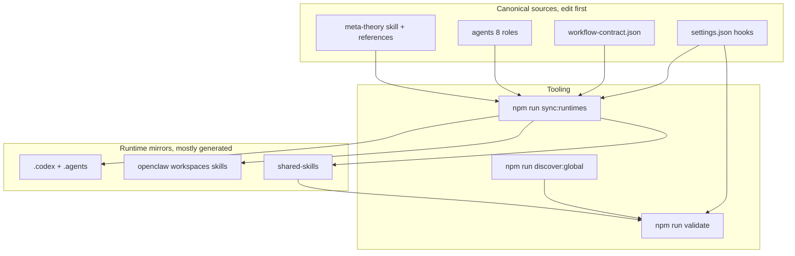

### 2. 既定パス: 意図 → 入口 → 八段階スパイン

`meta-theory` は**スキル**（トリガーで読み込まれる手順書）。`meta-warden` は**エージェント**（既定の公開入口、ゲートと総合）。

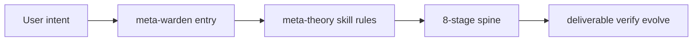

### 3. 八段階スパイン（各段の意味）

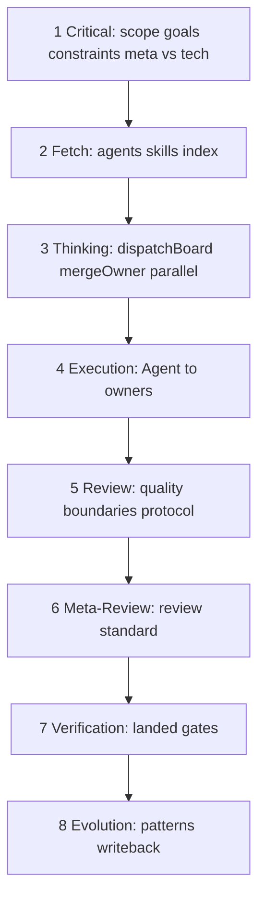

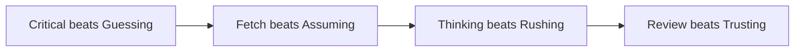

### 4. 二層のワークフロー（スパイン vs 部門契約）

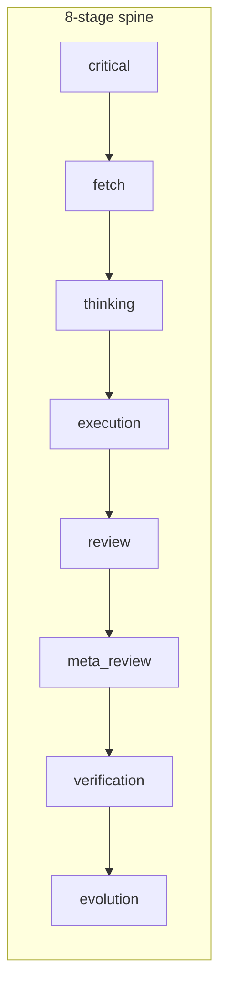

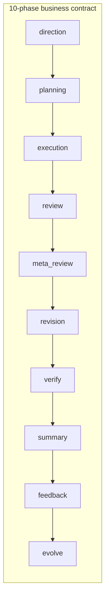

業務フェーズはスパインの段階名を**置き換えません**。run 契約・表示・成果物パッケージの層です。

### 5. タスク分岐

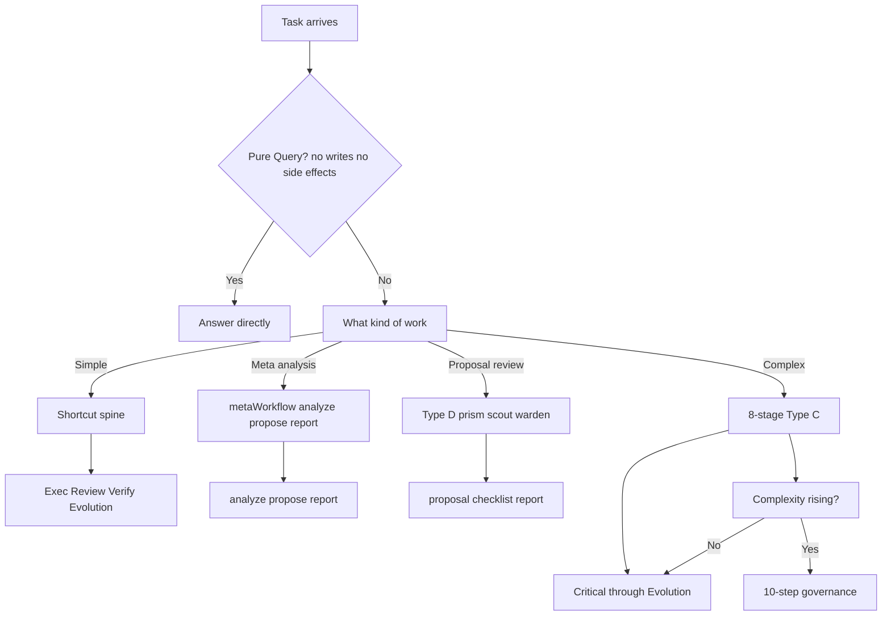

### 6. コア方法の連鎖（拡張）

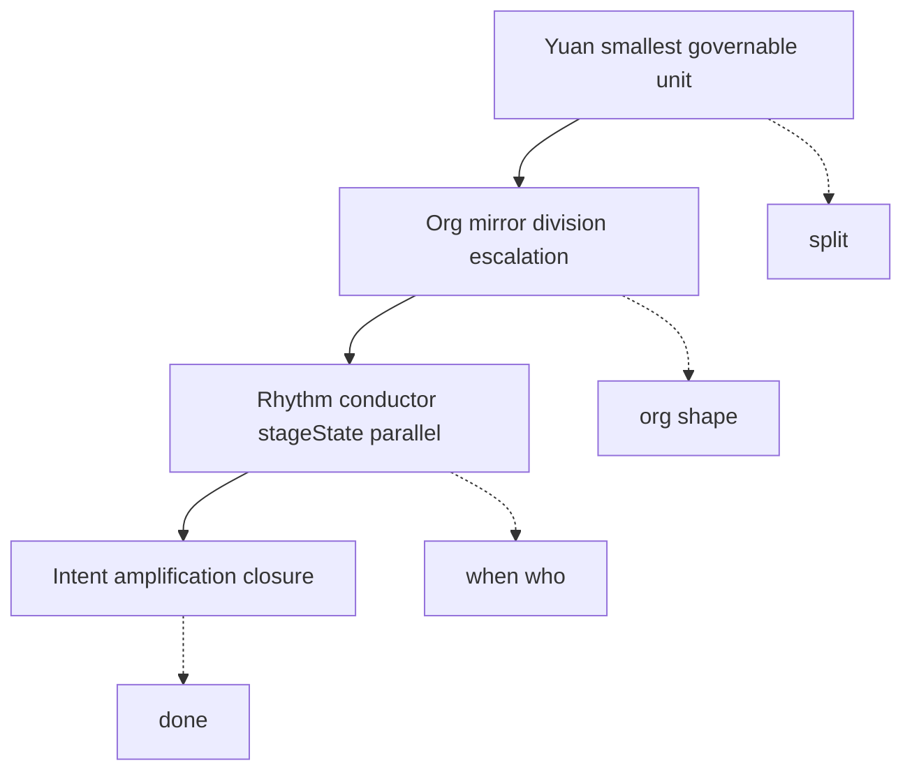

## 著者・サポート

（連絡先・決済 QR は [README.md](README.md) と同一です。）

## 論文・方法の根拠

- 論文: [Zenodo](https://zenodo.org/records/18957649)
- DOI: `10.5281/zenodo.18957649`

## 向いている人 / 向いていない人

**向いている**: マルチファイル・横断モジュール・複数ランタイムの作業、エージェント／スキル／MCP の保守、レビュー可能でロールバックしやすい協業を求める場合。

**向いていない**: 一回だけの軽い質問、ほぼ単一ファイル編集のみ、SaaS として即利用したいだけの場合。

## ランタイム入口

**Meta_Kim は三つの別プロジェクトではなく、一つの方法の三つの投影です。**

| ランタイム | 入口 | リポジトリ内の主な場所 | 役割 |
| ---------- | ---- | ---------------------- | ---- |
| Claude Code | [CLAUDE.md](CLAUDE.md) | `.claude/`、`.mcp.json` | 正典編集ランタイム |
| Codex | [AGENTS.md](AGENTS.md) | `.codex/`、`.agents/`、`codex/` | Codex 向け投影 |
| OpenClaw | `openclaw/workspaces/` | `openclaw/` | ローカル workspace 投影 |

- メンテは **`.claude/` と `contracts/workflow-contract.json` から**
- `.codex/`、`openclaw/` の多くは生成物またはランタイム用
- 編集後は `npm run sync:runtimes` 等で再同期

### OpenClaw の例

```bash
npm install
npm run prepare:openclaw-local
openclaw agent --local --agent meta-warden --message "..." --json --timeout 120
```

## Meta_Kim における「元（Meta）」

**元 = 意図拡張を支える、最小の統治可能単位**

有効な単位は、独立して理解でき、十分小さく、所有と拒否が明示でき、システム全体を壊さず差し替え可能で、ワークフローをまたいで再利用できること。

### エンジニアリングとの関係

**エンジニアリングは元が統治する領域の一つ**。元システムはエンジニアリングを閉ループに載せられるが、**万能エンジニアそのものではない**。実行詳細は具名オーナーに委ね、メタ理論はディスパッチャとして振る舞う、が正典の立場です。

## コア・メソッド

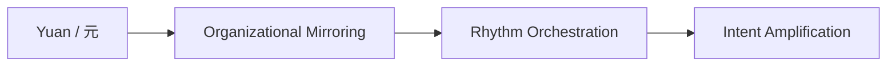

いずれかを欠くと方法として未完成です。より詳しい図は上文「図解」を参照。

## 開発ガバナンスの背骨（八段階）

複雑な仕事（マルチファイル・複数能力など）は八段階スパインに乗ります。

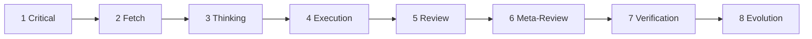

| 段階 | 目的（要約） |
| ---- | ------------ |
| Critical | 推測の前に要件を明確化 |
| Fetch | 既存能力を探索 |
| Thinking | 分割・オーナー・成果物・順序を設計 |
| Execution | 適切なエージェントへ委譲 |
| Review | 品質・境界 |
| Meta-Review | レビュー基準そのものの妥当性 |
| Verification | 修正が実際に着地したか |
| Evolution | パターン・傷・再利用知を記録 |

補足規則（正典）: 純粋な `Q / Query` のみエージェントバイパス可。実行可能タスクにはオーナー必須。Thinking はプロトコル先行。独立タスクは並列を検討。

## 八段階スパインと業務ワークフローは別物

- **八段階**: 複雑開発の実行背骨（`meta-theory` / `dev-governance.md`）
- **十フェーズ**: 部門 run の契約・表示・成果物規律（`workflow-contract.json`）

業務側はスパインを**置換しません**。詳細は英語版 [§ The 8-Stage Spine And The Business Workflow](README.md#the-8-stage-spine-and-the-business-workflow-are-not-the-same-thing) を参照。

## ワークフロー関係の地図

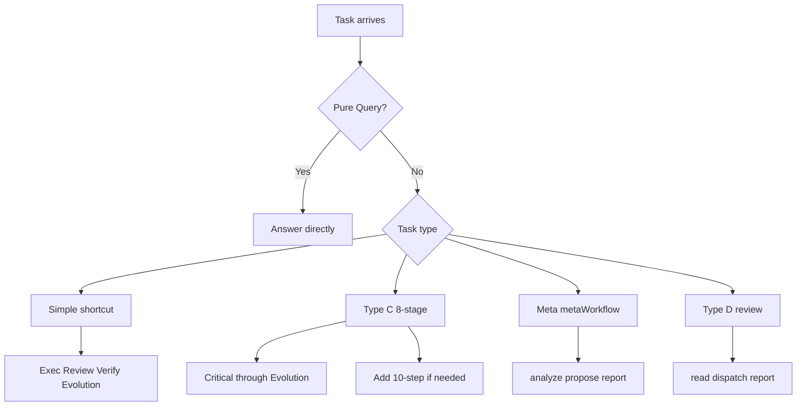

## 八つのメタ／元エージェント

| エージェント | 主な役割 |
| ------------ | -------- |
| `meta-warden` | 既定入口・仲裁・最終総合 |
| `meta-conductor` | 段階とリズム |
| `meta-genesis` | SOUL.md・ペルソナ設計 |
| `meta-artisan` | スキル・MCP・ツール適合 |
| `meta-sentinel` | 安全・権限・フック・ロールバック |
| `meta-librarian` | メモリと連続性 |
| `meta-prism` | 品質・ドリフト・アンチスロップ |
| `meta-scout` | 外部能力の発見と評価 |

**公開の前門は `meta-warden`。**

## クイックスタート（要点）

```bash
git clone https://github.com/KimYx0207/Meta_Kim.git
cd Meta_Kim
node setup.mjs
```

または手動:

```bash
npm install
npm run sync:runtimes
npm run validate
```

グローバル能力索引: `npm run discover:global`（ローカルパスを含むため、通常はコミットしない）

詳細手順・全コマンド表は [README.md の Quick Start / Commands](README.md#quick-start-clone-to-working-in-5-minutes) を参照。

## よく使う npm スクリプト（抜粋）

| コマンド | 用途 |
| -------- | ---- |
| `npm run validate` | リポジトリ整合性（契約・エージェント・workspace・MCP 自己検証など） |
| `npm run check:runtimes` | 鏡像が正典と一致するか（書き換えなし） |
| `npm run sync:runtimes` | 正典から鏡像を再生成 |
| `npm run test:meta-theory` | メタ理論テストスイート |
| `npm run eval:agents` | ランタイムの軽量スモーク |
| `npm run validate:run -- <run.json>` | 記録された run アーティファクトの検証 |
| `npm run doctor:governance` | 契約・フック・鏡像・サンプル validate:run の狭いヘルスチェック |
| `npm run verify:all` | 本番前の広いスタック（グローバル meta-theory 同期状況にも依存） |

## リポジトリ構造（要約）

```text
Meta_Kim/
├─ .claude/        正典: エージェント・スキル・フック
├─ .codex/         Codex 用ミラー
├─ .agents/        Codex プロジェクト skill ミラー
├─ openclaw/       OpenClaw workspace・スキル
├─ contracts/      ガバナンス契約
├─ scripts/        同期・検証・MCP
├─ README.md / README.zh-CN.md / README.ja-JP.md / README.ko-KR.md
├─ CLAUDE.md / AGENTS.md
└─ …
```

手で編集するのは主に `.claude/` と `contracts/`。`.codex/` や `openclaw/workspaces/*` は通常 `sync:runtimes` で生成。

## ライセンス

[MIT License](LICENSE)

---

*本ドキュメントはコミュニティ向けの日本語ガイドです。規律の最終解釈は英語正典および `contracts/workflow-contract.json` に従います。*
