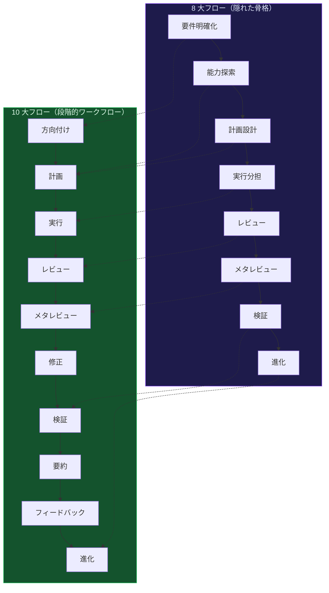
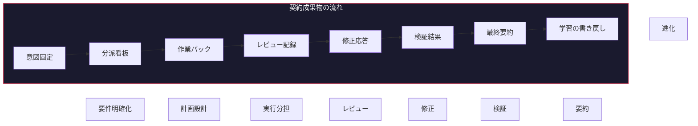
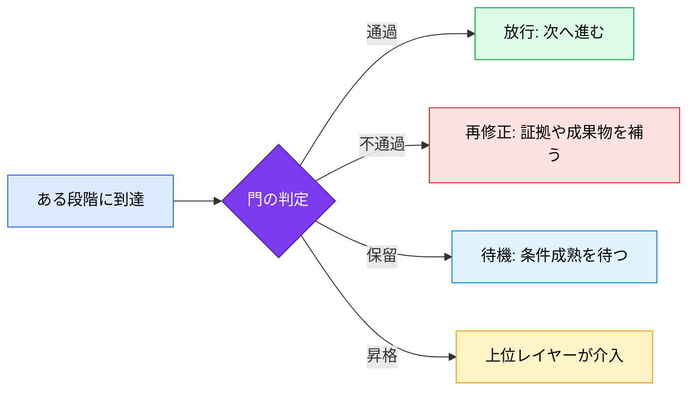
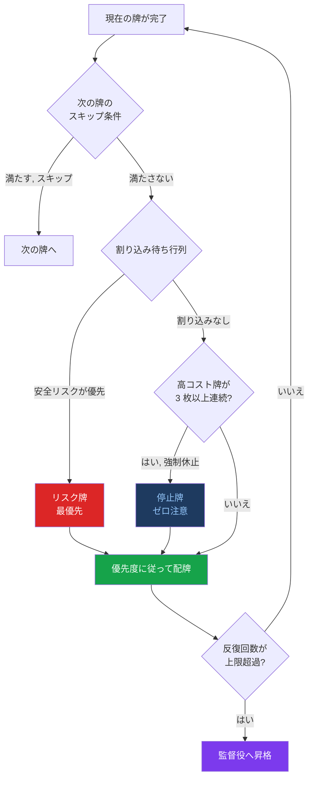
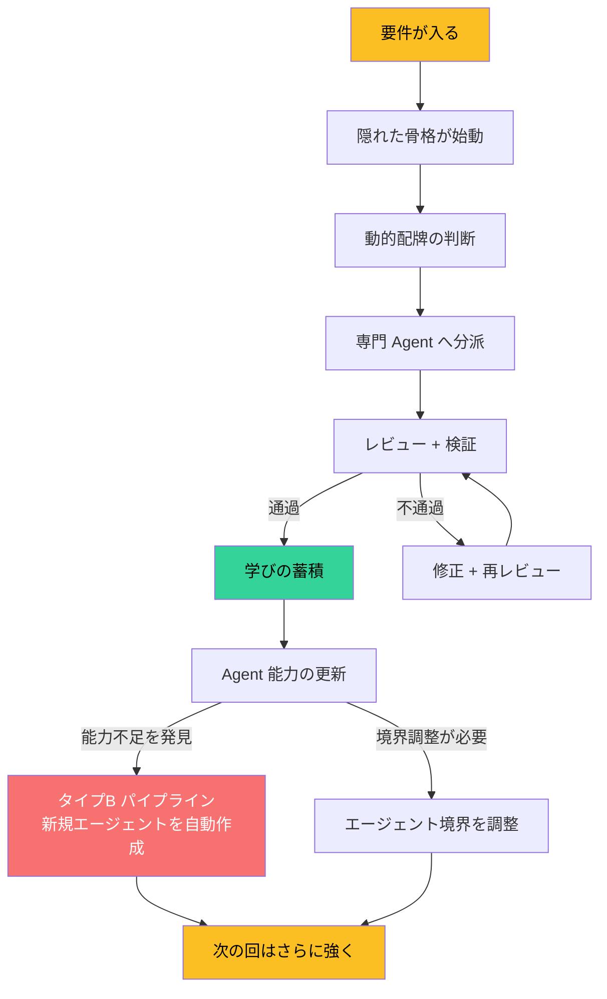
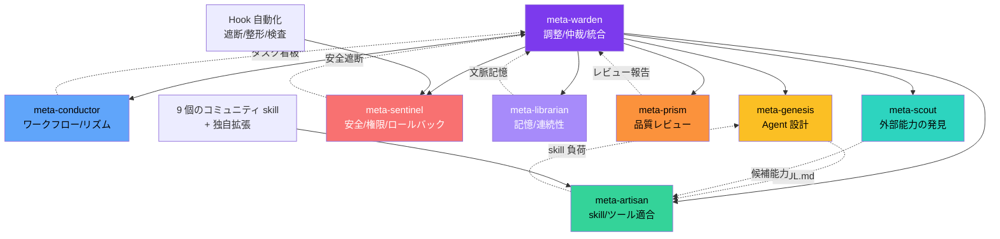
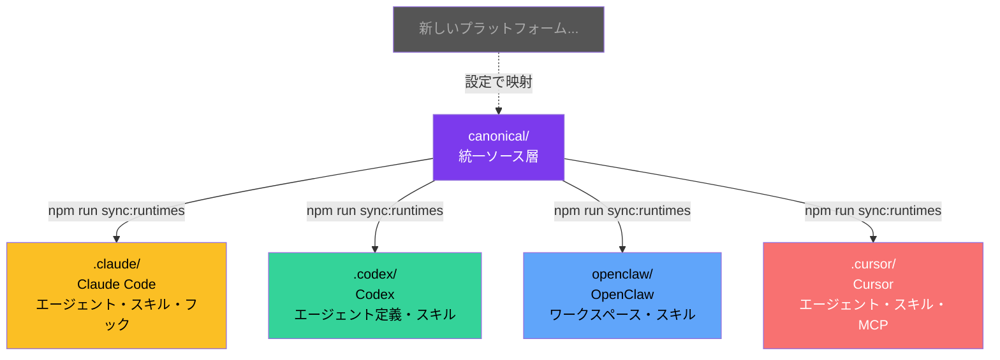
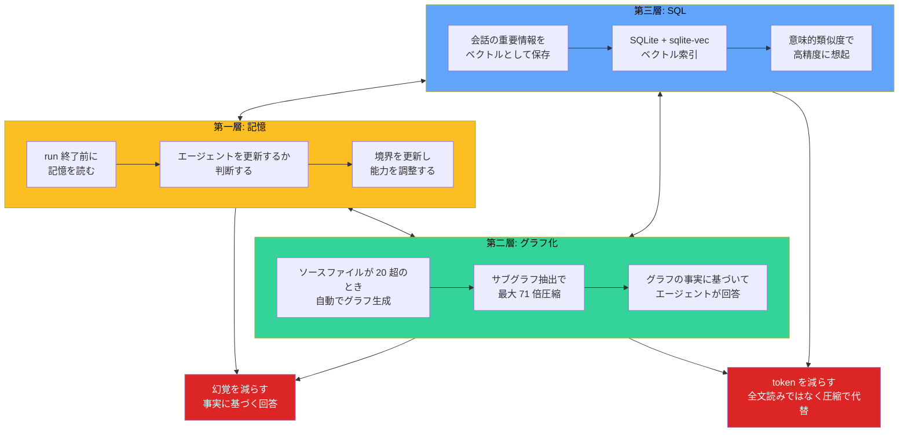

<div align="center">

<h1 style="font-size: 6em; font-weight: 900; margin-bottom: 0.2em; letter-spacing: 0.1em;">元</h1>
<p style="font-size: 1.2em; color: #7c3aed; font-weight: 600; margin-top: 0;">META_KIM</p>

<p>
  <a href="README.md">English</a> |
  <a href="README.zh-CN.md">简体中文</a> |
  <a href="README.ja-JP.md">日本語</a> |
  <a href="README.ko-KR.md">한국어</a>
</p>

<p>
  
  
  
</p>

</div>

## 概要

**Meta_Kim** は、AI コーディング支援のための単なるツールではありません。AI エージェントに「判断」と「規律」を与えるガバナンスシステムです。

たとえば Claude Code、Codex、OpenClaw、Cursor は、コードを書いたりファイルを編集したりする「手」にはなれます。しかし、何を先に直すのか、誰がレビューするのか、どこで止めるのか、修正が本当に閉じたのかを決めるには、別の統治層が必要です。

Meta_Kim はその層です。**AI の上にある AI** として、複雑なタスクを「推測で進めるもの」から「規律を持って進めるもの」に変えます。

### 一言でいうと

> **まず何をするかを明確にする → 次に誰がやるかを決める → 実行する → レビューする → 学びを残す → 次の実行に反映する。**

これは新しい発明ではなく、成熟したチームが当たり前にやっていることです。Meta_Kim は、その当たり前を人の気合いではなく、実行可能なシステムに落とし込んでいます。

## すぐ始める

まず試すだけなら、これで十分です。

```bash
npx --yes github:KimYx0207/Meta_Kim meta-kim
```

従来どおりに進めるなら、こちらです。

```bash
git clone https://github.com/KimYx0207/Meta_Kim.git
cd Meta_Kim
node setup.mjs
```

リポジトリを保守する場合は、まず `canonical/` と `config/contracts/workflow-contract.json` を編集し、そのあとで同期と検証を実行します。

```bash
npm run sync:runtimes
npm run validate
```

読む順番は次のとおりです。

1. このファイル `README.ja-JP.md`
2. `AGENTS.md`
3. `docs/runtime-capability-matrix.md`

---

## 連絡先


GitHub <a href="https://github.com/KimYx0207">KimYx0207</a> |
X <a href="https://x.com/KimYx0207">@KimYx0207</a> |
公式サイト <a href="https://www.aiking.dev/">aiking.dev</a> |
WeChat 公式アカウント：**老金带你玩AI**

Feishu ナレッジベース：
<a href="https://my.feishu.cn/wiki/OhQ8wqntFihcI1kWVDlcNdpznFf">継続更新の入口</a>

### コーヒーを一杯

Meta_Kim が役に立ったなら、継続メンテの支援としてコーヒーをご馳走いただけるとうれしいです。

| WeChat Pay | Alipay |
| --- | --- |
|  |  |

### 方法の根拠

Meta_Kim の方法論は、本プロジェクトのメンテナ（KimYx0207）による「元に基づく意図拡張（intent amplification）」の研究に依拠しています。

- 論文: <https://zenodo.org/records/18957649>
- DOI: `10.5281/zenodo.18957649`

---

## アーキテクチャ: 隠れた骨格 + 動的配牌

これは Meta_Kim の中核です。文書全体の中でも最も重要な章です。

### まず用語を分ける

| 概念 | 何か | 何ではないか |
| --- | --- | --- |
| **隠れた骨格** | 表層の流れの下にある、バックエンドの実行骨格 | 最初から固定された職務一覧 |
| **8 大フロー** | 隠れた骨格が実行層に現れた、人が読める主鎖 | 統治ロジックそのもの全部 |
| **10 大フロー** | 複雑な run に重ねる、より段階的な業務フロー | 8 大フローの置き換え |
| **配牌** | 8 大フローと agent 単位に対する動的な介入 | 単純なタスク割り当て |
| **門** | 次に進めるかどうかの放行条件 | 段階そのもの |
| **契約** | 各ノードが必ず差し出す構造化成果物 | スローガンや抽象的価値観 |
| **agent 単位ガバナンス** | 境界、能力、昇格、ロールバックを扱えるようにすること | 役割メニュー |
| **三層記憶体系** | memory / graphify / SQL が分担する長期記憶 | ひとまとめの雑多なメモ |

覚えるなら一文で十分です。

> **8 大フローが進行を担い、門が准入を担い、契約が成果物を担い、配牌が動的介入を担います。**

### 8 大フロー = 隠れた骨格

Meta_Kim には 8 つの固定実行段階があります。これを **隠れた骨格** と呼びます。


**Critical - まず本当の問題を確定し、後続が誤解の上に乗らないようにする**

要件が曖昧なら、推測せずに確認します。この段階では `intentPacket` を出し、ユーザーの真の意図、成功条件、除外範囲を固定します。すでに十分明確なら、なぜ飛ばすのかを明示的に記録します。

**Fetch - いきなり自作せず、既存能力を先に探す**

既存の agent、skill、ツール、MCP でこの要件を満たせるかを探索します。ここでの核心は **capability-first** です。まず必要能力を定義し、それを宣言している owner を探し、最適なものに委譲します。最初から agent 名を固定するのは、設計上の近道です。

**Thinking - 境界、owner、順序、成果物、リスク、停止条件を定義する**

タスクを分解し、各サブタスクに owner を割り当て、依存関係と並列実行の単位を定めます。この段階では `dispatchBoard` を作り、誰が何をやるか、何を並列で走らせるか、最終的な統合責任は誰かを明確にします。さらに、少なくとも 2 つの候補経路を考え、一本足にしません。

**Execution - 産物を出す。ただしまだ統治下にある**

専門 agent に委譲して実行します。各サブタスクは `workerTaskPacket` に包み、完全なファイルコンテキスト、制約、レビュー owner、検証 owner を含めます。独立したサブタスクは並列に走らせ、実行を無駄に直列化しません。**実行は完了ではありません。** このあとにレビューと検証が続きます。

**Review - 品質と境界の観点で、実行結果が妥当かを確認する**

コード品質、安全性、アーキテクチャ整合性、境界逸脱をチェックします。`reviewPacket` には findings を構造化して残し、各 finding には CRITICAL から LOW までの重大度を付けます。ここは形式上の通過点ではなく、閉じていない finding があれば次に進めません。

**Meta-Review - review の基準そのものが偏っていないかを確認する**

「レビューをレビュー」します。基準が甘ければ意味がなく、基準がずれていれば見当違いの審査になります。この段階は、審査対象だけでなく審査システム自体の品質を守ります。

**Verification - テキスト上ではなく、現実世界で本当に成立したかを確認する**

修正が review finding を本当に閉じたかを検証します。`verificationResult` と `closeFindings` を出し、閉じていなければ再修正して再検証します。ここは最も正直な門です。見た目が直っていても、閉じていなければ直ったことにはなりません。

**Evolution - 今回の学びをシステムへ書き戻す**

再利用できるパターンは memory に、失敗は傷として、能力の不足は Scout への追跡対象として、agent 境界の変更は canonical への反映候補として残します。各 run では必ず `writebackDecision` を出し、書き戻すのか、書き戻さない理由は何かを明示します。**学びを残さない run は、何も積んでいないのと同じです。**

---

この 8 段階をまとめると、これが実行の背骨です。

なぜ「相対的に」固定なのか。簡単な場面では一部を省略できるからです。ただし、省略するなら必ず理由を記録し、黙って飛ばしません。

### 10 大フロー = 骨格の上にある段階的ワークフロー

8 大フローが骨格なら、10 大フローはその上に乗る **より複雑な業務フロー** です。

```
direction → planning → execution → review → meta_review → revision → verify → summary → feedback → evolve
```

これは別物を追加しているのではなく、8 大フローから **派生** しています。違いは次のとおりです。

- **8 大フロー** は実行ロジック寄りで、「どの順で動くか」を定義します
- **10 大フロー** は業務統治寄りで、「各段階で何を出し、どう完了とみなすか」を定義します



10 大フローには `revision`、`summary`、`feedback` といった段階が加わり、単に「終わる」だけでなく、「よく終わる」「正しく終わる」ことを支えます。

### 契約 = 各ノードが必ず差し出すもの

フローだけでは不十分です。各段階が **何を差し出すべきか** を定義しなければなりません。それが契約です。

Meta_Kim の契約は、口約束ではなく **構造化されたデータパケット** です。

| 契約成果物 | どの段階か | 役割 |
| --- | --- | --- |
| `intentPacket` | Critical | 真の意図を固定し、実行中の逸脱を防ぐ |
| `dispatchBoard` | Thinking | 誰が何をするか、依存関係、並列グループ |
| `workerTaskPacket` | Execution | 各サブタスクの完全な文脈パック |
| `reviewPacket` | Review | レビュー指摘の構造化記録 |
| `revisionResponse` | Revision | 各指摘に対する修正応答 |
| `verificationResult` | Verification | 問題が本当に閉じたかの判定 |
| `summaryPacket` | Summary | 外部公開前の最終要約 |
| `evolutionWriteback` | Evolution | 学習内容の書き戻し先 |



これらの成果物は、ただのドキュメントではありません。システムが事実として参照する **現実のソース** です。契約がなければ、次の段階は「引き継ぐ」のではなく「前段が何を言いたかったかを推測する」ことになります。それが複雑な AI 協業で破綻が起きる典型原因です。

### 門 = 段階に着いたからといって、通過したわけではない

契約は「何を出すか」を定義し、門は「それで通してよいか」を判定します。

一言で言えば次のとおりです。

> **段階は、どこまで来たかを示す。門は、次へ進む資格があるかを示す。**



現在のシステムにある主要な門は次のとおりです。

| 門 | 何を止めるか | 通過条件 |
| --- | --- | --- |
| **planning gate** | 計画から実行へ入る前 | 境界、owner、成果物、リスクが定義済み |
| **metaReview gate** | メタレビューが妥当か | レビュー基準そのものに偏り、漏れ、緩みがない |
| **verify gate** | 修正が本当に閉じたか | finding → revision → verification が閉じている |
| **summary gate** | 外部公開してよいか | 検証完了 + 要約完了 |
| **publicDisplay gate** | 「完了した」と宣言してよいか | `verifyPassed + summaryClosed + singleDeliverableMaintained + deliverableChainClosed` |

最重要なのは **publicDisplay gate** です。検証が通っていない、要約が閉じていない、成果物チェーンが切れているなら、「完了」と言ってはいけません。

門と契約の関係は次のとおりです。

- **契約** は「各段階が何を出すか」を決めます。これは成果物契約です
- **門** は「それで通すか」を決めます。これは准入判定です
- 契約がなければ門は判断できず、門がなければ契約は形だけになります

### 動的配牌 = 隠れた骨格に柔軟性を足す

8 大フローの骨格は固定に近いですが、現実のタスクは毎回違います。そこで Meta_Kim は **動的配牌** を導入しています。

配牌は 8 大フローに対応しますが、1:1 の単純対応ではありません。10 枚の牌があります。

| 牌 | 発火条件 | 注意コスト |
| --- | --- | --- |
| **Clarify（明確化）** | 要件が曖昧 | 低 |
| **Shrink scope（スコープ縮小）** | リポジトリが大きすぎる、ファイルが多すぎる | 低 |
| **Options（選択肢）** | 要件は明確だが経路が複数ある | 中 |
| **Execute（実行）** | 方針が決まった | 高 |
| **Verify（検証）** | 実行が終わった | 中 |
| **Fix（修正）** | 検証に失敗した | 中 |
| **Rollback（巻き戻し）** | リスクが拡大した | 高 |
| **Risk（リスク）** | 安全・全体・複数当事者が絡む | 高 |
| **Nudge（促し）** | ユーザーが詰まっているので軽く後押しする | 低 |
| **Pause（停止）** | 高コスト牌が 3 枚続いたら強制休止 | ゼロ |

重要なのは、**一部の牌が動的に差し込まれる**ことです。これにより、固定骨格では吸収しきれない現実の揺れを補えます。

- 高注意コストの牌が 3 枚続いたら、システムは自動で **Pause（停止）** を挿入します
- 安全上のリスクが出たら、**Risk** が現在の流れを中断します
- すでに分かっていることは、該当牌を **スキップ** して無駄を減らします
- 反復回数が上限を超えたら、**Warden** に裁定を上げます

固定骨格があるからこそ底が抜けず、動的配牌があるからこそ状況に合わせて呼吸できます。



### 閉ループ = 反復、生成、改善が止まらないこと

骨格、段階的ワークフロー、契約、動的配牌が揃うと、完全な **閉ループ** になります。

```
要件が入る → 骨格が始動する → 配牌を決める → 分派して実行する → レビューと検証を行う → 学びを残す → agent を更新する → 次の回はもっと強くなる
```

この閉ループは一回きりではありません。各ラウンドで次のことが起こります。

1. **対応する agent を生成する** - 能力不足が見つかれば、Type B パイプラインで新しい agent を作成します
2. **agent の能力を高める** - Evolution の書き戻しにより、SOUL.md、スキル負荷、ツールチェーンを継続改善します
3. **各 agent の境界を明確にする** - 各 agent は一つの仕事に集中し、越境は Sentinel が止めます



### Agent 境界 + skill の統合

8 つのメタ役割はそれぞれ担当範囲が分かれています。

| 役割 | 職責 | やらないこと |
| --- | --- | --- |
| **meta-warden** | 調整、仲裁、最終統合 | 直接コードを書かない |
| **meta-conductor** | ワークフロー、リズム制御 | 安全チェックをしない |
| **meta-genesis** | Agent 設計、SOUL.md | ツール選定をしない |
| **meta-artisan** | skill、MCP、ツールの適合 | agent の人格設計をしない |
| **meta-sentinel** | 安全、権限、ロールバック | リズムを組まない |
| **meta-librarian** | 記憶、連続性 | コードを実行しない |
| **meta-prism** | 品質レビュー、反スロップ | 能力探索をしない |
| **meta-scout** | 外部能力の発見 | 内部調整をしない |

各 agent は必要に応じて、さまざまな **skill** や **command** を読み込みます。Meta_Kim には 9 個のコミュニティ skill が同梱されており、独自拡張も可能です。



### Hook 自動化

Claude Code では、Meta_Kim は **Hook** によって自動化されています。

- **危険コマンドの遮断** - `rm -rf` や `DROP TABLE` などは自動で止めます
- **Git push の注意喚起** - push 前に確認を促します
- **整形** - JS/TS の編集後に自動整形します
- **型チェック** - 編集後に TypeScript のチェックを走らせます
- **console.log の警告** - `console.log` を見つけたら削除を促します
- **セッション終了時の監査** - 終了前に未解決問題を確認します
- **子 agent への文脈注入** - プロジェクト文脈を自動で注入します

これらの Hook は「あると便利」ではなく、統治システムの実行面です。

### クロスプラットフォーム映射

**このアーキテクチャは、agent と agent 間通信をサポートする任意のプロジェクトに映射できます。**

Meta_Kim はすでに 4 つのプラットフォームに対応しています。

| プラットフォーム | 状態 | 映射方法 |
| --- | --- | --- |
| **Claude Code** | 完全対応 | `.claude/agents/*.md` + `SKILL.md` + hooks + MCP |
| **Codex** | 完全対応 | `.codex/agents/*.toml` + skills + commands |
| **OpenClaw** | 完全対応 | `openclaw/` のディレクトリ構造 + workspaces |
| **Cursor** | 完全対応 | `.cursor/agents/*.md` + skills + MCP |

中核ロジックは同じで、`canonical/` が共通の正典ソースです。同期スクリプト `npm run sync:runtimes` により、各プラットフォームの構造へ投影されます。



新しいプラットフォームは、agent と agent 間通信をサポートしていれば、順次追加できます。

ただし、4 つのランタイムは対等ではありません。現時点では Claude Code の受け皿が最も完全で、主編集ランタイムです。

| 能力面 | Claude Code | Codex | OpenClaw | Cursor |
| --- | --- | --- | --- | --- |
| **agent** | native agents/subagents、プロジェクト級とユーザー級が成熟 | custom agents/subagents が強力 | workspace 型 agent、agent-to-agent 対応 | agent 投影は使えるが軽量 |
| **skill / references** | native skill、references、グローバル skill エコシステムが充実 | `.agents/skills/` と相性が良い | workspace skill + installable skill | skill / references は軽量接続 |
| **hook / 自動化** | project hooks + settings.json + 拡張エコシステム | リポジトリ級の native hook 面はない | workspace boot / hook 的な能力あり | 統治 hook は最も軽い |
| **MCP / 設定** | native MCP と設定面が充実 | runtime adapter と MCP を接続可能 | workspace config が明確 | MCP は接続可能だが全体は軽量 |
| **統治閉ループの受け皿** | **最も高い** | 高いが Claude Code よりは下 | 高いが形態が異なる | 最も軽い |

理由は感覚ではありません。Claude Code には agent、skill、references、hooks、settings、MCP、plugin、global capability discovery などの native 面が揃っているため、「配牌 → 契約 → 門 → 自動防御 → 書き戻し」の閉ループを完整に載せやすいのです。

### リポジトリの四層構造

| 層 | 位置 | 役割 |
| --- | --- | --- |
| **canonical の正典層** | `canonical/`、`config/contracts/workflow-contract.json` | 長期保守ではまずここを編集 |
| **ランタイム投影層** | `.claude/`、`.codex/`、`.agents/skills/`、`openclaw/`、`.cursor/` | 同じ能力を別ランタイムへ投影 |
| **ローカル状態層** | `.meta-kim/state/{profile}/`、`.meta-kim/local.overrides.json` | profile 単位の状態、run index、継続性 |
| **スクリプトと検証層** | `scripts/`、`npm run *` | 同期、検証、発見、受け入れ |

### 三層状態（プロジェクト級 / グローバル級 / ローカル級）

この 3 層は混同しやすいので、はっきり分けて考えます。

| レイヤー | 保管先 | 決めること |
| --- | --- | --- |
| **プロジェクト級** | 現在のリポジトリにある `canonical/`、contracts、runtime projections、ドキュメント、スクリプト | このプロジェクトが何を定義するか |
| **グローバル級** | `~/.claude/`、`~/.codex/`、`~/.openclaw/`、`~/.cursor/`、`~/.meta-kim/global/` | このマシンで何を検出できるか |
| **ローカル級** | `.meta-kim/state/{profile}/run-index.sqlite`、`compaction/`、`profile.json` | この profile の run が何を残したか |

#### `.meta-kim/` の中身

`.meta-kim/` は Meta_Kim のローカルセーブデータです。3 つの役割があります：

**1. 選択を記憶する** — `local.overrides.json`

初めて `node setup.mjs` を実行して「Claude Code と Codex を使う」と選んだ内容がここに保存されます。次回 setup を実行する際、再度選ぶ必要がありません。

*例：Claude Code、Codex、OpenClaw の 3 つがインストールされているが、最初の 2 つだけ使いたい場合。このファイルにその設定が保存され、すべてのスクリプトがどのランタイムにスキルをインストールすべきか判断します。*

**2. 作業履歴を記録する** — `state/{profile}/run-index.sqlite`

ガバナンスワークフロー（例：「8-stage spine でコードをレビューする」）を実行した結果は、SQLite データベースに索引付けできます。後から「前回何をレビューしたか、誰が実行したか、結果はどうだったか」を照会できます。

*例：先週 meta-prism に認証モジュールのレビューを依頼しました。今週また認証モジュールを変更しました。システムが `.meta-kim/state/` を確認すると「前回のレビューで 3 つの問題が見つかり、2 つは修正済み、1 つは未解決」と分かり、改めて説明する必要がありません。*

**3. セッション間の復旧** — `state/{profile}/compaction/`

会話の途中でトークンが尽きてセッションが切れた場合、compaction パケットが現在の進捗（どのステップまで完了したか、何が未処理か）を保存し、新しいセッションで続きから再開できます。

*例：Meta_Kim に複雑な複数ファイルのリファクタリングを依頼し、ステップ 6 まで完了してセッションが終了しました。次のセッションで、システムが compaction パケットを読み取り「ステップ 6 完了、ステップ 7 は未着手」を確認 — ステップ 7 から再開でき、最初からやり直す必要がありません。*

**その他のファイル：** `doctor-cache/` は `npm run doctor:governance` のキャッシュ結果、`migrations/` はバージョン間のデータ構造アップグレードを追跡、`profile.json` はプロファイルのメタデータです。すべてスクリプトが自動管理するため、手動で編集する必要はありません。

**クイックリファレンス：**

| パス | 役割 | いつ書き込まれるか |
| --- | --- | --- |
| `local.overrides.json` | `setup.mjs` で選択したランタイムを記憶 | 自動 — 初回 `setup.mjs` 実行時 |
| `state/{profile}/profile.json` | プロファイルのメタデータ（作成日時、名前） | 自動 — `setup.mjs` が `default` プロファイルを作成 |
| `state/{profile}/run-index.sqlite` | ガバナンス run のインデックス — 誰が何を実行したか、何が見つかったか、何が未解決か | オンデマンド — `npm run index:runs -- <artifact>` |
| `state/{profile}/compaction/` | セッション間の引き継ぎパケット：未完了のステップ、未処理の発見、未閉鎖の検証ゲート | オンデマンド — セッションをまたぐ場合に書き込み |
| `state/{profile}/doctor-cache/` | `npm run doctor:governance` のキャッシュ結果 | オンデマンド — `doctor:governance` 実行時 |
| `state/{profile}/migrations/` | 状態移行の追跡（バージョン間のスキーマアップグレード） | 自動 — バージョン間で状態スキーマが変更された時 |

### グローバル導入後の対応状況

Meta_Kim の門とプロトコルは 4 層の実行保障があります。グローバル導入（`node setup.mjs`）後、任意のプロジェクトで利用する場合：

| 実行層 | グローバル導入で利用可能 | Meta_Kim リポジトリが必要 |
| --- | --- | --- |
| **Prompt 層**（agents + skills に定義された門・プロトコルルール） | 対応 — `~/.claude/skills/` と `~/.claude/agents/` に導入済み、AI は prompt に従う | — |
| **Hook 層**（セッション終了時の門チェック、危険コマンド遮断） | 対応 — `.claude/settings.json` に設定済み | — |
| **設定層**（workflow-contract.json のプロトコルフィールド定義） | 対応 — プロトコルルールは skill prompt に組み込み済み | — |
| **コード検証**（`npm run validate:run` による packet chain のハードチェック） | — | 必要 — スクリプトは `scripts/validate-run-artifact.mjs` にあり |

最初の 3 層は主要な防衛線であり、グローバル導入後は任意のプロジェクトで動作します。コード検証は最後の安全ネットであり、Meta_Kim リポジトリディレクトリから実行する必要があります。

---

## 三層記憶体系

## Three-Layer Memory

Meta_Kim の記憶は一枚岩ではありません。3 層に分かれ、各層が役割分担しながら、agent が継続的に学び、プロジェクトに馴染んでいきます。

各層の活性化方式是それぞれ異なります：
- **第一層** は Claude Code に組み込み——Claude Code ランタイムが必要（`~/.claude/projects/*/memory/` で自動読み書き）
- **第二層** は `node setup.mjs` が自動インストール
- **第三層** は `node setup.mjs` がインストールするが、サーバーの手動起動が必要（下部第三層活性化を参照）

### 第一層: 記憶（Agent 更新記憶）

- **何を担うか**: agent の更新と継続学習
- **保存先**: `.claude/projects/*/memory/`
- **動き**: 各 run の終了前に memory を読み、agent を更新するか、境界を調整するかを判断します
- **価値**: 使うほど賢くなり、毎回ゼロから始めなくて済みます
- **激活**: 自動——AI が各セッションで memory を自動的に読み書きします
- **查询**: AI に直接聞く——「前回のセッションで、このプロジェクトについて何を学びましたか？」

### 第二層: Graphify（プロジェクト級 LLM Wiki）

- **何を担うか**: プロジェクト単位のコード知識グラフ
- **保存先**: `graphify-out/graph.json`（NetworkX のノードリンク形式）
- **動き**: `node setup.mjs` が graphify をインストールし、git hook を登録し（commit/checkout 時自動再構築）、初期グラフを生成——すべて自動
- **価値**:
  - ただのコード文字列ではなく、構造と関係を理解できます
  - **幻覚を大きく減らします** - 記憶で捏造せず、グラフの事実に基づいて答えます
  - **token 消費を大きく減らします** - 元ファイルの読み直しではなく、サブグラフ抽出で代替します
- **品質基準**:
  - あいまいノードが 30% 超 → 低品質グラフとして扱い、直接ファイル読み込みへ戻す
  - 総ノード数が 10 未満 → グラフが疎すぎるので Glob/Grep へ戻す
  - 「神ノード」（入次数が高すぎる）→ 直列ボトルネックとして扱う
- **激活**: `node setup.mjs` がオールインワン——インストール、依存チェック（networkx >= 3.4）、git hook、初期グラフ生成
- **查询**: `python -m graphify query "あなたの質問"`——自然言語でコードグラフにクエリ

### 第三層: SQL（ベクトル級セッション検索）

- **何を担うか**: プロジェクト会話のベクトル保存と検索
- **保存方式**: SQLite + ベクトル拡張（sqlite-vec）
- **動き**: 各会話の重要情報をベクトル化し、次回は意味的類似度で検索します
- **価値**:
  - 会話の継続性 - 前回の続きから自然に始められます
  - ベクトル検索 - キーワード一致ではなく意味理解で探します
  - 精度の高い想起 - 履歴会話から最も関連の強い文脈を引けます
- **激活**: `node setup.mjs` が MCP Memory Service（第三層）をインストール・設定します；インストール後サーバーを手動で起動する必要があります。
  - **Claude Code**: SessionStart Hook は `node setup.mjs` 時に自動登録
  - **他のツール**: `mcp-memory-service/claude-hooks/` を参照して手動インストール
- **サーバー起動**: `npm start`（mcp-memory-service ディレクトリ）または `python -m mcp_memory_service`、次に `http://localhost:8888` にアクセス
- **Hook**: Claude Code は自動登録；他のツールは mcp-memory-service ドキュメントを参照
- **クエリ**: `npm run query:runs -- --owner <agent>`——agent ごとに過去の run を検索、または `npm run index:runs -- <artifact>` で手動インデックス化

### 三層の協調



三層記憶が一緒に働くことで、次の 2 つを実現します。

1. **幻覚を大幅に減らす** - agent が勝手に捏造せず、事実と文脈に基づいて答える
2. **token 消費を大幅に減らす** - 全文読みの代わりにグラフ圧縮、力任せの検索の代わりにベクトル検索を使う

---

## 運用コマンド早見

### 日常利用

| コマンド | 役割 |
| --- | --- |
| `node setup.mjs` | 対話式のインストール / 更新 / 検証ウィザード |
| `node setup.mjs --update` | すべての skill と依存関係を更新 |
| `node setup.mjs --check` | 環境チェック（書き込みなし） |
| `node setup.mjs --lang zh-CN` | 中国語 UI を指定 |

### 同期と検証

| コマンド | 役割 |
| --- | --- |
| `npm run sync:runtimes` | canonical から 4 つのランタイムへ同期 |
| `npm run check:runtimes` | 4 つのランタイムが同期しているか確認 |
| `npm run validate` | プロジェクト整合性の検証 |
| `npm run verify:all` | フル検証（runtime smoke を含む） |
| `npm run doctor:governance` | ガバナンスの健全性チェック |

### skill と依存

| コマンド | 役割 |
| --- | --- |
| `npm run deps:install` | 9 個のコミュニティ skill を全体へインストール |
| `npm run deps:install:all-runtimes` | すべての runtime にインストール |
| `npm run discover:global` | グローバル能力をスキャン |
| `npm run sync:global:meta-theory` | meta-theory をユーザー級へ同期 |

### 上級運用

| コマンド | 役割 |
| --- | --- |
| `npm run validate:run -- <file.json>` | ガバナンス run の成果物を検証 |
| `npm run eval:agents` | 軽量な runtime smoke テスト |
| `npm run eval:agents:live` | 実際の prompt を使った受け入れ検証 |
| `npm run probe:clis` | ローカル CLI ツールを検出 |
| `npm run test:mcp` | MCP の自己テスト |
| `npm run index:runs -- <dir>` | 検証済み run 産物を索引化 |
| `npm run query:runs -- --owner <agent>` | run index を検索 |
| `npm run migrate:meta-kim -- <dir> --apply` | 旧版の prompt pack を取り込む |

---

## FAQ

### Q: Meta_Kim と普通の AI コーディング支援の違いは何ですか?

普通の AI コーディング支援は、聞かれたことをそのままやります。Meta_Kim はその間に統治層を挟みます。まず何を求めているかを確定し、次に誰がやるかを決め、実行後はレビューし、検証し、学びを残します。**単なる AI ではなく、AI に工程規律を持たせる仕組みです。**

### Q: 1 ファイルだけの修正にも Meta_Kim は必要ですか?

**必要ありません。** Meta_Kim が解くのは、複数ファイル、複数モジュール、複数能力の協調が必要な複雑タスクです。1 つの関数を 1 つ直すだけなら、通常の Claude Code で十分です。大砲で蚊を撃つ必要はありません。

### Q: 8 大フローと 10 大フローの関係は何ですか?

8 大フローは **実行の骨格** です。`Critical → Fetch → Thinking → Execution → Review → Meta-Review → Verification → Evolution` という固定に近い流れです。10 大フローは、その骨格から派生した **業務ワークフロー** で、`direction → planning → execution → review → meta_review → revision → verify → summary → feedback → evolve` のように、成果物の流れや完了判定をより細かく扱います。10 大フローは 8 大フローを置き換えません。

### Q: 動的配牌とは何ですか?

8 大フローは固定ですが、現実のタスクは毎回違います。配牌は、その固定骨格に柔軟性を足す仕組みです。たとえば、高強度の作業が 3 連続なら `Pause` を自動挿入し、安全問題が出れば `Risk` が現在の流れを止めます。**固定骨格が土台を守り、動的配牌が適応性を守ります。**

### Q: 三層記憶は重くないですか?

重くありません。3 層は役割が違います。

- Memory は軽いです。数個の markdown ファイル程度です
- Graphify はソースが 20 ファイルを超えるプロジェクトで有効になり、一度作れば再利用できます
- SQL はローカル SQLite を使うので、別の DB サービスは要りません

合計のコストは、毎回プロジェクト全体をゼロから読ませる token 消費よりずっと小さくなります。

### Q: どのプラットフォームに対応していますか?

現在は Claude Code、Codex、OpenClaw、Cursor の 4 つを完全にサポートしています。中核ロジックは `canonical/` にあり、同期スクリプトで各プラットフォームに投影します。agent と agent 間通信をサポートするプラットフォームなら、理論上は拡張できます。

### Q: インストールは難しいですか?

1 行で始められます。

```bash
npx --yes github:KimYx0207/Meta_Kim meta-kim
```

あるいは clone してから実行します。

```bash
git clone https://github.com/KimYx0207/Meta_Kim.git
cd Meta_Kim
node setup.mjs
```

ウィザードが言語、プラットフォーム、インストール範囲を案内します。

### Q: なぜ「元」と呼ぶのですか?

Meta_Kim では、**元 = 最小の統治可能単位** です。有効な元単位は次の条件を満たします。

- 明確な責任範囲がある
- 拒否する境界が定義されている
- 独立してレビューできる
- 置き換え可能である
- 安全にロールバックできる

何でも「元」と呼べるわけではありません。その基準を満たしたものだけが、元です。

### Q: このプロジェクトと MCP にはどんな関係がありますか?

Meta_Kim は MCP（Model Context Protocol）を使って agent の能力境界を広げています。`.mcp.json` で外部ツールやサービスを呼び出せます。ただし Meta_Kim 自体は MCP サーバーではありません。これはガバナンスフレームワークであり、MCP はその中に統合される道具の一つです。

## 参考資料

- [README.md](README.md)
- [AGENTS.md](AGENTS.md)
- [config/contracts/workflow-contract.json](config/contracts/workflow-contract.json)
- [docs/runtime-capability-matrix.md](docs/runtime-capability-matrix.md)

---

## ライセンス

本プロジェクトは [MIT License](LICENSE) を採用しています。
