<div align="center">

<h1 style="font-size: 6em; font-weight: 900; margin-bottom: 0.2em; letter-spacing: 0.1em;">元</h1>
<p style="font-size: 1.2em; color: #7c3aed; font-weight: 600; margin-top: 0;">META_KIM</p>
<p style="color: #dc2626; font-weight: 700; margin-bottom: 0.5em;">⚠️ BETA — 開発中</p>

<p>
  <a href="README.md">English</a> |
  <a href="README.zh-CN.md">简体中文</a> |
  <a href="README.ja-JP.md">日本語</a> |
  <a href="README.ko-KR.md">한국어</a>
</p>

<p>
  
  
  
  
  
</p>

> **正典（最新・最長）**: 英語は [README.md](README.md)、中文は [README.zh-CN.md](README.zh-CN.md)。本書は日本語読者向けの対訳・要約です。

</div>

## ひと目で

**AI コーディング支援のためのガバナンス層**です。Claude Code・Codex・OpenClaw の三ランタイムで同じ規律を貫き、複雑タスクを先に**正しく**進めます。多くのツールはいきなりコードを書き始めますが、Meta_Kim はその手前に明確化・探索・実行・レビュー・進化の段を置きます。

- 公開エントリは一つ、その背後に 8 つのメタ（**英語概念名は Meta**。漢字「元」はロゴ／正典用語）
- **一つのガバナンス規律**を三ランタイムに投影
- 複雑タスクの流れ: 明確化 → 探索 → 実行 → レビュー → 進化
- **四つの鉄則**: Critical > 推測、Fetch > 思い込み、Thinking > 突っ走り、Review > 盲信
- 規律: 一部署・一主たる成果物・閉じた引き渡しチェーン
- 長期のソース・オブ・トゥルースは主に `canonical/` と `config/contracts/workflow-contract.json`

## 時間が経つほど軽くなる理由

最初から最安トークンではありません。**高コストな一時推論を、長期で再利用できる能力資産に変えていく**設計です。

- 初期は重い（エージェント・スキル・フック・契約・メモリ・検証規律を揃える）
- 慣れると軽い（毎回ゼロから境界を探し直さない）
- 削るのは「すべてのトークン」ではなく**繰り返しトークン**

## このプロジェクトは何か

主目的は「もっとコードを書かせる」ことではなく、複雑仕事の典型失敗（曖昧要求→推測、境界横断変更、マルチランタイムのズレ、レビュー／検証／学習の欠落）を減らすことです。核は **実行前の意図拡張（intent amplification）**（詳細は上文「ひと目で」と英語 [README.md](README.md) の *What This Project Is*）。

## メタ・アーキテクチャ視点

このリポジトリは「プロンプトの束」ではなく、層になった統治システムとして読むのが安全です。

- **理論主源**: `.claude/skills/meta-theory/` と `references/`
- **組織主源**: `canonical/agents/*.md`（8 役割と境界）
- **契約主源**: `config/contracts/workflow-contract.json`（ゲートと成果物の閉じ方）
- **ランタイム投影**: `.codex/`、`.agents/`、`openclaw/`、`shared-skills/`
- **ツールと検証**: `scripts/`、`validate`、`eval:agents`、`tests/meta-theory/`

**メタ理論主源 → 統治されたメタ組織 → ワークフロー契約 → 複数ランタイム投影 → 同期・検証ループ**

既定の実行経路:

`ユーザー意図 → meta-warden → Critical → Fetch → Thinking → 専門実行 → Review → Verification → Evolution`

**メンテの原則**: まず `canonical/` と `config/contracts/` を編集し、その後ランタイム鏡像を同期・検証する。

図は**概念の横**に置きます（独立した「図だけの章」ではありません）。段階の詳細・二層の語彙・分岐の地図は英語正典 [README.md](README.md) の [Development Governance Spine](README.md#complex-spine-en)・[The 8-Stage Spine And The Business Workflow](README.md#meta-kim-diagram-two-layers-en)・[Workflow Relation Map](README.md#task-routing-en) を参照。ノード表記は Mermaid 互換のため英語のままです。

<a id="meta-kim-visual-maps-ja"></a>

#### 図: 主源・ツール・ランタイム鏡像

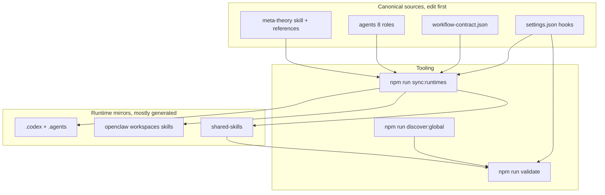

<a id="default-path-ja"></a>

#### 図: 既定パス（入口・meta-theory スキル・八段階スパインの略図）

`meta-theory` は**スキル**（トリガーで読み込まれる手順書）。`meta-warden` は**エージェント**（既定の公開入口かつ分派決定の検証役）。フロー：ユーザー意図 → `meta-warden` 入口 → `meta-theory` 分類＋分派計画 → **`meta-warden` が分派決定を検証（Gate 3）** → agent 実行 → review → verify → evolve。**全段の展開**は下文「開発ガバナンスの背骨」と英語版を参照。

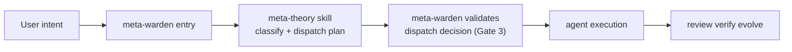

## 著者・サポート

（連絡先・決済 QR は [README.md](README.md) と同一です。）

## 論文・方法の根拠

- 論文: [Zenodo](https://zenodo.org/records/18957649)
- DOI: `10.5281/zenodo.18957649`

## 向いている人 / 向いていない人

**向いている**: マルチファイル・横断モジュール・複数ランタイムの作業、エージェント／スキル／MCP の保守、レビュー可能でロールバックしやすい協業を求める場合。

**向いていない**: 一回だけの軽い質問、ほぼ単一ファイル編集のみ、SaaS として即利用したいだけの場合。

## ランタイム入口

**Meta_Kim は三つの別プロジェクトではなく、一つの方法の三つの投影です。**

<div align="center">

| ランタイム | 入口 | リポジトリ内の主な場所 | 役割 |
| ---------- | ---- | ---------------------- | ---- |
| Claude Code | [CLAUDE.md](CLAUDE.md) | `.claude/`、`.mcp.json` | 正典編集ランタイム |
| Codex | [AGENTS.md](AGENTS.md) | `.codex/`、`.agents/`、`codex/` | Codex 向け投影 |
| OpenClaw | `openclaw/workspaces/` | `openclaw/` | ローカル workspace 投影 |

</div>

**同一の方法を三か所に落とす**略図（詳細は上文 [図: 主源・ツール・ランタイム鏡像](#meta-kim-visual-maps-ja)）:

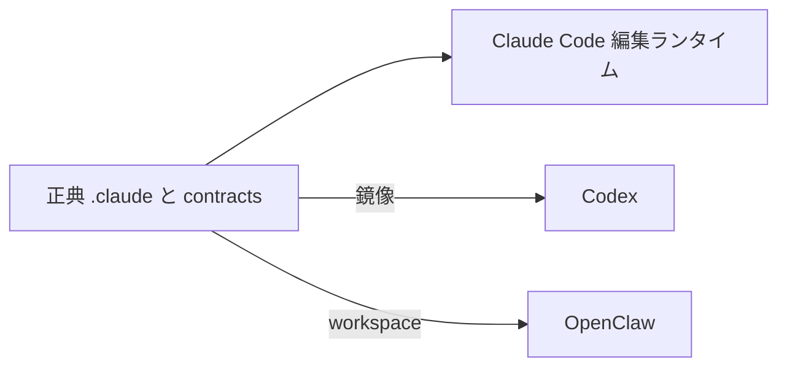

- メンテは **`canonical/` と `config/contracts/workflow-contract.json` から**
- `.codex/`、`openclaw/` の多くは生成物またはランタイム用
- 編集後は `npm run sync:runtimes` 等で再同期
- **Claude Code**: ガバナンスの手引きは **`/meta-theory`** で `meta-theory` スキルを読み込む（正典 [`canonical/skills/meta-theory/SKILL.md`](canonical/skills/meta-theory/SKILL.md)）。エージェントのデフォルト前门は `meta-warden`、スキルはディスパッチャ。詳細は英語 [README.md § In Claude Code](README.md#meta-theory-skill-en)。

### OpenClaw の例

```bash
npm install
npm run prepare:openclaw-local
openclaw agent --local --agent meta-warden --message "..." --json --timeout 120
```

## Meta_Kim における「元（Meta）」

**元 = 意図拡張を支える、最小の統治可能単位**

有効な単位は、独立して理解でき、十分小さく、所有と拒否が明示でき、システム全体を壊さず差し替え可能で、ワークフローをまたいで再利用できること。

### エンジニアリングとの関係

**エンジニアリングは元が統治する領域の一つ**。元システムはエンジニアリングを閉ループに載せられるが、**万能エンジニアそのものではない**。実行詳細は具名オーナーに委ね、メタ理論はディスパッチャとして振る舞う、が正典の立場です。

## コア・メソッド

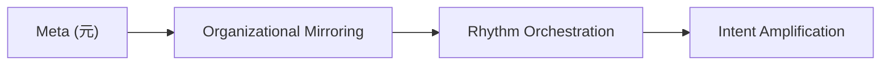

いずれかを欠くと方法として未完成です。詳細な図・分岐は英語正典 [README.md](README.md) の [Meta Architecture View](README.md#meta-kim-visual-maps-en) 以降を参照。

<a id="complex-spine-ja"></a>

## 開発ガバナンスの背骨（八段階）

複雑な仕事（マルチファイル・複数能力など）は八段階スパインに乗ります。段階は**2 行×4**で読みやすく（下表と同じ順）。Mermaid の `TB`+横並び `subgraph` は左右に並ぶことがあるため、上下二段を確実にするには `LR` を二つに分けます。

**上行 1–4 段（明確化 → 実行）**

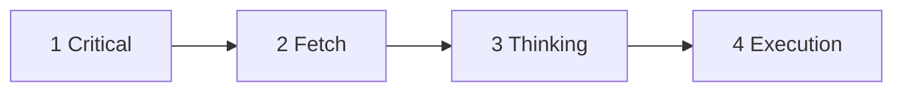

**接続:** `4 Execution` → `5 Review`

**下行 5–8 段（審査 → 進化）**

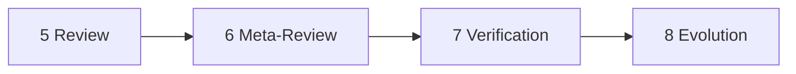

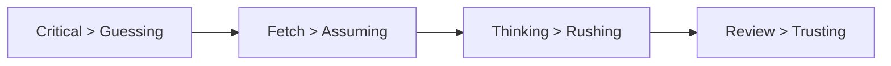

<div align="center">

| 段階 | 目的（要約） |
| ---- | ------------ |
| Critical | 推測の前に要件を明確化 |
| Fetch | 既存能力を探索 |
| Thinking | 分割・オーナー・成果物・順序を設計 |
| Execution | 適切なエージェントへ委譲 |
| Review | 品質・境界 |
| Meta-Review | レビュー基準そのものの妥当性 |
| Verification | 修正が実際に着地したか |
| Evolution | パターン・傷・再利用知を記録 |

</div>

補足規則（正典）: 純粋な `Q / Query` のみエージェントバイパス可。実行可能タスクにはオーナー必須。Thinking はプロトコル先行。独立タスクは並列を検討。

## 八段階スパインと業務ワークフローは別物

混同しやすいので、二層は**別語彙**として並べます。業務フェーズはスパインの段階名を**置き換えません**。

プロジェクト内には次の二層のワークフロー語彙があります（[README.zh-CN.md](README.zh-CN.md) の対照表と同じ構造）:

<div align="center">

| 層 | 定義の所在 | 役割 |
| --- | --- | --- |
| **八段階スパイン** | `meta-theory` / `dev-governance.md` | 複雑開発タスクの正典実行鎖 |
| **業務 10 フェーズ** | `config/contracts/workflow-contract.json` | 部門 run の契約語彙・表示・成果物規律 |

</div>

<a id="meta-kim-diagram-two-layers-ja"></a>

**図:** 上段が**実行スパイン**（八段階）、下段が**部門 run 契約**（業務十フェーズ）。並行する語彙であり、業務がスパインの段階を改名するわけではありません。`TB`+横 `subgraph` 二つは左右に並ぶことがあるため、`LR` を二つに分けて上下を固定します。

**上行：八段階スパイン（実行背骨）**

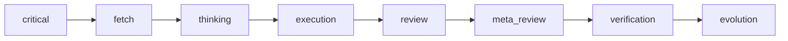

**下行：十フェーズ業務契約（部門 run）**

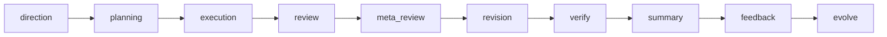

八段階スパイン（短文）:

<div align="center">

```text
Critical -> Fetch -> Thinking -> Execution -> Review -> Meta-Review -> Verification -> Evolution
```

</div>

業務ワークフロー（別語彙）:

<div align="center">

```text
direction -> planning -> execution -> review -> meta_review -> revision -> verify -> summary -> feedback -> evolve
```

</div>

要点:

- **業務ワークフローは八段階スパインを置き換えない**
- run 契約・表示・成果物の梱包層として理解するのが近い
- 複雑開発の実際の背骨は八段階のまま
- `summary` / `feedback` / `evolve` などは run 管理とクロージャの話であり、下の実行段階の改名ではない

一文で言うなら:**八段階が実行背骨、十フェーズが部門レベルの run 契約。**

## ワークフロー関係の地図

<a id="task-routing-ja"></a>

**タスク分岐**（下表と同じトポロジ）: 横置きで縦スペースを節約します。

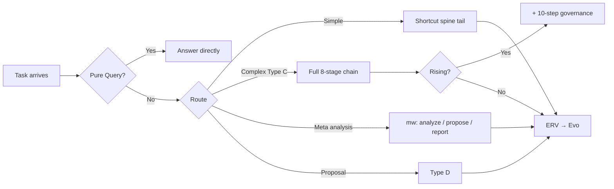

<div align="center">

| 分岐 | 意味 |
| --- | --- |
| 単純・単一オーナー | 圧縮スパイン: Exec → Review → Verify → Evolution |
| 複雑・多ファイル | 全 `Critical`…`Evolution`、複雑度が上がれば十段ガバナンスを追加し得る |
| メタ部門分析 | `metaWorkflow`: analyze → propose → report |
| Type D | 提案・チェックリスト・prism / scout / warden レビュー報告 |

</div>

**上図との関係:** ここでは**読み違えやすい含意**だけを集め、各フォークの再説明はしません。英語正典 [Workflow Relation Map](README.md#task-routing-en) と併読してください。

## 八つのメタエージェント

<div align="center">

| エージェント | 主な役割 |
| ------------ | -------- |
| `meta-warden` | 既定入口・仲裁・最終総合 |
| `meta-conductor` | 段階とリズム |
| `meta-genesis` | SOUL.md・ペルソナ設計 |
| `meta-artisan` | スキル・MCP・ツール適合 |
| `meta-sentinel` | 安全・権限・フック・ロールバック |
| `meta-librarian` | メモリと連続性 |
| `meta-prism` | 品質・ドリフト・アンチスロップ |
| `meta-scout` | 外部能力の発見と評価 |

</div>

**公開の前門は `meta-warden`。**

組織関係（まず**前門**だけ覚えれば足ります）:

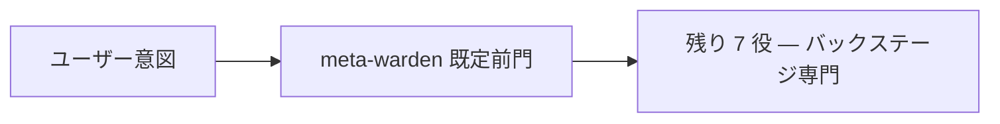

入口・スキル・スパインの**略図**は上文 [既定パス](#default-path-ja) を参照。

## クイックスタート（要点）

**clone なし（`npx` が一時取得して `setup.mjs` と同等を実行）:**

```bash
npx --yes github:KimYx0207/Meta_Kim meta-kim
```

**UI 言語を固定し、環境チェックのみ（書き込み・インストールなし）:** `--lang` は `en` / `zh-CN` / `ja-JP` / `ko-KR`。

<div align="center">

| UI 言語 | コマンド |
| --- | --- |
| English | `npx --yes github:KimYx0207/Meta_Kim meta-kim -- --lang en --check` |
| 简体中文 | `npx --yes github:KimYx0207/Meta_Kim meta-kim -- --lang zh-CN --check` |
| 日本語 | `npx --yes github:KimYx0207/Meta_Kim meta-kim -- --lang ja-JP --check` |
| 한국어 | `npx --yes github:KimYx0207/Meta_Kim meta-kim -- --lang ko-KR --check` |

</div>

**従来どおり clone 後:**

```bash
git clone https://github.com/KimYx0207/Meta_Kim.git
cd Meta_Kim
node setup.mjs
```

<div align="center">

| 使い方 | 説明 |
| --- | --- |
| `npx --yes github:KimYx0207/Meta_Kim meta-kim` | `node setup.mjs` と同等。手動 `git clone` / `cd` を省略 |
| `node setup.mjs` | 対話式セットアップ（言語選択 → インストール/アップデート/チェック） |
| `node setup.mjs --lang en` | 言語選択をスキップ、UI は English |
| `node setup.mjs --lang zh-CN` | 言語選択をスキップ、UI は简体中文 |
| `node setup.mjs --lang ja-JP` | 言語選択をスキップ、UI は日本語 |
| `node setup.mjs --lang ko-KR` | 言語選択をスキップ、UI は 한국어 |
| `node setup.mjs --update` | 全スキルと依存関係を更新 |
| `node setup.mjs --check` | 環境 + 依存関係 + ランタイム間同期チェック |
| `node setup.mjs --silent` | 非対話モード（CI/スクリプト用） |

</div>

ウィザードの全体フローと `--check` の意味は上表のとおり。長文手順は [README.md の Quick Start / Manual setup](README.md#quick-start-clone-to-working-in-5-minutes) を参照。

> **サードパーティのメタスキル findskill:** **Meta_Kim を正としてください。** `setup.mjs` は **`KimYx0207/findskill`** を `~/.claude/skills/findskill/` にインストールします。**本リポジトリ内のドキュメントとエージェントでは名称を `findskill` に統一**します。別チャネルから同じ機能を重複インストールしないでください。

> 純粋な Node.js スクリプト — Windows / macOS / Linux で動作し、bash 不要。

または手動:

```bash
npm install
npm run sync:runtimes
npm run validate
```

グローバル能力索引: `npm run discover:global`（`.claude/capability-index/meta-kim-capabilities.json` を再生成し、互換ミラー `global-capabilities.json` も更新。どちらもローカルパスを含むため、通常はコミットしない）

## よく使う npm スクリプト（抜粋）

<div align="center">

| コマンド | 用途 |
| -------- | ---- |
| `npm run validate` | リポジトリ整合性（契約・エージェント・workspace・MCP 自己検証など） |
| `npm run check:runtimes` | 鏡像が正典と一致するか（書き換えなし） |
| `npm run sync:runtimes` | 正典から鏡像を再生成 |
| `npm run test:meta-theory` | メタ理論テストスイート |
| `npm run eval:agents` | ランタイムの軽量スモーク |
| `npm run validate:run -- <run.json>` | 記録された run アーティファクトの検証 |
| `npm run index:runs -- <dir-or-file>` | 妥当な governed run だけを `.meta-kim/state/{profile}/run-index.sqlite` に索引 |
| `npm run query:runs -- --owner meta-warden` | flow / owner / publicReady / open findings でローカル run index を検索 |
| `npm run migrate:meta-kim -- <source-dir> --apply` | 旧 prompt pack / 単一 agent リポジトリから persona / skill / contract 周辺資産だけを staging |
| `npm run doctor:governance` | canonical contract・mirror parity・runtime hooks・local profile/run-index health の分層ヘルスチェック |
| `npm run verify:all` | 本番前の広いスタック（グローバル meta-theory 同期状況にも依存） |

</div>

全文のコマンド一覧は英語正典 [README.md — Commands](README.md#commands) を参照。

## 補足 FAQ

### 旧 prompt pack / 単一 agent リポジトリはどう移行する？

```bash
npm run migrate:meta-kim -- ../old-agent-repo --apply
```

このコマンドは persona / skill / contract 周辺資産だけを `.meta-kim/state/{profile}/migrations/...` に staging し、未検証 run state・SQLite キャッシュ・ログ・artifact は拒否します。正典 `canonical/` や `config/contracts/` に移す前に、生成された `manifest.json` を確認してください。

## コードナレッジグラフ（graphify）

[graphify](https://github.com/safishamsi/graphify)（`pip install graphifyy`）を使って**対象プロジェクト**（Meta_Kim 自身ではない）のコードナレッジグラフを生成。サブグラフ抽出により最大 **71 倍のトークン圧縮**を実現します。

- Fetch 段階で `graphify-out/graph.json` を自動検出
- 全派生エージェントにグラフコンテキストを自動注入
- ソースファイル >20、Python 3.10+、graphify インストール済みの場合に自動有効化
- 複雑なプロジェクト（ノード >50）では Type B パイプラインでプロジェクトレベル Conductor を自動生成

```bash
# インストール
pip install graphifyy && graphify claude install

# 状態確認
npm run graphify:check

# 対象プロジェクトのグラフ更新
npm run graphify:update
```

詳細: [README.md の Code Knowledge Graph セクション](README.md#code-knowledge-graph-graphify)

## リポジトリ構造（要約）

（ツリー表示は環境によってずれることがあります。下表は [README.zh-CN.md](README.zh-CN.md) の「项目结构」と同じ粒度です。）

<div align="center">

| パス | 説明 |
| --- | --- |
| `.claude/` | 正典: agents、skills、hooks、settings |
| `.codex/` | Codex custom agents ミラー |
| `.agents/` | Codex プロジェクト skill ミラー |
| `codex/` | Codex グローバル設定の例 |
| `openclaw/` | OpenClaw workspaces、skills、テンプレート |
| `config/contracts/` | ランタイム治理契約 |
| `docs/` | 内部メモ等、追跡済み runtime ドキュメント少量 |
| `scripts/` | 同期・検証・MCP・ヘルス |
| `shared-skills/` | ランタイム横断の skill ミラー |
| `README.md` | 英語主 README |
| `README.zh-CN.md` | 简体中文 |
| `README.ja-JP.md` | 日本語 |
| `README.ko-KR.md` | 한국어 |
| `CLAUDE.md` | Claude Code 入口 |
| `AGENTS.md` | Codex 入口 |
| `CHANGELOG.md` | 変更履歴 |

</div>

手で編集するのは主に `canonical/` と `config/contracts/`。`.codex/` や `openclaw/workspaces/*` は通常 `sync:runtimes` で生成。

## ライセンス

[MIT License](LICENSE)

---

*本ドキュメントはコミュニティ向けの日本語ガイドです。規律の最終解釈は英語正典および `config/contracts/workflow-contract.json` に従います。*
