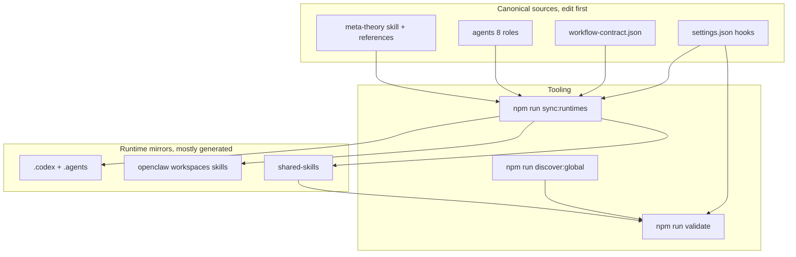
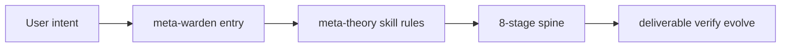
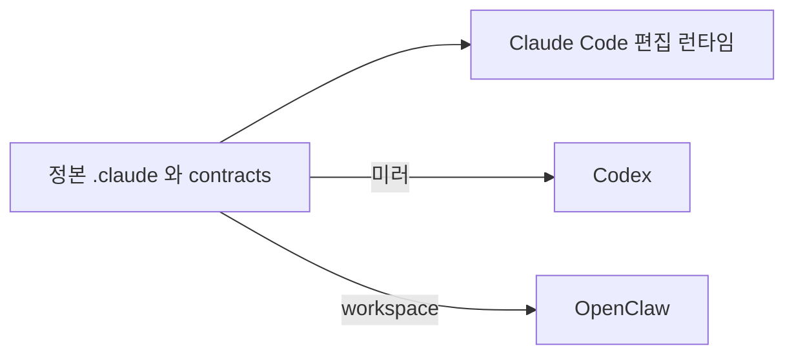
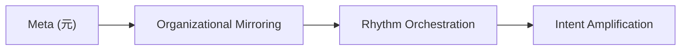
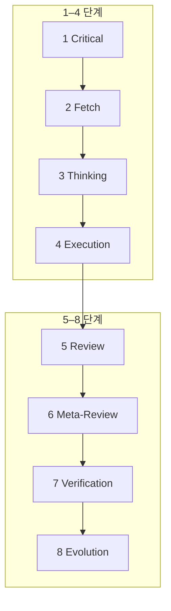
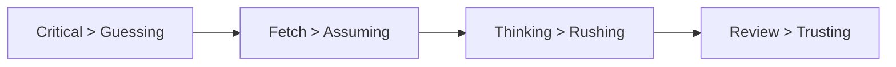
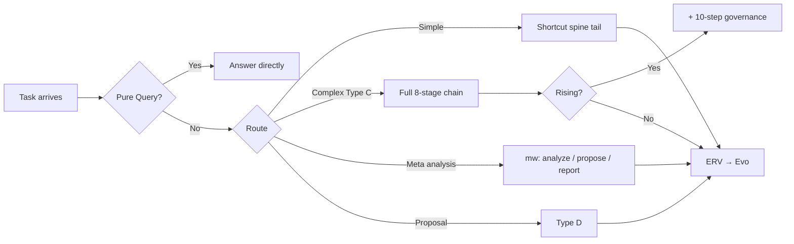
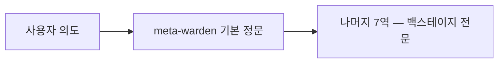

<div align="center">

<h1 style="font-size: 6em; font-weight: 900; margin-bottom: 0.2em; letter-spacing: 0.1em;">元</h1>
<p style="font-size: 1.2em; color: #7c3aed; font-weight: 600; margin-top: 0;">META_KIM</p>
<p style="color: #dc2626; font-weight: 700; margin-bottom: 0.5em;">⚠️ BETA — 진행 중</p>

<p>
  <a href="README.md">English</a> |
  <a href="README.zh-CN.md">简体中文</a> |
  <a href="README.ja-JP.md">日本語</a> |
  <a href="README.ko-KR.md">한국어</a>
</p>

<p>
  
  
  
  
  
</p>

> **정본(최신·전체)**: 영어는 [README.md](README.md), 中文는 [README.zh-CN.md](README.zh-CN.md). 이 문서는 한국어 독자를 위한 안내입니다.

</div>

## 한눈에 보기

**AI 코딩 보조를 위한 거버넌스 레이어**입니다. Claude Code, Codex, OpenClaw 세 런타임에서 같은 규율을 유지해 복잡한 작업을 **먼저 제대로** 끝냅니다. 많은 도구는 곧바로 코드부터 쓰지만, Meta_Kim은 그 앞에 명확화·탐색·실행·검토·진화 단계를 둡니다.

- 공개 진입점은 하나, 뒤에는 메타 에이전트 8개（**영어 개념명은 Meta**. 한자 「元」는 로고·정본 용어）
- **하나의 거버넌스 규율**을 세 런타임에 투영
- 복잡한 작업 흐름: 명확화 → 탐색 → 실행 → 검토 → 진화
- **네 가지 철칙**: Critical > 추측, Fetch > 가정, Thinking > 성급함, Review > 맹신
- 규율: 한 부서 · 하나의 주요 산출물 · 닫힌 인수인계 체인
- 장기 진실 공급원은 주로 `.claude/`와 `contracts/workflow-contract.json`

## 시간이 지날수록 가벼워지는 이유

첫날부터 최소 토큰이 아닙니다. **비싼 일시적 추론을 장기적으로 재사용 가능한 역량 자산으로 바꾸는** 설계입니다.

- 초기에는 무겁습니다(에이전트, 스킬, 훅, 계약, 메모리, 검증 규율을 맞춤).
- 이후에는 가벼워집니다(매번 경계를 처음부터 다시 찾지 않음).
- 줄이는 것은 “모든 토큰”이 아니라 **반복 토큰**입니다.

## 이 프로젝트가 하는 일

핵심은 “코드를 더 쓰게 하는 것”이 아니라, 복잡 작업에서 흔한 실패(모호한 요청→추측, 경계 넘나드는 변경, 멀티 런타임 불일치, 검토·검증·학습 부재)를 줄이는 것입니다. 중심 개념은 **실행 전 의도 증폭(intent amplification)**이며, 요지는 위「한눈에 보기」와 영어 [README.md](README.md)의 *What This Project Is*와 같습니다.

## 메타 아키텍처 관점

이 저장소는 “프롬프트 묶음”이 아니라 **층을 이룬 거버넌스 시스템**으로 읽는 것이 안전합니다.

- **이론 정본**: `.claude/skills/meta-theory/` 및 `references/`
- **조직 정본**: `.claude/agents/*.md` (8역할·경계)
- **계약 정본**: `contracts/workflow-contract.json`
- **런타임 투영**: `.codex/`, `.agents/`, `openclaw/`, `shared-skills/`
- **도구·검증**: `scripts/`, `validate`, `eval:agents`, `tests/meta-theory/`

**메타이론 정본 → 거버넌스된 메타 조직 → 워크플로 계약 → 다중 런타임 투영 → 동기화·검증 루프**

기본 실행 경로:

`사용자 의도 → meta-warden → Critical → Fetch → Thinking → 전문 실행 → Review → Verification → Evolution`

**유지보수 원칙**: 먼저 `.claude/`와 `contracts/`를 고치고, 그다음 런타임 거울을 동기화·검증합니다.

그림은**개념 옆**에 둡니다(그림만 있는 장이 아님). 단계 상세·이중 어휘·분기 지도는 영어 정본 [README.md](README.md)의 [Development Governance Spine](README.md#complex-spine-en)·[The 8-Stage Spine And The Business Workflow](README.md#meta-kim-diagram-two-layers-en)·[Workflow Relation Map](README.md#task-routing-en)을 참고하세요. 노드 표기는 Mermaid 호환을 위해 영어로 둡니다.

<a id="meta-kim-visual-maps-ko"></a>

#### 그림: 정본·도구·런타임 미러

<div align="center">



</div>

<a id="default-path-ko"></a>

#### 그림: 기본 경로(진입·meta-theory 스킬·8단계 척추 개요)

`meta-theory`는 **스킬**(트리거 시 로드되는 방법서). `meta-warden`은 **에이전트**(기본 공개 진입). **전 단계 전개**는 아래「개발 거버넌스 척추」와 영어판을 참고하세요.

<div align="center">



</div>

## 저자·지원

(연락처·결제 QR은 [README.md](README.md)와 동일합니다.)

## 논문·방법론 근거

- 논문: [Zenodo](https://zenodo.org/records/18957649)
- DOI: `10.5281/zenodo.18957649`

## 맞는 경우 / 맞지 않는 경우

**맞음**: 멀티 파일·모듈 간·멀티 런타임 작업, 에이전트/스킬/MCP 유지, 검토·롤백 가능한 협업을 원할 때.

**맞지 않음**: 일회성 가벼운 질문만, 단일 파일 위주, 즉시 쓰는 SaaS만 원할 때.

## 런타임 진입점

**Meta_Kim은 세 개의 별도 프로젝트가 아니라 하나의 방법의 세 가지 투영입니다.**

<div align="center">

| 런타임 | 진입점 | 저장소 내 주요 위치 | 역할 |
| ------ | ------ | ------------------- | ---- |
| Claude Code | [CLAUDE.md](CLAUDE.md) | `.claude/`, `.mcp.json` | 정본 편집 런타임 |
| Codex | [AGENTS.md](AGENTS.md) | `.codex/`, `.agents/`, `codex/` | Codex 투영 |
| OpenClaw | `openclaw/workspaces/` | `openclaw/` | 로컬 workspace 투영 |

</div>

**같은 방법을 세 곳에 내려놓기** 요약(세부는 위 [그림: 정본·도구·런타임 미러](#meta-kim-visual-maps-ko)):

<div align="center">



</div>

- 유지보수는 **`.claude/`와 `contracts/workflow-contract.json`에서 시작**
- `.codex/`, `openclaw/` 대부분은 생성물 또는 런타임 전용
- 편집 후 `npm run sync:runtimes` 등으로 재동기화

### OpenClaw 예시

```bash
npm install
npm run prepare:openclaw-local
openclaw agent --local --agent meta-warden --message "..." --json --timeout 120
```

## Meta_Kim의 「元(Meta)」

**元 = 의도 증폭을 뒷받침하기 위한 최소 거버넌스 가능 단위**

유효한 단위는 독립적으로 이해 가능하고, 충분히 작으며, 소유와 거절이 명시되며, 전체를 무너뜨리지 않고 교체 가능하며, 워크플로 전반에서 재사용 가능해야 합니다.

### 엔지니어링과의 관계

**엔지니어링은 원이 다스리는 영역 중 하나**입니다. 원 시스템은 엔지니어링을 닫힌 루프로 가져올 수 있지만, **만능 엔지니어와 같지는 않습니다**. 실행 세부는 명명된 오너에게 맡기고, 메타이론은 디스패처로 행동하는 것이 정본입니다.

## 코어 메서드



하나라도 빠지면 방법이 불완전합니다. 상세 그림·분기는 영어 정본 [README.md](README.md)의 [Meta Architecture View](README.md#meta-kim-visual-maps-en) 이하를 참고하세요.

<a id="complex-spine-ko"></a>

## 개발 거버넌스 척추(8단계)

복잡한 작업(멀티 파일·다중 역량 등)은 8단계 척추를 따릅니다. 단계는 **2행×4**로 읽기 쉽게(아래 표와 같은 순).

<div align="center">



</div>

<div align="center">



</div>

| 단계 | 목적(요약) |
| ---- | ---------- |
| Critical | 추측 전 요구 명확화 |
| Fetch | 기존 역량 탐색 |
| Thinking | 분할·오너·산출물·순서 설계 |
| Execution | 적절한 에이전트에 위임 |
| Review | 품질·경계 |
| Meta-Review | 검토 기준 자체의 타당성 |
| Verification | 수정이 실제로 반영되었는지 |
| Evolution | 패턴·흉터·재사용 지식 기록 |

보충 규칙(정본): 순수 `Q / Query`만 에이전트 우회 가능. 실행 가능 작업에는 오너 필수. Thinking은 프로토콜 우선. 독립 작업은 병렬 검토.

## 8단계 척추와 비즈니스 워크플로는 다름

두 층은 **별도 어휘**입니다. 비즈니스 페이즈가 척추 단계 이름을 **바꾸지 않습니다**.

<a id="meta-kim-diagram-two-layers-ko"></a>

**그림:** 한 그림에 두 줄 — 위는 **실행 척추**(8단계), 아래는 **부서 run 계약**(비즈니스 10페이즈). 병렬 어휘이며 비즈니스가 척추 단계를 개명하지 않습니다.

```mermaid
flowchart TB
  subgraph Spine["8-stage spine (실행 척추)"]
    direction LR
    A1[critical] --> A2[fetch] --> A3[thinking] --> A4[execution]
    A4 --> A5[review] --> A6[meta_review] --> A7[verification] --> A8[evolution]
  end
  subgraph Biz["10-phase business contract (부서 run)"]
    direction LR
    B1[direction] --> B2[planning] --> B3[execution] --> B4[review]
    B4 --> B5[meta_review] --> B6[revision] --> B7[verify]
    B7 --> B8[summary] --> B9[feedback] --> B10[evolve]
  end
```

<div align="center">



</div>

8단계 척추(한 줄):

<div align="center">

```text
Critical -> Fetch -> Thinking -> Execution -> Review -> Meta-Review -> Verification -> Evolution
```

</div>

비즈니스 워크플로(별도):

<div align="center">

```text
direction -> planning -> execution -> review -> meta_review -> revision -> verify -> summary -> feedback -> evolve
```

</div>

요점:

- **비즈니스 워크플로가 8단계 척추를 대체하지 않음**
- run 계약·표시·산출물 포장 층으로 이해하는 편이 가깝다
- 복잡 개발의 실제 척추는 여전히 8단계
- `summary` / `feedback` / `evolve` 등은 run 관리·클로저에 가깝고 기저 실행 단계의 개명이 아님

한 문장:**8단계가 실행 척추, 10페이즈가 부서 수준 run 계약.**

## 워크플로 관계 지도

<a id="task-routing-ko"></a>

**작업 라우팅**(아래 표와 같은 토폴로지): 가로 배치로 세로 공간을 줄입니다.

<div align="center">



</div>

<div align="center">

| 분기 | 의미 |
| --- | --- |
| 단순·단일 오너 | 압축 척추: Exec → Review → Verify → Evolution |
| 복잡·다중 파일 | 전체 `Critical`…`Evolution`, 복잡도가 오르면 10단 거버넌스 추가 가능 |
| 메타 부서 분석 | `metaWorkflow`: analyze → propose → report |
| Type D | 제안·체크리스트·prism / scout / warden 검토 보고 |

</div>

**위 그림과의 관계:** 이 절은 같은 그래프에서 **읽기 쉬운 오해**만 모읍니다. 영어 정본 [Workflow Relation Map](README.md#task-routing-en)과 함께 읽으세요.

## 여덟 메타 에이전트

| 에이전트 | 주요 역할 |
| -------- | --------- |
| `meta-warden` | 기본 진입·중재·최종 종합 |
| `meta-conductor` | 단계·리듬 |
| `meta-genesis` | SOUL.md·페르소나 설계 |
| `meta-artisan` | 스킬·MCP·도구 적합 |
| `meta-sentinel` | 안전·권한·훅·롤백 |
| `meta-librarian` | 메모리·연속성 |
| `meta-prism` | 품질·드리프트·안티 슬롭 |
| `meta-scout` | 외부 역량 발견·평가 |

**공개 정문은 `meta-warden`.**

조직 관계(**정문**만 먼저 기억해도 됨):

<div align="center">



</div>

진입·스킬·척추 **개요**는 위 [기본 경로](#default-path-ko)를 참고하세요.

## 빠른 시작(요점)

**clone 없이 (`npx`가 임시로 가져와 `setup.mjs`와 동일 계열 실행):**

```bash
npx --yes github:KimYx0207/Meta_Kim meta-kim
```

**UI 언어 고정 + 환경 점검만 (쓰기·설치 없음):** `--lang` 은 `en` / `zh-CN` / `ja-JP` / `ko-KR`.

| UI 언어 | 명령 |
| --- | --- |
| English | `npx --yes github:KimYx0207/Meta_Kim meta-kim -- --lang en --check` |
| 简体中文 | `npx --yes github:KimYx0207/Meta_Kim meta-kim -- --lang zh-CN --check` |
| 日本語 | `npx --yes github:KimYx0207/Meta_Kim meta-kim -- --lang ja-JP --check` |
| 한국어 | `npx --yes github:KimYx0207/Meta_Kim meta-kim -- --lang ko-KR --check` |

**clone 후:**

```bash
git clone https://github.com/KimYx0207/Meta_Kim.git
cd Meta_Kim
node setup.mjs
```

| 사용법 | 설명 |
| --- | --- |
| `node setup.mjs` | 대화형 설정 (언어 선택 → 설치/업데이트/확인) |
| `node setup.mjs --lang en` | 언어 선택 생략, UI English |
| `node setup.mjs --lang zh-CN` | 언어 선택 생략, UI 简体中文 |
| `node setup.mjs --lang ja-JP` | 언어 선택 생략, UI 日本語 |
| `node setup.mjs --lang ko-KR` | 언어 선택 생략, UI 한국어 |
| `node setup.mjs --update` | 모든 스킬과 의존성 업데이트 |
| `node setup.mjs --check` | 환경 + 의존성 + 런타임 간 동기화 확인 |
| `node setup.mjs --silent` | 비대화형 모드 (CI/스크립트용) |

마법사 전체 흐름과 `--check` 의미는 위 표와 같습니다. 긴 설명은 [README.md Quick Start / Manual setup](README.md#quick-start-clone-to-working-in-5-minutes)을 보세요.

> **타사 메타 스킬 findskill:** **이 저장소(Meta_Kim)를 정본으로 삼으세요.** `setup.mjs`는 **`KimYx0207/findskill`**을 `~/.claude/skills/findskill/`에 설치합니다. **이 저장소의 문서·에이전트는 이름을 `findskill`로만 통일**합니다. 다른 채널에서 같은 기능을 중복 설치하지 마세요.

> 순수 Node.js 스크립트 — Windows / macOS / Linux에서 작동하며 bash 불필요.

또는 수동:

```bash
npm install
npm run sync:runtimes
npm run validate
```

전역 역량 색인: `npm run discover:global` (로컬 절대 경로 포함 → 보통 커밋하지 않음)

전체 절차·명령 표는 [README.md Quick Start / Commands](README.md#quick-start-clone-to-working-in-5-minutes)를 보세요.

## 자주 쓰는 npm 스크립트(발췌)

| 명령 | 용도 |
| ---- | ---- |
| `npm run validate` | 저장소 무결성(계약·에이전트·workspace·MCP 자가검사 등) |
| `npm run check:runtimes` | 미러가 정본과 일치하는지(쓰기 없음) |
| `npm run sync:runtimes` | 정본에서 미러 재생성 |
| `npm run test:meta-theory` | 메타이론 테스트 스위트 |
| `npm run eval:agents` | 런타임 경량 스모크 |
| `npm run validate:run -- <run.json>` | 기록된 run 아티팩트 검증 |
| `npm run doctor:governance` | 계약·훅·미러·샘플 validate:run 좁은 헬스체크 |
| `npm run verify:all` | 릴리스 전 넓은 스택(전역 meta-theory 동기 상태에도 의존) |

## 코드 지식 그래프 (graphify)

[graphify](https://github.com/safishamsi/graphify) (`pip install graphifyy`)를 사용하여 **대상 프로젝트**(Meta_Kim 자체가 아님)의 코드 지식 그래프를 생성합니다. 서브그래프 추출로 최대 **71배 토큰 압축**을 실현합니다.

- Fetch 단계에서 `graphify-out/graph.json`을 자동 감지
- 모든 파견 에이전트에 그래프 컨텍스트 자동 주입
- 소스 파일 >20, Python 3.10+, graphify 설치됨 → 자동 활성화
- 복잡한 프로젝트(노드 >50) → Type B 파이프라인으로 프로젝트 수준 Conductor 자동 생성

```bash
# 설치
pip install graphifyy && graphify claude install

# 상태 확인
npm run graphify:check

# 대상 프로젝트 그래프 업데이트
npm run graphify:update
```

자세한 내용: [README.md Code Knowledge Graph 섹션](README.md#code-knowledge-graph-graphify)

## 저장소 구조(요약)

```text
Meta_Kim/
├─ .claude/        정본: 에이전트·스킬·훅
├─ .codex/         Codex 미러
├─ .agents/        Codex 프로젝트 skill 미러
├─ openclaw/       OpenClaw workspace·스킬
├─ contracts/      거버넌스 계약
├─ scripts/        동기화·검증·MCP
├─ README.md / README.zh-CN.md / README.ja-JP.md / README.ko-KR.md
├─ CLAUDE.md / AGENTS.md
└─ …
```

직접 편집은 주로 `.claude/`와 `contracts/`. `.codex/`, `openclaw/workspaces/*`는 보통 `sync:runtimes`로 생성됩니다.

## 라이선스

[MIT License](LICENSE)

---

*이 문서는 커뮤니티용 한국어 안내입니다. 규율의 최종 해석은 영어 정본 및 `contracts/workflow-contract.json`을 따릅니다.*
