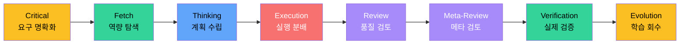
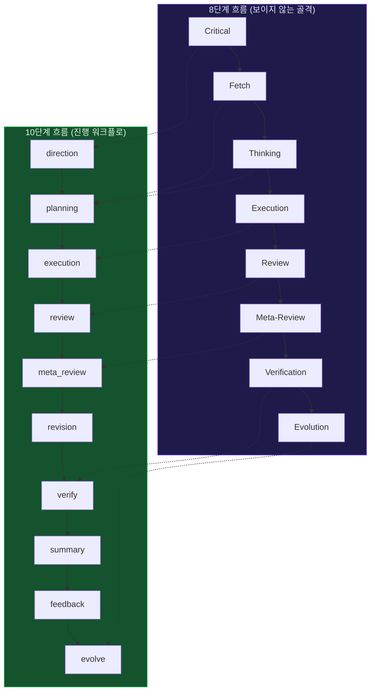
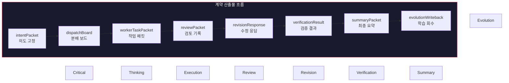
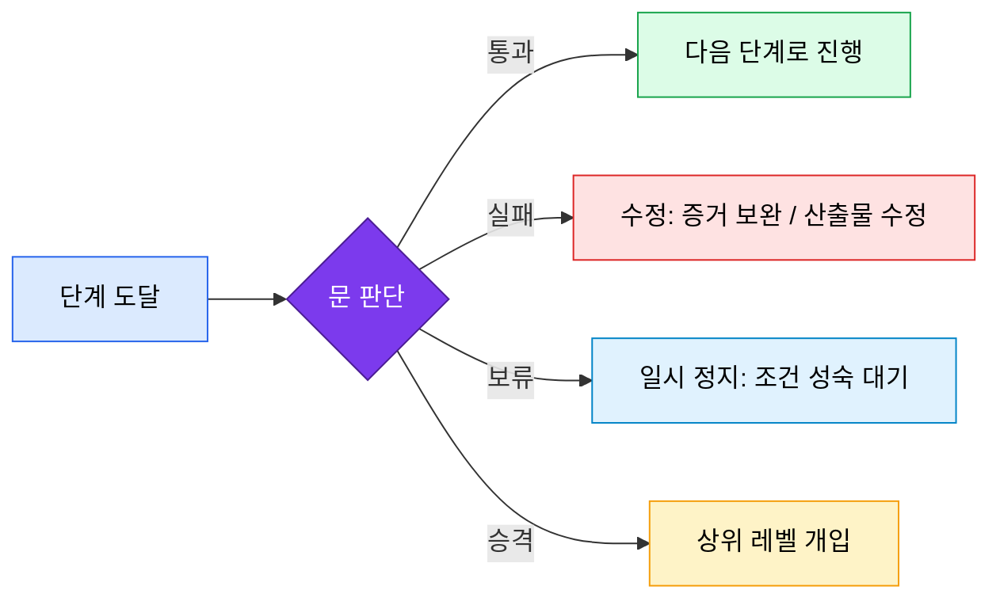
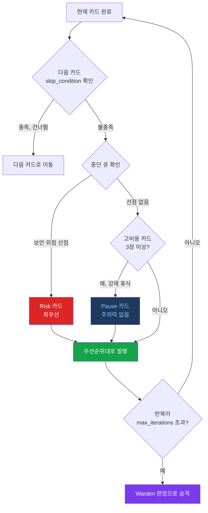
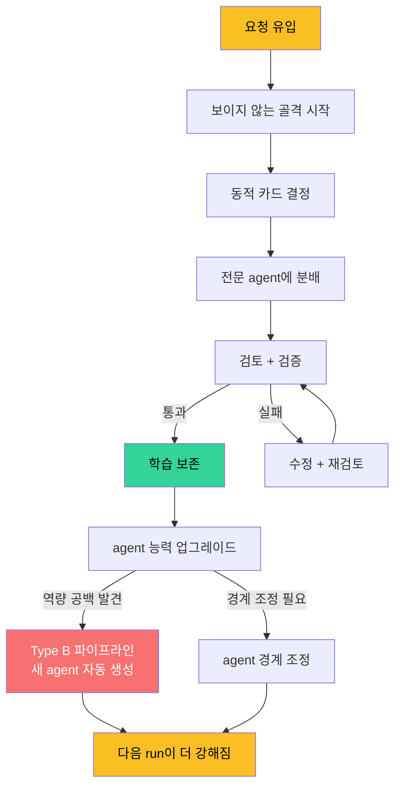
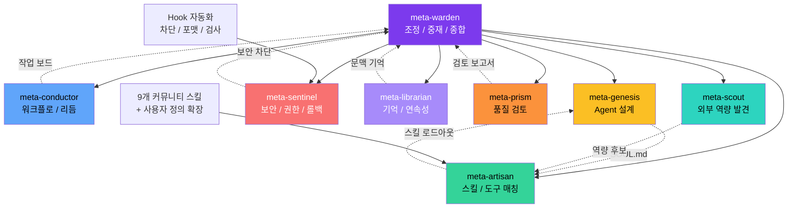
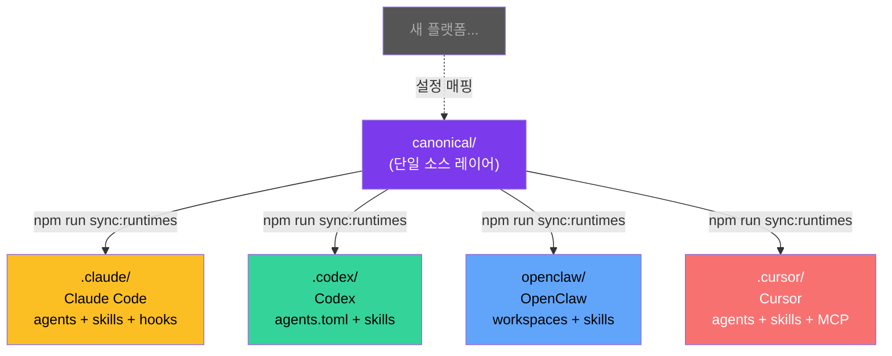
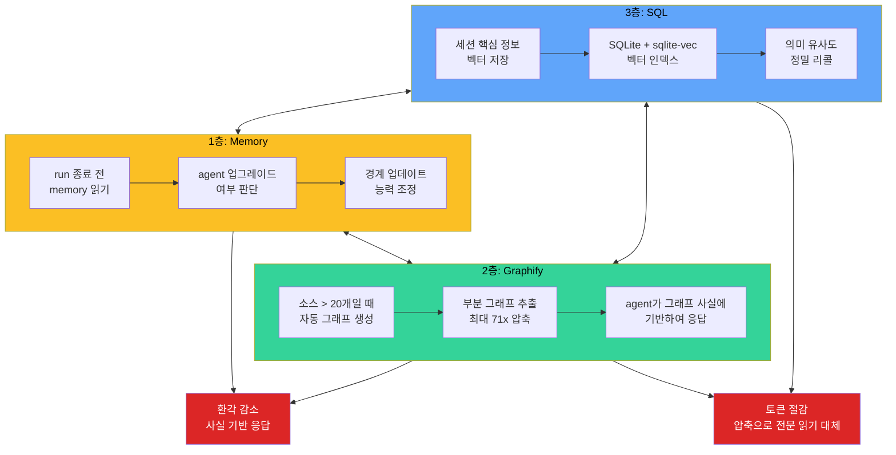

<div align="center">

<h1 style="font-size: 6em; font-weight: 900; margin-bottom: 0.2em; letter-spacing: 0.1em;">元</h1>
<p style="font-size: 1.2em; color: #7c3aed; font-weight: 600; margin-top: 0;">META_KIM</p>

<p>
  <a href="README.md">English</a> |
  <a href="README.zh-CN.md">简体中文</a> |
  <a href="README.ja-JP.md">日本語</a> |
  <a href="README.ko-KR.md">한국어</a>
</p>

<p>
  
  
  
</p>

</div>

## 개요

**Meta_Kim**은 또 다른 AI 코딩 도구가 아닙니다. AI 코딩 보조에 "두뇌"를 달아주는 거버넌스 시스템입니다.

비유하자면: Claude Code, Codex, OpenClaw, Cursor는 모두 "손"입니다 — 코드를 작성하고 파일을 수정할 수 있습니다. 하지만 어떤 파일을 먼저 바꿀지 누가 결정하나요? 결과는 누가 검토하나요? 문제가 생기면 누가 고치나요? 같은 실수를 다음에 반복하지 않으려면 어떻게 하나요?

Meta_Kim이 바로 그 역할을 합니다. **AI 위의 AI** — 복잡한 작업이 한데 엉키지 않도록 하는 통합 거버넌스 레이어입니다.

### 한 줄 요약

> **무엇을 할지 먼저 정리하고 → 누가 할지 정하고 → 끝나면 검토하고 → 검증하고 → 배운 것을 다음에 반영한다.**

새로운 개념이 아닙니다. 성숙한 엔지니어링 팀이라면 이미 하고 있는 일입니다. Meta_Kim은 이를 사람의 자율에 맡기지 않고 실행 가능한 시스템으로 만듭니다.

## 빠른 시작

빠르게 사용해 보려면:

```bash
npx --yes github:KimYx0207/Meta_Kim meta-kim
```

또는 전통적인 방식:

```bash
git clone https://github.com/KimYx0207/Meta_Kim.git
cd Meta_Kim
node setup.mjs
```

저장소를 유지보수할 계획이라면, 먼저 `canonical/`과 `config/contracts/workflow-contract.json`을 수정한 뒤 다음을 실행하세요:

```bash
npm run sync:runtimes
npm run validate
```

권장 읽기 순서:

1. 이 파일, `README.ko-KR.md`
2. `AGENTS.md`
3. `docs/runtime-capability-matrix.md`

---

## 연락처


GitHub <a href="https://github.com/KimYx0207">KimYx0207</a> |
X <a href="https://x.com/KimYx0207">@KimYx0207</a> |
공식 사이트 <a href="https://www.aiking.dev/">aiking.dev</a> |
위챗 공식 계정: **老金带你玩AI**

Feishu 지식 베이스:
<a href="https://my.feishu.cn/wiki/OhQ8wqntFihcI1kWVDlcNdpznFf">지속 업데이트 입구</a>

### 커피 한 잔

Meta_Kim이 도움이 되었다면 후원으로 응원해 주세요.

| 위챗 결제 | 알리페이 |
| --- | --- |
|  |  |

### 방법론 근거

Meta_Kim의 방법론은 본 프로젝트 메인테이너(KimYx0207)가 작성한 "메타 기반 의도 증폭(intent amplification)" 연구에 기반합니다:

- 논문: <https://zenodo.org/records/18957649>
- DOI: `10.5281/zenodo.18957649`

---

## 아키텍처: 보이지 않는 골격 + 동적 카드 발행

이것이 Meta_Kim의 핵심 설계 사상입니다. 한 섹션만 읽는다면 이것을 읽으세요.

### 핵심 용어 정리

| 개념 | 무엇인가 | 무엇이 아닌가 |
| --- | --- | --- |
| **보이지 않는 골격** | 표면 아래 항상 존재하는 백엔드 프레임워크 노드 | 미리 정해진 책임 목록 |
| **8단계 흐름** | 골격이 실행 단계에서 드러나는 읽기 쉬운 주 체인 | 거버넌스 논리 전체 |
| **10단계 흐름** | 8단계 위에 덧붙는 더 복잡한 진행 방식 | 8단계의 대체물 |
| **카드 발행** | 8단계와 agent 단위를 중심으로 한 동적 제어 | 단순 작업 배분 |
| **문(Gate)** | 통과/실패 조건 | 단계 자체 |
| **계약(Contract)** | 각 노드가 반드시 생성해야 하는 구조화된 산출물 | 구호나 추상적 가치 |
| **Agent 단위 거버넌스** | 경계, 능력, 업그레이드, 롤백을 관리하는 실천적 방법 | 역할 메뉴 |
| **3층 기억 체계** | memory / graphify / SQL로 분업된 장기 기억 | 하나의 뒤섞인 노트 |

한 문장으로 기억하세요:

> **8단계는 진행을 맡고, 문은 통과를 맡고, 계약은 산출물을 맡고, 카드는 동적 개입을 맡습니다.**

### 8단계 = 보이지 않는 골격

Meta_Kim에는 8개의 고정된 실행 단계가 있습니다. 이것이 **보이지 않는 골격**입니다:



**Critical — 먼저 실제 문제를 고정하세요**

요구가 모호하면 추측 대신 질문하세요. 이 단계에서 `intentPacket`을 생성하여 실제 사용자 의도, 성공 기준, 제외 항목을 고정합니다. 요구가 이미 명확하면 시스템은 조용히 건너뛰지 않고 명시적인 건너뛰기 사유를 기록합니다.

**Fetch — 새로 발명하기 전에 기존 역량을 먼저 탐색하세요**

기존 agent, skill, 도구, MCP가 요구를 이미 충족하는지 검색합니다. 핵심은 **역량 우선**입니다: 먼저 필요한 역량을 정의하고, 그 역량을 선언한 소유자를 검색한 다음, 최적의 매치에 분배합니다. 특정 agent 이름을 미리 고정하지 마세요.

**Thinking — 경계, 소유자, 순서, 산출물, 위험, 정지 조건을 정의하세요**

작업을 하위 작업으로 나누고 소유자를 지정하며 의존성과 병렬 그룹을 명시합니다. 이 단계에서 `dispatchBoard`를 생성합니다: 누가 무엇을 하는지, 무엇을 병렬로 실행할 수 있는지, 결과 병합 책임자는 누구인지. 최소 2개의 해결 경로를 탐색해야 하며, 너무 일찍 한 경로에 고정되지 마세요.

**Execution — 거버넌스 하에 실제 산출물을 생성하세요**

하위 작업을 전문 agent에 분배합니다. 각 하위 작업은 파일 문맥, 제약 조건, 검토 소유자, 검증 소유자를 포함하는 `workerTaskPacket`으로 감싸집니다. 독립적인 하위 작업은 가능하면 병렬로 실행합니다. **실행 ≠ 완료** — 산출물은 여전히 검토와 검증을 통과해야 합니다.

**Review — 품질과 경계 준수를 확인하세요**

코드 품질, 보안, 아키텍처 준수, 경계 위반을 검사합니다. 구조화된 발견이 담긴 `reviewPacket`을 생성합니다. 각 발견은 CRITICAL부터 LOW까지 심각도가 있습니다. 이것은 형식적인 절차가 아닙니다 — 해결되지 않은 발견은 앞으로 나아갈 수 없습니다.

**Meta-Review — 검토 기준 자체가 편향되거나 너무 느슨한지 확인하세요**

검토를 검토합니다. 검토 기준이 너무 약하면 실제로 검토하는 것이 아닙니다. 편향되면 잘못된 것을 검토하는 것입니다. 이 단계는 검토 시스템 자체의 품질을 보호합니다.

**Verification — 현실이 주장과 일치하는지 확인하세요**

수정이 실제로 검토 발견을 닫았는지 검증합니다. `verificationResult`와 `closeFindings`를 생성합니다. 수정이 실제로 발견을 닫지 않았다면 돌아가서 다시 수정한 후 검증하세요. 이것이 시스템에서 가장 정직한 관문입니다.

**Evolution — 역량 공백과 재사용 가능한 패턴을 시스템에 다시 기록하세요**

경험을 구조적 업그레이드로 전환합니다: 재사용 가능한 패턴은 memory에, 실패는 학습 산출물로, 역량 공백은 Scout에 전달하고, agent 경계는 canonical에 다시 기록합니다. 모든 run은 `writebackDecision`으로 끝나야 합니다: 구체적인 것을 기록하거나, 지속할 내용이 없는 이유를 명시적으로 설명하세요. **학습을 보존하지 않는 run은 낭비된 작업입니다.**

---

이 8단계가 합쳐져 실행 척추를 형성합니다.

왜 "상대적으로" 고정되어 있을까요? 간단한 경우에는 일부 단계를 건너뛸 수 있지만, 시스템은 건너뛴 이유를 명시적으로 기록해야 합니다. 아무것도 조용히 건너뛰지 않습니다.

### 10단계 = 골격 위에 구축된 진행 워크플로

8단계가 골격이라면, 10단계는 그 위에 자라난 **더 복잡한 진행 방식**입니다:

```text
direction → planning → execution → review → meta_review → revision → verify → summary → feedback → evolve
```

별도의 시스템이 아닙니다. 8단계 골격에서 파생되었습니다. 차이점은:

- **8단계**는 실행 논리에 집중 — "작업을 어떤 순서로 할 것인가"
- **10단계**는 거버넌스에 집중 — "각 단계가 무엇을 전달해야 하고 완료는 어떻게 정의되는가"



10단계는 `revision`, `summary`, `feedback`을 추가하여, 단순히 "끝내는 것"을 넘어 제대로 끝내고 루프를 올바르게 닫도록 합니다.

### 계약 = 각 노드가 전달해야 하는 것

워크플로만으로는 충분하지 않습니다. 각 단계는 **무엇을 출력해야 하는지** 정의해야 합니다. 그것이 계약의 역할입니다.

Meta_Kim의 계약은 구두 약속이 아닙니다. **구조화된 패킷**입니다:

| 계약 산출물 | 단계 | 목적 |
| --- | --- | --- |
| `intentPacket` | Critical | 실제 의도를 잠그고 이탈 방지 |
| `dispatchBoard` | Thinking | 소유자, 의존성, 병렬 그룹 정의 |
| `workerTaskPacket` | Execution | 각 하위 작업의 전체 문맥 전달 |
| `reviewPacket` | Review | 구조화된 발견 기록 |
| `revisionResponse` | Revision | 각 검토 발견에 대한 응답 |
| `verificationResult` | Verification | 이슈가 실제로 닫혔는지 확인 |
| `summaryPacket` | Summary | 공개 전 최종 요약 |
| `evolutionWriteback` | Evolution | 무엇을 다시 기록할지 정의 |



이 산출물들은 선택적 문서가 아닙니다. 시스템의 진실 공급원입니다. 계약 없이는 다음 노드가 "인계"하는 것이 아니라 이전 노드가 무엇을 의미했는지 "추측"하는 것입니다. 그것이 복잡한 작업에서 AI 협업이 무너지는 이유입니다.

현재 구현에서 이 산출물들은 명시적으로 전달됩니다: 실행 전 `taskClassification`, 발행 전 `cardPlanPacket`, 분배 전 `dispatchEnvelopePacket`, 검토 후 `reviewPacket.findings`, 수정과 검증 사이의 `revisionResponses` + `verificationResults` + `closeFindings`, 외부 공개 전 `summaryPacket`, 진화 전 `writebackDecision`.

`npm run validate:run`은 이 산출물 체인이 완전히 닫히는지 확인합니다.

### 문(Gate) = 단계에 도달했다고 통과한 것은 아닙니다

계약은 각 노드가 무엇을 전달해야 하는지 정의합니다. 문은 그 전달이 앞으로 나아갈 만큼 충분한지 판단합니다.

한 문장으로:

> **단계는 어디에 있는지 알려주고, 문은 앞으로 나아갈 자격이 있는지 알려줍니다.**



시스템의 주요 문:

| 문 | 차단하는 것 | 통과 조건 |
| --- | --- | --- |
| **planning gate** | 계획에서 실행으로 이동하기 전 | 경계, 소유자, 산출물, 위험이 모두 정의됨 |
| **metaReview gate** | 메타 검토가 충분히 강력한지 | 검토 기준 자체가 편향되거나 누락되거나 너무 느슨하지 않음 |
| **verify gate** | 수정이 실제로 이슈를 닫았는지 | `finding → revision → verification`이 깔끔하게 닫힘 |
| **summary gate** | 결과를 공개할 수 있는지 | 검증 통과 + 요약 완료 |
| **publicDisplay gate** | 시스템이 "완료"라고 주장할 수 있는지 | `verifyPassed + summaryClosed + singleDeliverableMaintained + deliverableChainClosed` |

가장 중요한 것은 **publicDisplay gate**입니다. 검증이 통과하지 않았거나 요약이 닫히지 않았거나 산출물 체인이 끊어진 경우, 시스템은 작업이 완료되었다고 주장할 수 없습니다.

문과 계약의 관계:

- **계약**은 "이 노드가 무엇을 전달해야 하는가" — 전달 의무
- **문**은 "앞으로 나아가기에 충분한가" — 해제 결정
- 계약 없이는 문이 판단할 근거가 없고, 문 없이는 계약은 그저 형식입니다

### 동적 카드 발행 = 골격 위에 유연성 추가

8단계 골격은 상대적으로 고정되어 있지만, 실제 작업은 하나의 경직된 경로로 처리하기에는 너무 다양합니다. 그래서 Meta_Kim은 **동적 카드 발행**을 도입했습니다.

카드는 8단계에 대응하지만, 단순한 1:1 매핑은 아닙니다. 10장의 카드는:

| 카드 | 발동 조건 | 주의력 비용 |
| --- | --- | --- |
| **Clarify** | 요구가 모호함 | 낮음 |
| **Shrink scope** | 저장소가 너무 크거나 파일이 너무 많음 | 낮음 |
| **Options** | 요구는 명확하지만 경로가 많음 | 중간 |
| **Execute** | 계획이 결정됨 | 높음 |
| **Verify** | 실행 완료 | 중간 |
| **Fix** | 검증 실패 | 중간 |
| **Rollback** | 위험이 확산됨 | 높음 |
| **Risk** | 보안, 전역 또는 다자 영향 | 높음 |
| **Nudge** | 사용자가 막혀서 가벼운 밀어줌이 필요함 | 낮음 |
| **Pause** | 고비용 카드 3장이 연속으로 나옴 | 없음 |

중요한 점은 일부 카드가 동적이라는 것입니다:

- 고주의력 카드 3장이 연속으로 발행되면 시스템이 강제로 **Pause**를 삽입합니다 — 사용자가 알아채기를 기다리지 않습니다
- 보안 위험이 나타나면 **Risk**가 현재 흐름을 선점합니다
- 사용자가 이미 알고 있는 정보는 해당 카드를 건너뜁니다
- 작업 반복이 상한을 초과하면 **Warden 판정**으로 승격됩니다

동적 카드 발행은 고정된 골격에 숨통을 틔워줍니다: 엄격해야 할 곳에서는 엄격하고, 유연함이 도움이 되는 곳에서는 유연합니다.



### 닫힌 루프 = 반복, 생성, 개선

골격, 진행 워크플로, 계약, 동적 카드 발행이 갖춰지면 시스템은 **닫힌 루프**를 형성합니다:

```text
요청 유입 → 골격 시작 → 카드 결정 → 실행 분배 → 검토·검증 → 학습 보존 → agent 업그레이드 → 다음 run이 더 강해짐
```

루프는 한 번으로 끝나지 않습니다. 각 라운드마다:

1. **누락된 agent 생성** — 역량 공백이 나타나면 Type B 파이프라인을 통해 새 agent를 생성할 수 있습니다
2. **agent 능력 향상** — Evolution이 SOUL.md, 스킬 로드아웃, 도구 체인에 변경 사항을 기록합니다
3. **모든 agent의 경계 명확화** — 각 agent는 한 가지 종류의 작업을 담당하고, 경계 위반은 Sentinel이 차단합니다



### Agent 경계 + 스킬 통합

8개 메타 역할은 각각 다른 도메인을 담당합니다:

| 역할 | 책임 | 담당하지 않는 것 |
| --- | --- | --- |
| **meta-warden** | 조정, 중재, 최종 종합 | 직접 코드를 작성하지 않음 |
| **meta-conductor** | 워크플로 및 리듬 제어 | 보안 검토를 하지 않음 |
| **meta-genesis** | agent 설계 및 SOUL.md | 도구를 선택하지 않음 |
| **meta-artisan** | 스킬, MCP 및 도구 매칭 | 페르소나를 정의하지 않음 |
| **meta-sentinel** | 보안, 권한, 롤백 | 리듬을 안무하지 않음 |
| **meta-librarian** | 기억 및 연속성 | 코드를 실행하지 않음 |
| **meta-prism** | 품질 검토 및 안티슬롭 | 역량을 검색하지 않음 |
| **meta-scout** | 외부 역량 발견 | 내부 조정을 하지 않음 |

각 agent는 필요에 따라 강력한 **스킬**과 **명령**을 로드할 수 있습니다. Meta_Kim은 9개의 커뮤니티 스킬을 기본 제공하며 사용자 정의 확장을 지원합니다.



### Hook 자동화

Claude Code에서 Meta_Kim은 **Hook**을 사용하여 자동화합니다:

- **위험 명령 차단**: `rm -rf`, `DROP TABLE` 등의 작업이 자동으로 차단됩니다
- **Git push 리마인더**: 푸시 전에 확인하도록 알립니다
- **포맷팅**: 편집 후 JS/TS 파일을 자동으로 포맷합니다
- **타입 검사**: 편집 후 TypeScript 검사를 실행합니다
- **console.log 경고**: `console.log`를 제거하라고 알립니다
- **세션 종료 감사**: 세션이 끝나기 전에 남은 이슈를 확인합니다
- **하위 agent 문맥 주입**: 하위 agent에 프로젝트 문맥을 자동으로 주입합니다

이 Hook들은 선택적 장식이 아닙니다. 거버넌스 시스템의 실행 레이어 보호 장치입니다.

### 플랫폼 매핑

**전체 아키텍처는 agent와 agent 간 통신을 지원하는 모든 프로젝트에 매핑할 수 있습니다.**

Meta_Kim은 현재 4개 플랫폼에 매핑되어 있습니다:

| 플랫폼 | 상태 | 매핑 방식 |
| --- | --- | --- |
| **Claude Code** | 완전 지원 | `.claude/agents/*.md` + `SKILL.md` + hooks + MCP |
| **Codex** | 완전 지원 | `.codex/agents/*.toml` + skills + commands |
| **OpenClaw** | 완전 지원 | `openclaw/` 디렉터리 구조 + workspaces |
| **Cursor** | 완전 지원 | `.cursor/agents/*.md` + skills + MCP |

핵심 논리는 동일(`canonical/`)하며, `npm run sync:runtimes`를 통해 다른 플랫폼별 파일 구조로 투영합니다.



플랫폼이 agent와 agent 간 통신을 지원하는 한 계속 플랫폼 매핑을 추가할 수 있습니다.

하지만 중요한 주의 사항이 있습니다: 4개 런타임은 동등하지 않습니다. Claude Code가 현재 가장 완전한 실행 표면을 가지고 있으며 주 편집 런타임입니다.

| 역량 표면 | Claude Code | Codex | OpenClaw | Cursor |
| --- | --- | --- | --- | --- |
| **Agent** | 네이티브 agents/subagents, 프로젝트 및 사용자 범위 모두 성숙 | 강력한 custom agents/subagents | 워크스페이스형 agent, agent-to-agent 지원 | 경량 agent 투영 |
| **스킬 / 참조** | 네이티브 스킬, 참조, 성숙한 글로벌 생태계 | `.agents/skills/` 잘 작동 | 워크스페이스 스킬 + 설치 가능 스킬 | 가벼운 스킬/참조 지원 |
| **Hook / 자동화** | 프로젝트 hook + settings.json + 플러그인 생태계 | 저장소 수준 네이티브 hook 파일 표면 없음 | 워크스페이스 boot/hook 스타일 역량 | 가장 약한 네이티브 거버넌스 hook |
| **MCP / 설정** | 완전한 네이티브 MCP 및 설정 표면 | 런타임 어댑터와 MCP로 연결 가능 | 명확한 워크스페이스 설정 | MCP 사용 가능하지만 표면이 가벼움 |
| **거버넌스 루프 수용력** | **가장 높음** | 높지만 Claude Code보다는 낮음 | 높지만 형태가 다름 | 가장 가벼움 |

이유는 감정이 아닙니다. Claude Code는 네이티브로 agent, skill, reference, hook, settings, MCP, plugin, 글로벌 역량 발견을 지원하여, 전체 루프(발행 → 계약 → 문 → 자동 보호장치 → 기록)를 엔드투엔드로 수행하기 쉽습니다.

### 4층 저장소 구조

| 레이어 | 위치 | 목적 |
| --- | --- | --- |
| **Canonical 소스** | `canonical/`, `config/contracts/workflow-contract.json` | 장기 편집 우선 위치 |
| **런타임 투영** | `.claude/`, `.codex/`, `.agents/skills/`, `openclaw/`, `.cursor/` | 같은 역량을 다른 런타임에 투영 |
| **로컬 상태** | `.meta-kim/state/{profile}/`, `.meta-kim/local.overrides.json` | 프로필 수준 상태, run 인덱스, 연속성 |
| **스크립트 및 검사** | `scripts/`, `npm run *` | 동기화, 검증, 발견, 수락 |

### 3층 상태 (프로젝트 / 글로벌 / 로컬)

이 3층은 혼동하기 쉬우므로 명확히 분리해야 합니다:

| 레이어 | 저장 위치 | 결정하는 것 |
| --- | --- | --- |
| **프로젝트 수준** | 현재 저장소의 `canonical/`, 계약, 런타임 투영, 문서, 스크립트 | 이 프로젝트 자체가 정의하는 것 |
| **글로벌 수준** | `~/.claude/`, `~/.codex/`, `~/.openclaw/`, `~/.cursor/`, `~/.meta-kim/global/` | 이 기기에서 발견할 수 있는 것 |
| **로컬 수준** | `.meta-kim/state/{profile}/run-index.sqlite`, `compaction/`, `profile.json` | 이 프로필에서 run이 남긴 것 |

#### `.meta-kim/` 안에는 무엇이 있나요?

`.meta-kim/`은 Meta_Kim의 로컬 저장 디렉토리입니다. 세 가지 역할을 합니다:

**1. 선택 기억** — `local.overrides.json`

처음 `node setup.mjs`를 실행해서 "Claude Code와 Codex를 쓰겠다"고 선택하면, 그 선택이 여기에 저장됩니다. 다음 setup 실행 시 다시 선택할 필요가 없습니다.

*예: Claude Code, Codex, OpenClaw 세 개가 설치되어 있는데 처음 두 개만 쓰고 싶다면. 이 파일에 그 설정이 저장되고, 모든 스크립트가 어느 런타임에 스킬을 설치할지 판단합니다.*

**2. 작업 이력 기록** — `state/{profile}/run-index.sqlite`

거버넌스 워크플로(예: "8-stage spine으로 코드 리뷰")를 실행한 결과를 SQLite 데이터베이스에 인덱싱할 수 있습니다. 나중에 "지난번에 뭘 리뷰했는지, 누가 실행했는지, 결과가 어땠는지"를 조회할 수 있습니다.

*예: 지난주에 meta-prism에게 인증 모듈 리뷰를 맡겼습니다. 이번 주에 인증 모듈을 또 변경했습니다. 시스템이 `.meta-kim/state/`를 확인하면 "지난 리뷰에서 3개의 문제를 발견했고, 2개는 수정되었으며, 1개가 아직 미해결"임을 알 수 있어, 다시 설명할 필요가 없습니다.*

**3. 세션 간 복원** — `state/{profile}/compaction/`

대화 중간에 토큰이 다 떨어져서 세션이 끊기면, compaction 패킷이 현재 진행 상황(어느 단계까지 완료했는지, 무엇이 미처리인지)을 저장해서, 새 세션에서 이어서 작업할 수 있습니다.

*예: Meta_Kim에게 복잡한 다중 파일 리팩토링을 맡기고, 6단계까지 완료한 후 세션이 끝났습니다. 다음 세션에서 시스템이 compaction 패킷을 읽어 "6단계 완료, 7단계 미시작"을 확인 — 7단계부터 바로 시작하고 처음부터 다시 할 필요가 없습니다.*

**기타 파일:** `doctor-cache/`는 `npm run doctor:governance`의 캐시 결과, `migrations/`는 버전 간 데이터 구조 업그레이드 추적, `profile.json`은 프로필 메타데이터입니다. 모두 스크립트가 자동 관리하므로 수동 편집할 필요가 없습니다.

**빠른 참고:**

| 경로 | 용도 | 언제 기록되나 |
| --- | --- | --- |
| `local.overrides.json` | `setup.mjs`에서 선택한 런타임 기억 | 자동 — 최초 `setup.mjs` 실행 시 |
| `state/{profile}/profile.json` | 프로필 메타데이터 (생성 시간, 이름) | 자동 — `setup.mjs`가 `default` 프로필 생성 |
| `state/{profile}/run-index.sqlite` | 거버넌스 run 인덱스 — 누가 무엇을 실행했는지, 무엇을 발견했는지, 미해결 사항 | 온디맨드 — `npm run index:runs -- <artifact>` |
| `state/{profile}/compaction/` | 세션 간 인계 패킷: 미완료 단계, 미처리 발견, 미폐쇄 검증 게이트 | 온디맨드 — 세션을 넘어 이어질 때 기록 |
| `state/{profile}/doctor-cache/` | `npm run doctor:governance` 캐시 결과 | 온디맨드 — `doctor:governance` 실행 시 |
| `state/{profile}/migrations/` | 상태 마이그레이션 추적 (버전 간 스키마 업그레이드) | 자동 — 버전 간 상태 스키마 변경 시 |

### 전역 설치 후 사용 가능한 기능

Meta_Kim의 문과 프로토콜은 4계층 실행 보장이 있습니다. 전역 설치(`node setup.mjs`) 후 임의의 프로젝트에서 사용할 때:

| 실행 계층 | 전역 설치로 사용 가능 | Meta_Kim 저장소 필요 |
| --- | --- | --- |
| **Prompt 계층** (agents + skills에 정의된 Gate/Protocol 규칙) | 가능 — `~/.claude/skills/`, `~/.claude/agents/`에 설치됨, AI가 prompt를 따름 | — |
| **Hook 계층** (세션 종료 시 Gate 확인, 위험 명령 차단) | 가능 — `.claude/settings.json`에 설정됨 | — |
| **설정 계층** (workflow-contract.json의 프로토콜 필드 정의) | 가능 — 프로토콜 규칙이 skill prompt에 내장됨 | — |
| **코드 검증** (`npm run validate:run`으로 packet chain 하드 체크) | — | 필요 — 스크립트는 `scripts/validate-run-artifact.mjs`에 위치 |

앞의 3계층은 주요 방어선으로, 전역 설치 후 어떤 프로젝트에서도 작동합니다. 코드 검증은 마지막 안전망으로, Meta_Kim 저장소 디렉토리에서 실행해야 합니다(또는 스크립트 경로를 지정).

---

## 3층 기억 체계

Meta_Kim은 단일 기억 레이어를 사용하지 않습니다. 세 가지 다른 역할을 가진 3개 레이어를 사용하여 agent가 지속적으로 개선되면서 프로젝트에 익숙해집니다.

3층 기억은 각각 다른 활성화 방식을 가지고 있습니다:
- **1층**은 Claude Code에 내장——Claude Code 런타임 필요（`~/.claude/projects/*/memory/` 에서 자동 읽기/쓰기）
- **2층**은 `node setup.mjs` 가 자동 설치
- **3층**은 `node setup.mjs` 가 설치하지만 서버를 수동으로 시작해야 함（3층 활성화 참고）

### 1층: Memory (agent 업그레이드 기억)

- **책임**: agent 업그레이드 및 지속 학습
- **저장 위치**: `.claude/projects/*/memory/`
- **메커니즘**: 각 run이 끝나기 전에 시스템이 memory를 읽고 agent를 업그레이드할지 경계를 변경할지 결정합니다
- **핵심 가치**: agent가 매번 처음부터 다시 시작하는 대신 시간이 지날수록 똑똑해집니다
- **활성화**: 자동——AI가 각 세션에서 memory를 자동으로 읽고 씁니다
- **쿼리**: AI에 직접 물어보기——"이 프로젝트에 대해 이전 세션에서 무엇을 배웠나요?"

### 2층: Graphify (프로젝트 수준 LLM 위키)

- **책임**: 프로젝트 수준 코드 지식 그래프
- **저장 위치**: `graphify-out/graph.json` (NetworkX node-link 형식)
- **메커니즘**: `node setup.mjs`가 graphify 설치, git hook 등록(commit/checkout 시 자동 재구축), 초기 그래프 생성——전부 자동
- **핵심 가치**:
  - 기억이 프로젝트에 점점 익숙해집니다 — 코드 원문이 아닌 구조와 관계를 이해
  - **환각 대폭 감소** — agent가 기억에 의존해 지어내는 대신 그래프 사실에 기반하여 응답
  - **토큰 소비 대폭 감소** — 원시 파일 읽기 대신 부분 그래프 추출, 최대 71배 압축
- **품질 게이트**:
  - 모호한 노드 > 30% → 저품질 그래프로 표시, 직접 파일 읽기로 대체
  - 총 노드 < 10 → 그래프가 너무 희소, Glob/Grep으로 대체
  - "갓 노드"(높은 진입도) → 직렬 병목으로 플래그
- **활성화**: `node setup.mjs`가 올인원——설치, 의존성 체크(networkx >= 3.4), git hook, 초기 그래프 생성
- **쿼리**: `python -m graphify query "당신의 질문"`——자연어로 코드 그래프에 쿼리

### 3층: SQL (벡터 수준 세션 검색)

- **책임**: 프로젝트 세션의 벡터 수준 저장 및 검색
- **저장 방식**: SQLite + 벡터 확장(sqlite-vec)
- **메커니즘**: 각 세션의 핵심 정보를 벡터로 저장, 다음에 의미 유사도로 검색
- **핵심 가치**:
  - 세션 간 연속성 — 지난번 어디까지 했는지 이번에 이어서 가능
  - 벡터 수준 검색 — 키워드 매칭이 아닌 의미 이해
  - 정밀 리콜 — 과거 세션에서 가장 관련성 높은 문맥 검색
- **활성화**: `node setup.mjs` 가 MCP Memory Service（3층）를 설치하고 설정합니다；설치 후 서버를 수동으로 시작해야 합니다.
  - **Claude Code**: SessionStart Hook 은 `node setup.mjs` 시 자동 등록
  - **기타 도구**: `mcp-memory-service/claude-hooks/` 참조하여 수동 설치
- **서버 시작**: `npm start`（mcp-memory-service 디렉토리）또는 `python -m mcp_memory_service`，그 다음 `http://localhost:8888` 접속
- **Hook**: Claude Code 자동 등록；기타 도구는 mcp-memory-service 문서 참조
- **쿼리**: `npm run query:runs -- --owner <agent>`——agent별로 과거 run 검색，또는 `npm run index:runs -- <artifact>`로 수동 인덱싱

### 3층 협업



3층 기억이 함께 작용하여 두 가지 핵심 목표를 달성합니다:

1. **환각 대폭 감소** — agent가 빈공간에서 지어내지 않고 사실과 문맥에 기반하여 응답
2. **토큰 소비 대폭 감소** — 전문 읽기 대신 그래프 압축, 역검색 대신 벡터 검색 활용

---

## 운용 명령

### 일상 사용

| 명령 | 목적 |
| --- | --- |
| `node setup.mjs` | 대화형 설치/업데이트/점검 마법사 |
| `node setup.mjs --update` | 모든 스킬과 의존성 업데이트 |
| `node setup.mjs --check` | 환경 점검 (디스크에 쓰지 않음) |
| `node setup.mjs --lang ko-KR` | 한국어 인터페이스 지정 |

### 동기화 및 검증

| 명령 | 목적 |
| --- | --- |
| `npm run sync:runtimes` | canonical에서 4개 런타임으로 동기화 |
| `npm run check:runtimes` | 런타임 미러 일치 여부 확인 |
| `npm run validate` | 프로젝트 정합성 검증 |
| `npm run verify:all` | 전체 검증 (runtime smoke 포함) |
| `npm run doctor:governance` | 거버넌스 건강 점검 |

### 스킬 및 의존성

| 명령 | 목적 |
| --- | --- |
| `npm run deps:install` | 9개 커뮤니티 스킬을 글로벌에 설치 |
| `npm run deps:install:all-runtimes` | 모든 런타임에 설치 |
| `npm run discover:global` | 글로벌 역량 스캔 |
| `npm run sync:global:meta-theory` | meta-theory를 사용자 수준에 동기화 |

### 고급 운용

| 명령 | 목적 |
| --- | --- |
| `npm run validate:run -- <file.json>` | governed run 산출물 검증 |
| `npm run eval:agents` | 경량 runtime smoke 테스트 |
| `npm run eval:agents:live` | 실시간 prompt 포함 런타임 수락 |
| `npm run probe:clis` | 로컬 CLI 도구 탐지 |
| `npm run test:mcp` | MCP 자체 테스트 |
| `npm run index:runs -- <dir>` | 검증된 run 산출물 인덱스 |
| `npm run query:runs -- --owner <agent>` | run 인덱스 조회 |
| `npm run migrate:meta-kim -- <dir> --apply` | 이전 프롬프트 팩 가져오기 |

---

## FAQ

### Meta_Kim은 일반 AI 코딩 보조와 뭐가 다르나요?

일반 AI 코딩 보조는 물으면 바로 합니다. 그 사이에 거버넌스가 없습니다. Meta_Kim은 "묻는 것"과 "하는 것" 사이에 여러 층을 추가합니다: 먼저 무엇을 원하는지 확인하고, 누가 할지 계획하고, 끝나면 검토하고, 검토 후 검증하고, 검증 후 경험을 보존합니다. **또 다른 AI가 아니라 AI에 엔지니어링 규율을 장착하는 것입니다.**

### 단일 파일 수정에도 필요한가요?

**아닙니다.** Meta_Kim은 다중 파일, 다중 모듈, 다양한 역량 협업이 필요한 복잡한 작업을 해결합니다. 하나의 파일에서 하나의 함수만 수정한다면 Claude Code만으로 충분합니다.

### 8단계와 10단계의 관계는 무엇인가요?

8단계는 **실행 골격**(Critical → Fetch → Thinking → Execution → Review → Meta-Review → Verification → Evolution)으로 상대적으로 고정되어 있습니다. 10단계는 골격에서 **파생된 비즈니스 워크플로**(direction → planning → execution → review → meta_review → revision → verify → summary → feedback → evolve)로, 산출물 전달과 루프 닫기에 더 중점을 둡니다. 10단계는 8단계를 대체하는 것이 아니라 그 위에 진행 거버넌스의 복잡성을 추가합니다.

### 동적 카드 발행은 무슨 뜻인가요?

8단계는 고정되어 있지만 현실의 작업은 천차만별입니다. 카드 발행 메커니즘은 고정된 흐름에 유연성을 부여합니다 — 예를 들어 고강도 작업을 3번 연속으로 하면 시스템이 자동으로 일시 정지(Pause 카드)하고, 보안 위험이 나타나면 즉시 현재 흐름을 중단합니다(Risk 선점 카드). **고정 골격이 기준을 보장하고, 동적 카드가 적응성을 보장합니다.**

### 3층 기억이 무겁지 않나요?

아닙니다. 각 층이 다른 역할을 담당합니다:
- Memory는 가벼운 몇 개의 markdown 파일입니다
- Graphify는 소스 파일이 20개 이상인 프로젝트에서만 활성화되며, 한 번 생성하면 재사용 가능합니다
- SQL은 로컬 SQLite를 사용하며, 추가 데이터베이스 서비스가 필요 없습니다

3층을 합친 리소스 소비는 매번 AI가 전체 프로젝트를 처음부터 읽는 토큰 소비보다 훨씬 적습니다.

### 어떤 플랫폼을 지원하나요?

현재 Claude Code, Codex, OpenClaw, Cursor 4개 플랫폼을 완전 지원합니다. 핵심 논리는 `canonical/` 디렉터리에 있으며 동기화 스크립트로 각 플랫폼에 투영합니다. 플랫폼이 agent와 agent 간 통신을 지원한다면 이론적으로 매핑 가능합니다.

### 설치가 복잡한가요?

한 줄 명령으로 가능합니다:

```bash
npx --yes github:KimYx0207/Meta_Kim meta-kim
```

또는 clone 후 실행:

```bash
git clone https://github.com/KimYx0207/Meta_Kim.git
cd Meta_Kim
node setup.mjs
```

마법사가 언어, 플랫폼, 설치 범위를 안내합니다.

### 왜 "元"이라고 부르나요?

Meta_Kim에서 **元 = 최소 거버넌스 가능 단위**입니다. 유효한 元 단위는:
- 명확한 책임 범주를 가져야 함
- 거부 경계를 정의해야 함
- 독립적으로 검토 가능해야 함
- 교체 가능해야 함
- 안전하게 롤백 가능해야 함

모든 것이 "元"이라고 불릴 수 있는 것은 아닙니다. 이 기준을 충족해야 합니다.

### MCP와는 어떤 관계인가요?

Meta_Kim은 MCP(Model Context Protocol)를 사용하여 agent의 역량 경계를 확장합니다. `.mcp.json` 설정 파일을 통해 agent가 외부 도구와 서비스를 호출할 수 있습니다. 하지만 Meta_Kim 자체는 MCP 서버가 아닙니다 — 거버넌스 프레임워크이며, MCP는 통합하는 도구 중 하나입니다.

---

## 더 읽기

- [README.md](README.md)
- [AGENTS.md](AGENTS.md)
- [config/contracts/workflow-contract.json](config/contracts/workflow-contract.json)
- [docs/runtime-capability-matrix.md](docs/runtime-capability-matrix.md)
- [canonical/skills/meta-theory/SKILL.md](canonical/skills/meta-theory/SKILL.md)

---

## 라이선스

본 프로젝트는 [MIT License](LICENSE)를 사용합니다.
