<div align="center">

<h1 style="font-size: 6em; font-weight: 900; margin-bottom: 0.2em; letter-spacing: 0.1em;">元</h1>
<p style="font-size: 1.2em; color: #7c3aed; font-weight: 600; margin-top: 0;">META_KIM</p>
<p style="color: #dc2626; font-weight: 700; margin-bottom: 0.5em;">⚠️ BETA — 진행 중</p>

<p>
  <a href="README.md">English</a> |
  <a href="README.zh-CN.md">简体中文</a> |
  <a href="README.ja-JP.md">日本語</a> |
  <a href="README.ko-KR.md">한국어</a>
</p>

<p>
  
  
  
  
  
</p>

**AI 코딩 보조를 위한 거버넌스 레이어입니다. 복잡한 작업을 제대로 끝내기 위해 Claude Code, Codex, OpenClaw 세 런타임에서 동일한 규율을 유지합니다.**

많은 도구는 바로 코드부터 씁니다. Meta_Kim은 그 사이에 요구를 명확히 하고, 누가 무엇을 할지 계획한 뒤, 검토까지 거치는 단계를 둡니다.

그 결과 멀티 파일 변경 실패를 줄이고, 에이전트 책임을 분명히 하며, 일회성 해킹 대신 재사용 가능한 패턴을 남깁니다.

> **정본(최신·전체)**: 영어는 [README.md](README.md), 中文는 [README.zh-CN.md](README.zh-CN.md). 이 문서는 한국어 독자를 위한 안내입니다.

</div>

## 한눈에 보기

- 공개 진입점은 하나, 뒤에는 8개의 메타/元 에이전트
- **하나의 거버넌스 규율**을 세 런타임에 투영
- 복잡한 작업 흐름: 명확화 → 탐색 → 실행 → 검토 → 진화
- **네 가지 철칙**: Critical > 추측, Fetch > 가정, Thinking > 성급함, Review > 맹신
- 규율: 한 부서 · 하나의 주요 산출물 · 닫힌 인수인계 체인
- 장기 진실 공급원은 주로 `.claude/`와 `contracts/workflow-contract.json`

## 시간이 지날수록 가벼워지는 이유

첫날부터 최소 토큰이 아닙니다. **비싼 일시적 추론을 장기적으로 재사용 가능한 역량 자산으로 바꾸는** 설계입니다.

- 초기에는 무겁습니다(에이전트, 스킬, 훅, 계약, 메모리, 검증 규율을 맞춤).
- 이후에는 가벼워집니다(매번 경계를 처음부터 다시 찾지 않음).
- 줄이는 것은 “모든 토큰”이 아니라 **반복 토큰**입니다.

## 이 프로젝트가 하는 일

“AI가 코드를 더 많이 쓰게 한다”가 핵심이 아닙니다. 복잡한 작업에서 흔한 실패(모호한 요청→추측, 경계를 넘나드는 변경, 멀티 런타임 설정 어긋남, 검토·검증·학습 부재)를 줄입니다.

핵은 **실행 전 의도 증폭(intent amplification)**입니다. 범위·제약·산출물·위험을 드러내고, 하나의 거대 컨텍스트에 몰아넣지 않고 역할에 맡깁니다.

## 메타 아키텍처 관점

이 저장소는 “프롬프트 묶음”이 아니라 **층을 이룬 거버넌스 시스템**으로 읽는 것이 안전합니다.

- **이론 정본**: `.claude/skills/meta-theory/` 및 `references/`
- **조직 정본**: `.claude/agents/*.md` (8역할·경계)
- **계약 정본**: `contracts/workflow-contract.json`
- **런타임 투영**: `.codex/`, `.agents/`, `openclaw/`, `shared-skills/`
- **도구·검증**: `scripts/`, `validate`, `eval:agents`, `tests/meta-theory/`

**메타이론 정본 → 거버넌스된 메타 조직 → 워크플로 계약 → 다중 런타임 투영 → 동기화·검증 루프**

기본 실행 경로:

`사용자 의도 → meta-warden → Critical → Fetch → Thinking → 전문 실행 → Review → Verification → Evolution`

**유지보수 원칙**: 먼저 `.claude/`와 `contracts/`를 고치고, 그다음 런타임 거울을 동기화·검증합니다.

<a id="meta-kim-visual-maps-ko"></a>

## 다이어그램: 부품 연결

(다이어그램 노드는 Mermaid 호환을 위해 영어로 유지합니다.)

### 1. 정본 → 런타임 미러 → 검증 루프

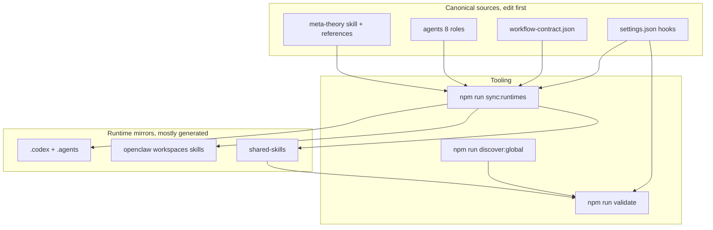

### 2. 기본 경로: 의도 → 진입 → 8단계 척추

`meta-theory`는 **스킬**(트리거 시 로드되는 방법서). `meta-warden`은 **에이전트**(기본 공개 진입, 게이트·종합).

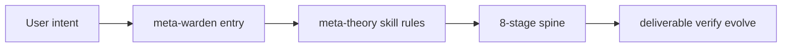

### 3. 8단계 척추

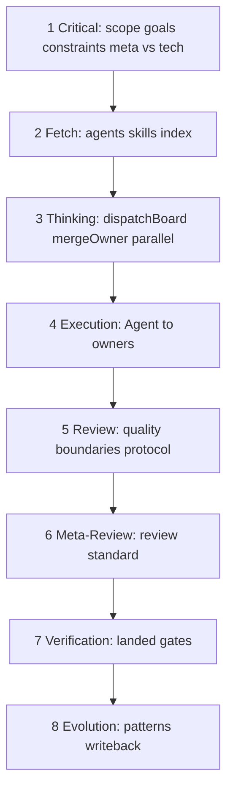

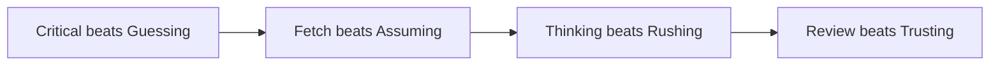

### 4. 이중 워크플로(척추 vs 부서 계약)

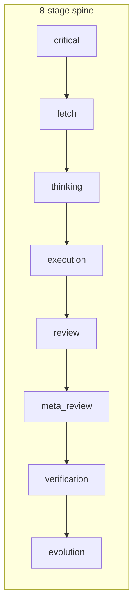

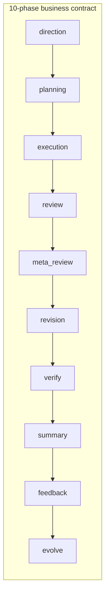

업무 단계는 척추 단계 이름을 **바꾸지 않습니다**. run 계약·표시·산출물 포장 층입니다.

### 5. 작업 분기

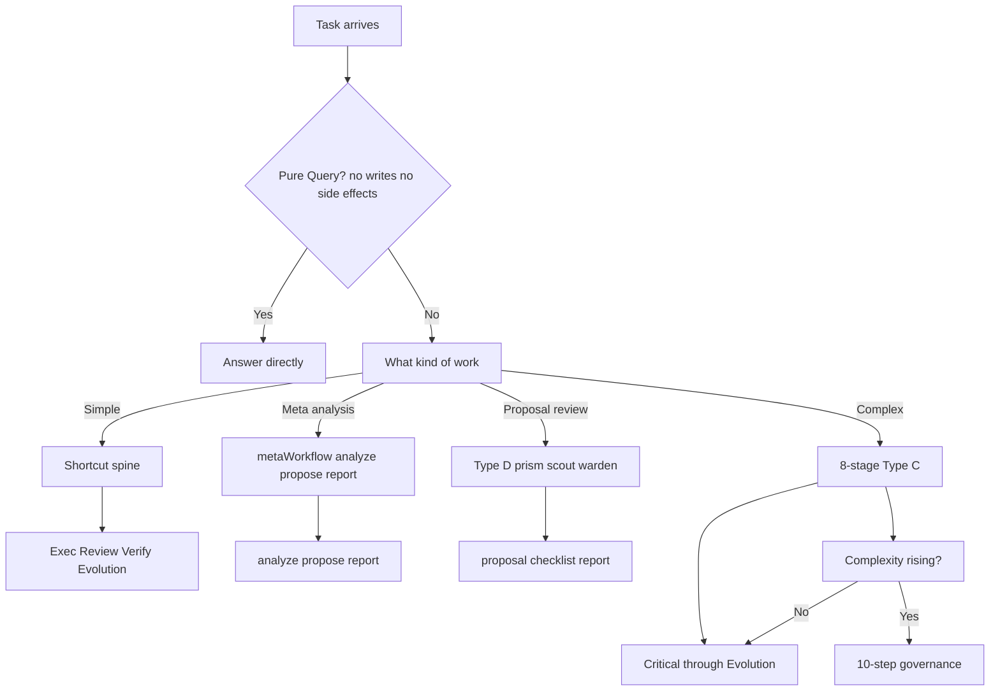

### 6. 핵심 방법 사슬(확장)

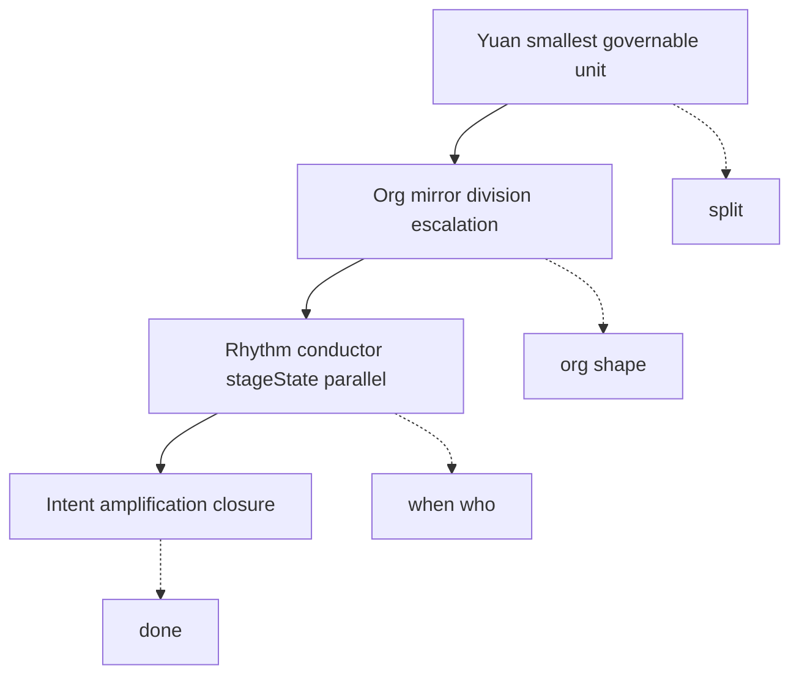

## 저자·지원

(연락처·결제 QR은 [README.md](README.md)와 동일합니다.)

## 논문·방법론 근거

- 논문: [Zenodo](https://zenodo.org/records/18957649)
- DOI: `10.5281/zenodo.18957649`

## 맞는 경우 / 맞지 않는 경우

**맞음**: 멀티 파일·모듈 간·멀티 런타임 작업, 에이전트/스킬/MCP 유지, 검토·롤백 가능한 협업을 원할 때.

**맞지 않음**: 일회성 가벼운 질문만, 단일 파일 위주, 즉시 쓰는 SaaS만 원할 때.

## 런타임 진입점

**Meta_Kim은 세 개의 별도 프로젝트가 아니라 하나의 방법의 세 가지 투영입니다.**

| 런타임 | 진입점 | 저장소 내 주요 위치 | 역할 |
| ------ | ------ | ------------------- | ---- |
| Claude Code | [CLAUDE.md](CLAUDE.md) | `.claude/`, `.mcp.json` | 정본 편집 런타임 |
| Codex | [AGENTS.md](AGENTS.md) | `.codex/`, `.agents/`, `codex/` | Codex 투영 |
| OpenClaw | `openclaw/workspaces/` | `openclaw/` | 로컬 workspace 투영 |

- 유지보수는 **`.claude/`와 `contracts/workflow-contract.json`에서 시작**
- `.codex/`, `openclaw/` 대부분은 생성물 또는 런타임 전용
- 편집 후 `npm run sync:runtimes` 등으로 재동기화

### OpenClaw 예시

```bash
npm install
npm run prepare:openclaw-local
openclaw agent --local --agent meta-warden --message "..." --json --timeout 120
```

## Meta_Kim의 「元(Meta)」

**元 = 의도 증폭을 뒷받침하기 위한 최소 거버넌스 가능 단위**

유효한 단위는 독립적으로 이해 가능하고, 충분히 작으며, 소유와 거절이 명시되며, 전체를 무너뜨리지 않고 교체 가능하며, 워크플로 전반에서 재사용 가능해야 합니다.

### 엔지니어링과의 관계

**엔지니어링은 원이 다스리는 영역 중 하나**입니다. 원 시스템은 엔지니어링을 닫힌 루프로 가져올 수 있지만, **만능 엔지니어와 같지는 않습니다**. 실행 세부는 명명된 오너에게 맡기고, 메타이론은 디스패처로 행동하는 것이 정본입니다.

## 코어 메서드

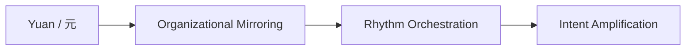

하나라도 빠지면 방법이 불완전합니다. 더 자세한 그림은 위「다이어그램」절을 보세요.

## 개발 거버넌스 척추(8단계)

복잡한 작업(멀티 파일·다중 역량 등)은 8단계 척추를 따릅니다.

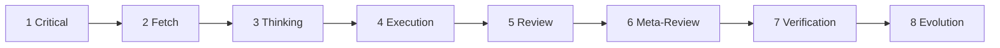

| 단계 | 목적(요약) |
| ---- | ---------- |
| Critical | 추측 전 요구 명확화 |
| Fetch | 기존 역량 탐색 |
| Thinking | 분할·오너·산출물·순서 설계 |
| Execution | 적절한 에이전트에 위임 |
| Review | 품질·경계 |
| Meta-Review | 검토 기준 자체의 타당성 |
| Verification | 수정이 실제로 반영되었는지 |
| Evolution | 패턴·흉터·재사용 지식 기록 |

보충 규칙(정본): 순수 `Q / Query`만 에이전트 우회 가능. 실행 가능 작업에는 오너 필수. Thinking은 프로토콜 우선. 독립 작업은 병렬 검토.

## 8단계 척추와 비즈니스 워크플로는 다름

- **8단계**: 복잡 개발의 실행 척추 (`meta-theory` / `dev-governance.md`)
- **10단계**: 부서 run 계약·표시·산출물 규율 (`workflow-contract.json`)

비즈니스 층은 척추를 **대체하지 않습니다**. 자세한 내용은 영문 [§ The 8-Stage Spine And The Business Workflow](README.md#the-8-stage-spine-and-the-business-workflow-are-not-the-same-thing)를 참고하세요.

## 워크플로 관계 지도

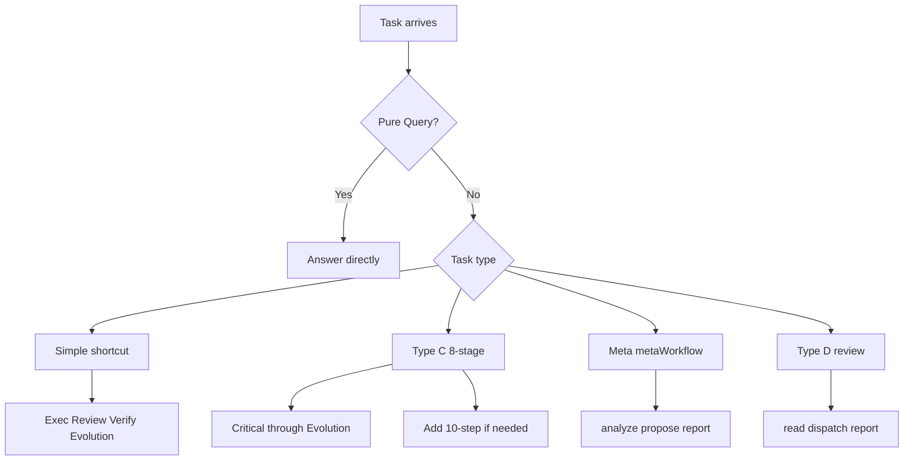

## 여덟 메타/元 에이전트

| 에이전트 | 주요 역할 |
| -------- | --------- |
| `meta-warden` | 기본 진입·중재·최종 종합 |
| `meta-conductor` | 단계·리듬 |
| `meta-genesis` | SOUL.md·페르소나 설계 |
| `meta-artisan` | 스킬·MCP·도구 적합 |
| `meta-sentinel` | 안전·권한·훅·롤백 |
| `meta-librarian` | 메모리·연속성 |
| `meta-prism` | 품질·드리프트·안티 슬롭 |
| `meta-scout` | 외부 역량 발견·평가 |

**공개 정문은 `meta-warden`.**

## 빠른 시작(요점)

```bash
git clone https://github.com/KimYx0207/Meta_Kim.git
cd Meta_Kim
node setup.mjs
```

또는 수동:

```bash
npm install
npm run sync:runtimes
npm run validate
```

전역 역량 색인: `npm run discover:global` (로컬 절대 경로 포함 → 보통 커밋하지 않음)

전체 절차·명령 표는 [README.md Quick Start / Commands](README.md#quick-start-clone-to-working-in-5-minutes)를 보세요.

## 자주 쓰는 npm 스크립트(발췌)

| 명령 | 용도 |
| ---- | ---- |
| `npm run validate` | 저장소 무결성(계약·에이전트·workspace·MCP 자가검사 등) |
| `npm run check:runtimes` | 미러가 정본과 일치하는지(쓰기 없음) |
| `npm run sync:runtimes` | 정본에서 미러 재생성 |
| `npm run test:meta-theory` | 메타이론 테스트 스위트 |
| `npm run eval:agents` | 런타임 경량 스모크 |
| `npm run validate:run -- <run.json>` | 기록된 run 아티팩트 검증 |
| `npm run doctor:governance` | 계약·훅·미러·샘플 validate:run 좁은 헬스체크 |
| `npm run verify:all` | 릴리스 전 넓은 스택(전역 meta-theory 동기 상태에도 의존) |

## 저장소 구조(요약)

```text
Meta_Kim/
├─ .claude/        정본: 에이전트·스킬·훅
├─ .codex/         Codex 미러
├─ .agents/        Codex 프로젝트 skill 미러
├─ openclaw/       OpenClaw workspace·스킬
├─ contracts/      거버넌스 계약
├─ scripts/        동기화·검증·MCP
├─ README.md / README.zh-CN.md / README.ja-JP.md / README.ko-KR.md
├─ CLAUDE.md / AGENTS.md
└─ …
```

직접 편집은 주로 `.claude/`와 `contracts/`. `.codex/`, `openclaw/workspaces/*`는 보통 `sync:runtimes`로 생성됩니다.

## 라이선스

[MIT License](LICENSE)

---

*이 문서는 커뮤니티용 한국어 안내입니다. 규율의 최종 해석은 영어 정본 및 `contracts/workflow-contract.json`을 따릅니다.*
