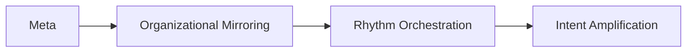
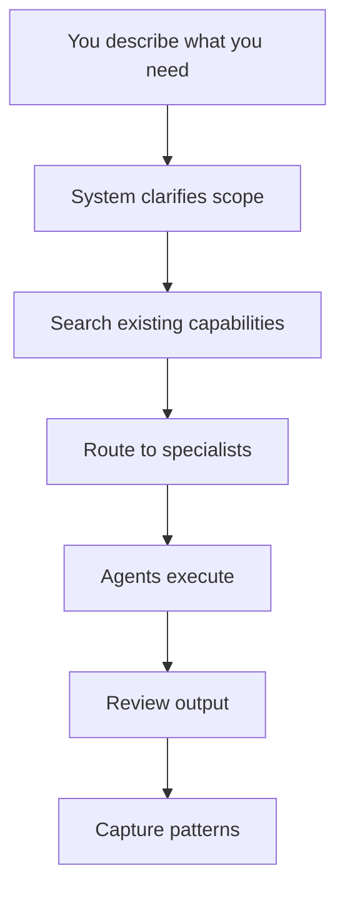

<div align="center">

<h1>Meta_Kim</h1>

<p>
  <a href="README.md">English</a> |
  <a href="README.zh-CN.md">简体中文</a>
</p>

<p>
  
  
  
  
</p>

**An open-source governance layer that makes AI coding assistants handle complex tasks properly — across Claude Code, Codex, and OpenClaw.**

Most AI coding tools jump straight to writing code. Meta_Kim adds a step in between: clarify what you actually need, plan who does what, then execute with review.

The result: fewer broken multi-file changes, clearer agent responsibilities, and reusable patterns instead of one-shot hacks.

</div>

## Author and Support

<div align="center">
  
  <p>
    GitHub <a href="https://github.com/KimYx0207">KimYx0207</a> |
    𝕏 <a href="https://x.com/KimYx0207">@KimYx0207</a> |
    Website <a href="https://www.aiking.dev/">aiking.dev</a> |
    WeChat Official Account: <strong>Lao Jin Takes You Through AI</strong>
  </p>
  <p>
    Feishu knowledge base:
    <a href="https://my.feishu.cn/wiki/OhQ8wqntFihcI1kWVDlcNdpznFf">ongoing updates</a>
  </p>
</div>

<div align="center">
  <table align="center">
    <tr>
      <td align="center">
        
        <br/>
        <strong>WeChat Pay</strong>
      </td>
      <td align="center">
        
        <br/>
        <strong>Alipay</strong>
      </td>
    </tr>
  </table>
</div>

## When You Need This

| Your situation | Without Meta_Kim | With Meta_Kim |
|---|---|---|
| "Refactor the auth module across 6 files" | AI jumps in, changes files, breaks things in other modules | Clarifies scope first, assigns the right agents, reviews cross-module impact |
| "Design a new agent for my project" | You get a generic template that doesn't fit your domain | System asks what you need, checks existing agents first, only creates if necessary |
| "My agents keep stepping on each other's toes" | Confusion, duplicated work, nobody knows who owns what | Clear ownership boundaries, governance flow, quality gates |

**If you only edit one file at a time, you don't need this.** Meta_Kim helps when work spans multiple files, modules, or requires coordination between different capabilities.

## What It Does

1. **Clarifies before executing** — asks follow-up questions when your request is vague, instead of guessing
2. **Searches before assuming** — checks if an existing agent/skill already does what you need
3. **Routes to the right agent** — breaks complex work into governable units with clear ownership
4. **Reviews every output** — code quality, security, architecture compliance, boundary violations
5. **Learns from each run** — captures reusable patterns, records failures for prevention

## At a Glance

- 8 specialized meta agents behind one default entry point
- Works on Claude Code, Codex, and OpenClaw with the same governance logic
- Every task goes through: Clarify → Search → Execute → Review → Evolve
- Discipline: one department, one primary deliverable, one closed handoff chain

## Quick Start (Clone to Working in 5 Minutes)

### Prerequisites

- **Node.js** v18+ (for sync, validate, and OpenClaw scripts)
- **Git** (to clone)
- **Claude Code CLI** (optional, only needed for `eval:agents`)
- **OpenClaw CLI** (optional, only needed for `npm run prepare:openclaw-local`)

### Step 1: Clone & Install

```bash
git clone <this-repo>
cd Meta_Kim
npm install
```

### Step 2: Sync Runtimes

```bash
npm run sync:runtimes
```

This synchronizes the 8 meta agents from `.claude/agents/` to all three runtime mirrors (Claude Code, Codex, OpenClaw). Run this **every time you modify an agent definition or SKILL.md**.

### Step 3: Discover Global Capabilities

```bash
npm run discover:global
```

Scans and indexes your globally-installed capabilities across all three runtimes (Claude Code, OpenClaw, Codex), generating a unified capability index. **Required on first setup; re-run after installing new global capabilities.**

Scan scope:
- **Claude Code** (`~/.claude/`): agents, skills, hooks, plugins, commands
- **OpenClaw** (`~/.openclaw/`): agents, skills, hooks, commands
- **Codex** (`~/.codex/`): agents, skills, commands

### Step 4: Validate

```bash
npm run validate
```

Checks that all agent frontmatter is valid, SKILL.md is synced across all layers, and OpenClaw/Codex config is intact.

**Expected output:** `Validation passed for 8 agents.`

### Step 5: Run a Health Check

```bash
node scripts/agent-health-report.mjs
```

Gives you a quick read on all 8 agents: version, frontmatter completeness, boundary definitions, workspace files, skill sync status, and a composite health score.

### Step 6: Start Using (in Claude Code)

Open the repo with Claude Code and just describe what you need:

```text
I need to refactor the authentication system — it's spread across 5 files and nobody knows which one handles token refresh anymore.
```

```text
Design me an agent that can handle data export jobs for this project.
```

```text
Something's wrong — my agents keep writing code that conflicts with each other.
```

The system automatically routes your request through the right governance flow. You don't need to know anything about meta agents, stages, or internal routing.

## What This Project Is

Meta_Kim is not a chatbot product, not a SaaS app, not a single giant prompt, and not a folder full of disconnected agent files.

It is an engineering system built around one idea:

**AI should understand what you actually need before it starts writing code.**

That means:

- the user starts with intent, not a finished specification
- the system first clarifies objective, boundaries, constraints, and deliverables
- work is routed through governable units instead of one giant undifferentiated context
- the same underlying discipline holds across Claude Code, Codex, and OpenClaw

Meta_Kim cares about whether complex tasks can be **sustained, stable, and governable** — not whether a single response looks right.

At the engineering level, it organizes:

- `agents`: responsibility boundaries and organizational roles
- `skills`: reusable capability blocks
- `MCP`: external capability interfaces
- `hooks`: runtime rules and automation interception
- `memory`: long-term continuity and context policy
- `workspaces`: local runtime operating spaces
- `sync / validate / eval`: synchronization, validation, and acceptance tooling

## The Meta Philosophy

In Meta_Kim:

**meta = the smallest governable unit that exists to support intent amplification**

A valid meta unit must be:

- independently understandable
- small enough to stay controllable
- explicit about what it owns and refuses
- replaceable without collapsing the whole system
- reusable across workflows

Meta is an architectural unit here, not decoration.

## Core Method

Meta_Kim follows one chain:



- `Meta`: how to split
- `Organizational Mirroring`: how to structure
- `Rhythm Orchestration`: how to dispatch
- `Intent Amplification`: how to complete

Remove any one of these and the method is incomplete.

## How the System Works

You don't need to know the internals. But if you're curious:



The default front door is `meta-warden`. The other seven meta agents are backstage specialists, not the public menu.

Every valid business run must keep a single organizing thread:

- one department
- one primary deliverable
- one closed handoff chain

If a plan bundles unrelated goals into the same run, `meta-conductor` should reject it and `meta-warden` should keep it out of public display.

## The Eight Meta Agents

- `meta-warden`: default entry, arbitration, synthesis
- `meta-conductor`: orchestration, sequencing, rhythm control
- `meta-genesis`: prompt identity, persona, `SOUL.md`
- `meta-artisan`: skills, MCP, tool and capability fit
- `meta-sentinel`: hooks, safety, permissions, rollback
- `meta-librarian`: memory, continuity, context policy
- `meta-prism`: quality review, drift detection, anti-slop checks
- `meta-scout`: external capability discovery and evaluation

## Runtime Entry Points

Meta_Kim keeps one operating logic while letting each runtime use its native interface.

| Runtime | Entry point | Main repo surface | Purpose |
| --- | --- | --- | --- |
| Claude Code | `CLAUDE.md` | `.claude/`, `.mcp.json` | Canonical editing runtime for meta agents, skills, hooks, and MCP |
| Codex | `AGENTS.md` | `.codex/`, `.agents/`, `codex/config.toml.example` | Codex-native agent and skill projection |
| OpenClaw | `openclaw/workspaces/` | `openclaw/` | Local workspace agents and template config with the same governance logic |

## How To Use It

### Auto Mode (just talk normally)

For complex tasks, just describe what you need. The governance flow activates automatically when the system detects multi-file or cross-module work.

```text
"Build a notification system — email, SMS, and in-app — with a shared queue and retry logic."
```

```text
"The checkout flow is broken across 3 services. Fix the race condition and add proper error handling."
```

The system will: ask clarifying questions if needed → search existing agents → route to the right specialist → execute → review → capture patterns.

### Manual Mode (when you know what you want)

If you specifically want to design, review, or audit agents:

```text
"Design an agent for handling data export jobs in this project."
```

```text
"Audit my agent definitions — are the boundaries clean?"
```

```text
"My agents keep overlapping responsibilities. Fix the organizational structure."
```

### Per-Runtime Setup

#### In Claude Code

Claude Code automatically reads `CLAUDE.md`, `.claude/agents/`, `.claude/skills/`, and `.mcp.json`. Just open the project and talk.

#### In Codex

Codex reads `AGENTS.md`, `.codex/agents/`, and `.agents/skills/`. For MCP wiring, see `codex/config.toml.example`.

#### In OpenClaw

```bash
npm install
npm run prepare:openclaw-local
```

Then talk to the agent directly:

```bash
openclaw agent --local --agent meta-warden --message "I need a system to handle batch data exports with progress tracking." --json --timeout 120
```

## Repository Structure

```text
Meta_Kim/
├─ .claude/        Canonical Claude Code source: agents, skills, hooks, settings
├─ .codex/         Codex-native agent and skill mirrors
├─ .agents/        Codex project-level skill mirror
├─ codex/          Codex global config example
├─ openclaw/       OpenClaw workspaces, template config, runtime mirrors
├─ contracts/      Runtime governance contracts
├─ images/         Public assets used by the README
├─ scripts/        Sync, validation, MCP, evaluation, OpenClaw helper, and agent health reporting scripts
├─ shared-skills/  Shared skill mirrors across runtimes
├─ AGENTS.md       Codex and cross-runtime guide
├─ CLAUDE.md       Claude Code guide
├─ .mcp.json       Claude Code project MCP entry
├─ README.md       English README
└─ README.zh-CN.md Chinese README
```

### Why There Is a `codex/` Folder

Codex uses two configuration layers:

- repo-local assets, which live in `.codex/` and `.agents/`
- user-global configuration, which cannot live directly inside the repository root

So:

- `.codex/` is the repo content Codex reads directly
- `codex/` is only the example directory for wiring `~/.codex/config.toml`

## Commands

### `npm install`

Run this after cloning if you want to use or validate the repo locally.

### `npm run sync:runtimes`

Run this after changing canonical agents, skills, or runtime-facing config. It rebuilds the runtime mirrors for Claude Code, Codex, and OpenClaw.

### `npm run discover:global`

Run this to scan and index your globally-installed capabilities across all three runtimes:

- **Claude Code** (`~/.claude/`): agents, skills, hooks, plugins, commands
- **OpenClaw** (`~/.openclaw/`): agents, skills, hooks, commands
- **Codex** (`~/.codex/`): agents, skills, commands

Generates `.claude/capability-index/global-capabilities.json` for use by the meta-theory skill's Fetch phase. This allows the meta architecture to see and integrate with your global capabilities.

### `npm run validate`

Run this to validate the canonical source files, agent definitions, SKILL.md sync, and OpenClaw/Codex configuration integrity.

### `npm run eval:agents`

Run this for runtime-level acceptance testing. It spawns each of the 8 meta agents and validates their boundary behavior against predefined test cases.

### `npm run verify:all`

Run this before publishing, shipping, or after substantial runtime changes. It performs the full validation and acceptance pass (validate + eval combined).

### `npm run prepare:openclaw-local`

Run this only if you want to execute the OpenClaw side on your own machine.

### `node scripts/agent-health-report.mjs`

Run this for a quick health check of all 8 meta agents. Outputs a markdown report covering version, frontmatter completeness, boundary definitions, workspace files, skill sync status, and overall health score.

## Simplest Starting Path

The [Quick Start section](#quick-start-clone-to-working-in-5-minutes) above gets you from clone to working in 5 minutes.

For reading order if you just want to understand:

1. `README.md` (this file) — start here
2. `CLAUDE.md` — Claude Code specific guide
3. `AGENTS.md` — Codex and cross-runtime guide

## Paper and Method Basis

The methodological basis comes from the evaluation work on meta-based intent amplification.

- Paper: <https://zenodo.org/records/18957649>
- DOI: `10.5281/zenodo.18957649`

The paper explains the method.  
This repository turns that method into runtime-ready engineering assets.

## License

This project is released under the [MIT License](LICENSE).
