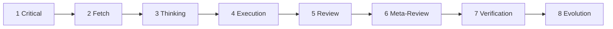
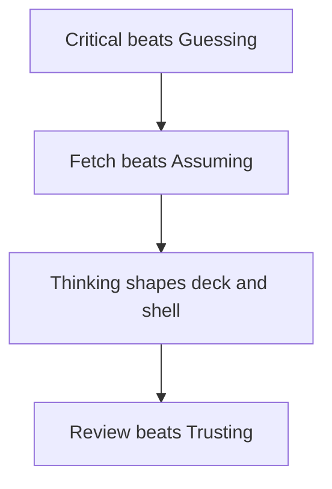
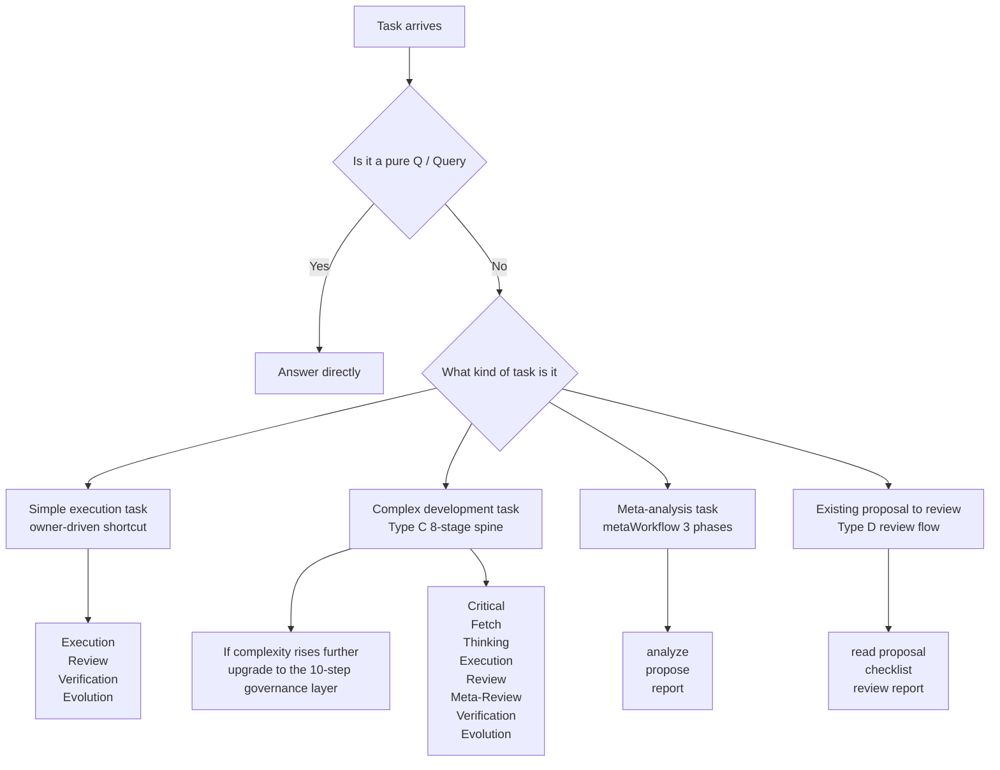
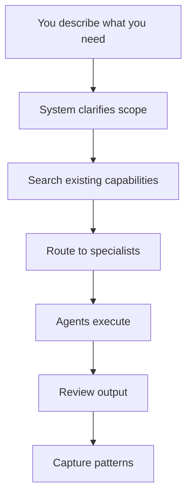

<div align="center">

<h1 style="font-size: 6em; font-weight: 900; margin-bottom: 0.2em; letter-spacing: 0.1em;">元</h1>
<p style="font-size: 1.2em; color: #7c3aed; font-weight: 600; margin-top: 0;">META_KIM</p>
<p style="color: #dc2626; font-weight: 700; margin-bottom: 0.5em;">⚠️ BETA VERSION — Work in Progress</p>

<p>
  <a href="README.md">English</a> |
  <a href="README.zh-CN.md">简体中文</a>
</p>

<p>
  
  
  
  
  
</p>

**A governance layer for AI coding assistants — designed to make complex tasks done right, with one unified discipline that runs on Claude Code, Codex, and OpenClaw.**

Most AI coding tools jump straight to writing code. Meta_Kim adds a step in between: clarify what you actually need, plan who does what, then execute with review.

The result: fewer broken multi-file changes, clearer agent responsibilities, and reusable patterns instead of one-shot hacks.

</div>

## At a Glance

- 8 specialized yuan / meta agents behind one public entry point
- **One unified governance discipline** projected across Claude Code, Codex, and OpenClaw
- Every complex task goes through: clarify -> search -> execute -> review -> evolve
- **Four iron rules**: Critical > Guessing, Fetch > Assuming, Thinking > Rushing, Review > Trusting
- Discipline: one department, one primary deliverable, one closed handoff chain
- The long-term source of truth mostly lives in `.claude/` and `contracts/workflow-contract.json`

## What This Project Is

Meta_Kim is not mainly about making AI write more code. It is about reducing the failure modes that show up when AI touches complex work:

- vague requests turn into guessing
- multi-file changes spill across boundaries
- the same agent / skill / config stack has to stay aligned across multiple runtimes
- nobody reviews, verifies, or captures what was learned

Meta_Kim solves that by doing **intent amplification before execution**.

In plain language, that means:

- turn a vague request into an executable task
- make scope, constraints, deliverables, and risks explicit
- route work to the right role instead of asking one giant context to brute-force everything

At the engineering level, it organizes:

- `agents`: responsibility boundaries and organizational roles
- `skills`: reusable capability blocks
- `MCP`: external capability interfaces
- `hooks`: runtime rules and automation interception
- `memory`: long-term continuity and context policy
- `workspaces`: local runtime operating spaces
- `sync / validate / eval`: synchronization, validation, and acceptance tooling

In one line:

**Meta_Kim cares less about whether a single answer looks right, and more about whether complex work can be sustained, stable, and governable.**

## Author and Support

<div align="center">
  
  <p>
    GitHub <a href="https://github.com/KimYx0207">KimYx0207</a> |
    𝕏 <a href="https://x.com/KimYx0207">@KimYx0207</a> |
    Website <a href="https://www.aiking.dev/">aiking.dev</a> |
    WeChat Official Account: <strong>老金带你玩AI</strong>
  </p>
  <p>
    Feishu knowledge base:
    <a href="https://my.feishu.cn/wiki/OhQ8wqntFihcI1kWVDlcNdpznFf">ongoing updates</a>
  </p>
</div>

<div align="center">
  <table align="center">
    <tr>
      <td align="center">
        
        <br/>
        <strong>WeChat Pay</strong>
      </td>
      <td align="center">
        
        <br/>
        <strong>Alipay</strong>
      </td>
    </tr>
  </table>
</div>

## Paper and Method Basis

The methodological foundation comes from evaluation work on meta-based intent amplification:

- Paper: <https://zenodo.org/records/18957649>
- DOI: `10.5281/zenodo.18957649`

The paper explains the method. This repository turns that method into runtime-ready engineering assets.

## Who This Is For

### Good Fit

- You work on multi-file, cross-module, or cross-runtime tasks
- You maintain agents, skills, hooks, MCP integrations, or other AI engineering assets
- You want AI collaboration that is reviewable, rollback-friendly, and maintainable over time

### Not A Good Fit

- You only want a lightweight one-off assistant
- You mostly edit a single file at a time
- You want a plug-and-play SaaS product

## Runtime Entry Points

The most important sentence in this repository is:

**Meta_Kim is one method projected into three runtimes, not three separate projects.**

| Runtime | Entry point | Main locations in this repo | Role |
| --- | --- | --- | --- |
| Claude Code | [CLAUDE.md](CLAUDE.md) | `.claude/`, `.mcp.json` | Canonical editing runtime and primary source of truth |
| Codex | [AGENTS.md](AGENTS.md) | `.codex/`, `.agents/`, `codex/` | Codex-native custom agent and skill projection |
| OpenClaw | `openclaw/workspaces/` | `openclaw/` | OpenClaw local workspace projection |

The practical takeaway is simple:

- **If you are maintaining the project, start from `.claude/` and `contracts/workflow-contract.json`.**
- Most content under `.codex/`, `.agents/`, and `openclaw/` is generated or runtime-specific.
- After editing canonical files, resync the runtime mirrors with the provided scripts.

### Per-Runtime Setup

#### In Claude Code

Claude Code automatically reads `CLAUDE.md`, `.claude/agents/`, `.claude/skills/`, and `.mcp.json`. Just open the project and talk.

#### In Codex

Codex reads `AGENTS.md`, `.codex/agents/`, `.agents/skills/`, and uses `codex/config.toml.example` as the MCP wiring example. Important: **Codex is a read / execute runtime, not the canonical editing runtime**. Edit `.claude/` first, then sync to Codex with `npm run sync:runtimes`.

#### In OpenClaw

```bash
npm install
npm run prepare:openclaw-local
```

Then you can call:

```bash
openclaw agent --local --agent meta-warden --message "I need a system to handle batch data exports with progress tracking." --json --timeout 120
```

## The Yuan Concept (元)

In Meta_Kim:

**yuan (`元`) = the smallest governable unit that exists to support intent amplification**

A valid yuan unit must be:

- independently understandable
- small enough to stay controllable
- explicit about what it owns and refuses
- replaceable without collapsing the whole system
- reusable across workflows

Yuan is an architectural unit here, not decoration.

## Core Method

Meta_Kim follows one chain:

```mermaid
flowchart LR
    A[Yuan (元)] --> B[Organizational Mirroring]
    B --> C[Rhythm Orchestration]
    C --> D[Intent Amplification]
```

- `Yuan (元)`: how to split
- `Organizational Mirroring`: how to structure
- `Rhythm Orchestration`: how to dispatch
- `Intent Amplification`: how to complete

Remove any one of these and the method is incomplete.

## Development Governance Spine (The Core - Read This First)

For **complex work** (multi-file, cross-module, or requiring multiple capabilities), Meta_Kim follows an eight-stage spine. The early chain lines up with the **four iron rules**: clarify before guessing, search before assuming, plan before rushing, verify before trusting, with **Thinking** in the middle to shape the deck and delivery shell.



| Stage | Purpose | Plain-English meaning |
| --- | --- | --- |
| `Critical` | Clarify | confirm what the user actually wants before guessing |
| `Fetch` | Search | look for existing capabilities before assuming they do not exist |
| `Thinking` | Plan | shape sub-tasks, ownership, deliverables, and sequencing |
| `Execution` | Execute | hand sub-tasks to the right agents |
| `Review` | Review | check code, boundaries, and quality |
| `Meta-Review` | Review the review | make sure the review standard itself is sound |
| `Verification` | Close the loop | confirm the fix really landed |
| `Evolution` | Learn | keep patterns, scars, and reusable knowledge |

The four iron rules underneath that flow are:



- `Critical > Guessing`
- `Fetch > Assuming`
- `Thinking > Rushing`
- `Review > Trusting`

Stage notes:

- **Stage 1 Critical**: clarify scope before guessing
- **Stage 2 Fetch**: search existing agents / skills before assuming they do not exist
- **Stage 3 Thinking**: plan sub-tasks, shape the deck, prepare the delivery shell
- **Stage 4 Execution**: route the work to the right roles instead of brute-forcing everything in one context
- **Stage 5 Review**: review every output against quality standards
- **Stage 6 Meta-Review**: review the review standard itself
- **Stage 7 Verification**: verify that fixes actually landed and close findings
- **Stage 8 Evolution**: capture patterns, scars, and reusable knowledge

There are 4 additional rules now enforced in the canonical sources:

- **Only pure `Q / Query` may bypass agents**: pure explanation / Q&A with no file change, no external side effect, and no handoff artifact
- **Every executable task needs an owner**: use an existing owner if one exists; otherwise resolve the owner first, then execute
- **Thinking is protocol-first**: `runHeader`, `dispatchBoard`, `workerTaskPacket`, `reviewPacket`, `verificationPacket`, and `evolutionWritebackPacket` must be defined before Execution starts
- **Parallelize when independence exists**: independent sub-tasks should declare `dependsOn`, `parallelGroup`, and `mergeOwner` rather than drifting into unnecessary serial execution

`meta-conductor` tracks `stageState` / `controlState` (including skip / interrupt / iteration). `meta-warden` and `meta-prism` own gates (`gateState`, verification closure). That hidden skeleton is not a second product UI; it keeps dealing rhythm and public-display discipline consistent.

## The 8-Stage Spine And The Business Workflow Are Not The Same Thing

This distinction matters because it is one of the easiest ways to misunderstand Meta_Kim.

There are two layers of workflow language in the project:

| Layer | Defined in | Purpose |
| --- | --- | --- |
| **8-stage spine** | `meta-theory` / `dev-governance.md` | canonical execution chain for complex development work |
| **10-phase business workflow** | `contracts/workflow-contract.json` | run-contract language, display language, and deliverable discipline for department runs |

The 8-stage spine remains the underlying execution backbone:

```text
Critical -> Fetch -> Thinking -> Execution -> Review -> Meta-Review -> Verification -> Evolution
```

The business workflow is a separate department-run vocabulary:

```text
direction -> planning -> execution -> review -> meta_review -> revision -> verify -> summary -> feedback -> evolve
```

The key relationship is:

- **the business workflow does not replace the 8-stage spine**
- it is better understood as a run-contract and delivery-packaging layer
- real complex development governance still runs on the 8-stage backbone
- phases such as `summary / feedback / evolve` are about run management and closure, not about renaming the underlying execution stages

If you remember one sentence, make it this:

**the 8-stage spine is the execution backbone; the 10 phases are the department-level run contract.**

## Workflow Relation Map

According to the actual project design, Meta_Kim does not have just one workflow. It has several paths layered together:



The 4 easiest misunderstandings here are:

- **the simplest path is not naked direct execution**. Only pure `Q / Query` may answer directly. The moment work executes, writes, hands off, or produces durable artifacts, it needs an owner.
- **simple tasks still have a compressed governed path**. That shortcut is `Execution → Review → Verification → Evolution`, not “just do it and trust it”.
- **the 8-stage spine is the formal backbone for complex development work**, while the 10-step governance is an upgrade layer, not a replacement.
- **the real 3-phase flow does exist, but it means `metaWorkflow = analyze → propose → report`**, not a standalone “review output → verify fixes → evolution” pipeline.

### Can you handcraft something first and then only send it through the last few stages?

There are two different cases:

- **If what you already have is a proposal / design / agent definition document**, that is closer to `Type D`: read proposal → checklist → output review report.
- **If what you already have is written code or another executable artifact**, you can theoretically treat it as a pre-existing artifact and attach it to the later chain, but you cannot pretend the earlier governance never existed.

The canonical project rules are explicit:

- `Review` first checks owner coverage and protocol compliance
- if there is no owner, no `dispatchBoard`, no `workerTaskPacket`, and no `mergeOwner`, the run should be marked protocol-non-compliant even if the code looks workable
- so “handcraft it first, then only run an imagined 3-stage validation flow” is **not** a canonical default path in this project

The more accurate mapping is:

- **reviewing a document / proposal** → use `Type D`
- **retrospectively validating an existing code artifact** → you may attach it to the review-side tail chain, but only after backfilling owner + protocol packets
- **doing complex development the Meta_Kim way** → still starts from `Critical / Fetch / Thinking`

## The Hidden State Skeleton And Public Display Gates

Meta_Kim is not only “a sequence of stages”.

Under the readable 8-stage flow, the project design also uses a hidden governance skeleton so a run cannot be treated as complete just because it looks complete.

Common state layers include:

| State layer | Typical values | Primary owner | Why it exists |
| --- | --- | --- | --- |
| `stageState` | `Critical -> ... -> Evolution` | Conductor | track canonical stage progression |
| `controlState` | `normal / skip / interrupt / intentional-silence / iteration` | Conductor | change dealing rhythm without inventing fake stages |
| `gateState` | `planning-open / verification-open / synthesis-ready` | Warden + Prism | separate stage completion from actual gate clearance |
| `surfaceState` | `debug-surface / internal-ready / public-ready` | Warden | decide whether a run is displayable |
| `capabilityState` | `covered / partial / gap / escalated` | Scout + Artisan | make capability coverage explicit |
| `agentInvocationState` | `idle / discovered / matched / dispatched / returned / escalated` | meta-theory | enforce search-first delegation instead of lazy self-execution |

This skeleton is intentionally **hidden**:

- it is not a second UI
- it is not there to expose more labels to the user
- it exists to support gates, skips, interrupts, verification, and evolution logging

### What Counts As Publicly Displayable

In the project design, a run must satisfy all of these before entering public display:

- `verifyPassed`
- `summaryClosed`
- `singleDeliverableMaintained`
- `deliverableChainClosed`
- `consolidatedDeliverablePresent`

In practical terms:

- “it looks done” is not enough
- “there is something to show” is not enough
- if verification is still open, the deliverable chain is broken, or synthesis is not closed, the run should remain on the debug or internal surface

## Rollback Protocol

The Verification stage does not only decide pass or fail. It also decides whether a rollback is necessary.

Meta_Kim treats rollback as a layered response:

| Rollback level | Trigger | Action |
| --- | --- | --- |
| File-level | a regression is isolated to one file | restore that file to the last known good state |
| Sub-task level | one sub-task broke adjacent paths | rollback only that sub-task’s file set |
| Partial rollback | some sub-tasks succeeded and some failed | keep the successful work, rollback the failed portion, then re-enter Thinking |
| Full rollback | cross-module contamination or invalidated assumptions | stash uncommitted changes and return to Stage 1 with a revised scope |

The simple mental model is:

- small problem, small rollback
- cross-module damage, do not keep pushing forward blindly
- a governance system without rollback is not a complete governance system

The iron rule is:

**rollback is not failure; rollback is the system knowing when to stop making things worse.**

## Evolution Is Not “A Nice Retrospective” - It Must Be Persisted

In Meta_Kim, `Evolution` is not just a conversational summary. Structural learning is expected to be written back to disk.

Typical outputs and storage locations are:

| Output | Storage location | Meaning |
| --- | --- | --- |
| Reusable patterns | `memory/patterns/{pattern-name}.md` | preserve repeatable solutions |
| Scars | `memory/scars/{scar-id}.yaml` | turn failures into future prevention rules |
| New skills | `.claude/skills/{skill-name}/SKILL.md` | convert learning into callable capability |
| Agent boundary adjustments | `.claude/agents/{agent}.md` | usually followed by `npm run sync:runtimes` |
| Rhythm optimizations | `contracts/workflow-contract.json` or Conductor defaults | improve the next dispatch cycle |
| Capability gap records | `memory/capability-gaps.md` | keep unresolved gaps visible to Scout |

If an Evolution artifact has no explicit storage location, it does not count as captured learning.

The canonical rules now also require one extra owner question after each run:

- does the current owner still fit?
- should the owner boundary be adjusted?
- if a temporary `generalPurpose` owner was used, should it now become a real maintained capability?

## When You Need This

| Your situation | Without Meta_Kim | With Meta_Kim |
| --- | --- | --- |
| “Refactor the auth module across 6 files” | AI jumps in, changes files, breaks things in other modules | clarifies scope first, assigns the right roles, reviews cross-module impact |
| “Design a new agent for my project” | you get a generic template that does not fit your domain | the system asks what you need, checks existing agents first, and only creates one when necessary |
| “My agents keep stepping on each other’s toes” | confusion, duplicated work, nobody knows who owns what | clear ownership boundaries, governance flow, quality gates |

**If you mostly edit one file at a time, you probably do not need this.** Meta_Kim helps when work spans files, modules, or capability boundaries.

## What It Does

1. **Clarifies before executing**: asks follow-up questions when the request is vague instead of guessing
2. **Searches before assuming**: checks whether an existing agent / skill already covers the job
3. **Establishes an owner before execution**: except for pure queries, every executable task needs an explicit owner
4. **Defines the protocol before work starts**: task packets, handoff chain, review packet, and verification packet come first
5. **Parallelizes when safe**: independent tasks should not be serialized by default
6. **Reviews every output**: code quality, safety, architecture compliance, protocol compliance, and boundary violations
7. **Writes learning back into the system**: reusable patterns, scars, and owner / skill / contract adjustments are persisted

## The Eight Yuan / Meta Agents

| Agent | Main job | Human shorthand |
| --- | --- | --- |
| `meta-warden` | default entry, arbitration, final synthesis | project manager / coordinator |
| `meta-conductor` | sequencing and rhythm control | dispatcher |
| `meta-genesis` | `SOUL.md`, persona, cognitive structure | prompt and role architect |
| `meta-artisan` | skills, MCP, tool fit | capability engineer |
| `meta-sentinel` | safety, permissions, hooks, rollback | security guardrail |
| `meta-librarian` | memory and continuity | knowledge keeper |
| `meta-prism` | quality review, drift detection, anti-slop checks | quality forensic reviewer |
| `meta-scout` | external capability discovery and evaluation | scout and evaluator |

If you are a normal user, remember just one thing:

**the public front door is `meta-warden`.**

## How the System Works

You do not need to know the internals. But if you are curious:



Every valid business run must keep a single organizing thread:

- one department
- one primary deliverable
- one closed handoff chain

If a run bundles unrelated goals into the same thread, `meta-conductor` should reject it and `meta-warden` should keep it out of public display.

## How To Use It

### Auto Mode (just talk normally)

For complex work, just describe what you need. The governance flow activates automatically when the system detects multi-file or cross-module work.

```text
Build a notification system - email, SMS, and in-app - with a shared queue and retry logic.
```

```text
The checkout flow is broken across 3 services. Fix the race condition and add proper error handling.
```

The system will: ask clarifying questions if needed -> search existing agents -> route to the right specialist -> execute -> review -> capture patterns.

If Fetch discovers that no clean owner exists, the normal path is not “just do it directly.” The project now distinguishes:

- durable / recurring gap -> create or compose the owner first (Type B), then execute
- one-off low-risk gap -> allow a temporary `generalPurpose` owner, then review that choice during Evolution

### Manual Mode (when you know what you want)

If you specifically want to design, review, or audit agents:

```text
Design an agent for handling data export jobs in this project.
```

```text
Audit my agent definitions - are the boundaries clean?
```

```text
My agents keep overlapping responsibilities. Fix the organizational structure.
```

## Repository Structure

```text
Meta_Kim/
├─ .claude/        Canonical source: agents, skills, hooks, settings
├─ .codex/         Codex custom agent mirrors
├─ .agents/        Codex project-level skill mirror
├─ codex/          Codex global config example
├─ openclaw/       OpenClaw workspaces, skills, config templates
├─ contracts/      Runtime governance contracts
├─ docs/           Method docs, repo map, capability matrix
├─ scripts/        Sync, validation, discovery, MCP, health scripts
├─ shared-skills/  Shared skill mirrors across runtimes
├─ README.md
├─ README.zh-CN.md
├─ CLAUDE.md
├─ AGENTS.md
└─ CHANGELOG.md
```

### Files You Should Usually Edit

If you are maintaining Meta_Kim, start with these:

- `.claude/agents/*.md`
- `.claude/skills/meta-theory/SKILL.md`
- `contracts/workflow-contract.json`
- `docs/meta.md`
- `README.md`
- `README.zh-CN.md`
- `CLAUDE.md`
- `AGENTS.md`

### Files You Usually Should Not Edit By Hand

Unless you know exactly why, do not treat these as the long-term maintenance source:

- `.codex/agents/*.toml`
- `.agents/skills/meta-theory/`
- `.codex/skills/meta-theory.md`
- `shared-skills/meta-theory.md`
- `openclaw/skills/meta-theory.md`
- `openclaw/workspaces/*`
- `openclaw/openclaw.local.json`

Those are normally maintained by:

- `npm run sync:runtimes`
- `npm run prepare:openclaw-local`

### Why There Is a `codex/` Folder

Codex uses two configuration layers:

- repo-local assets, which live in `.codex/` and `.agents/`
- user-global configuration, which cannot live directly inside the repository root

So:

- `.codex/` is the repo content Codex reads directly
- `codex/` is only the example directory for wiring `~/.codex/config.toml`

## Hooks (Claude Code)

Meta_Kim ships 7 project-level hooks in `.claude/settings.json`:

| Hook | Type | Purpose |
| --- | --- | --- |
| `block-dangerous-bash.mjs` | PreToolUse/Bash | block destructive commands (`rm -rf`, `DROP TABLE`, force-push) |
| `pre-git-push-confirm.mjs` | PreToolUse/Bash | remind to review before `git push` |
| `post-format.mjs` | PostToolUse/Edit,Write | auto-format JS/TS files with prettier |
| `post-typecheck.mjs` | PostToolUse/Edit,Write | run type checks after editing `.ts` / `.tsx` |
| `post-console-log-warn.mjs` | PostToolUse/Edit,Write | warn about `console.log` in edited files |
| `subagent-context.mjs` | SubagentStart | inject project context into spawned subagents |
| `stop-console-log-audit.mjs` | Stop | audit modified files for `console.log` before the session ends |

Codex and OpenClaw use their own native mechanisms for equivalent behavior.

## Quick Start (Clone to Working in 5 Minutes)

### Prerequisites

- **Node.js** v18+ (for sync, validate, and OpenClaw scripts)
- **Git** (to clone)
- **Claude Code CLI** (optional, only needed for `eval:agents`)
- **Codex CLI** (optional, only needed for `eval:agents`)
- **OpenClaw CLI** (optional, only needed for `npm run prepare:openclaw-local`)

### First-Time Setup

#### 1. Clone and install dependencies

```bash
git clone <repo-url>
cd Meta_Kim
npm install
```

#### 2. Sync the runtime mirrors

```bash
npm run sync:runtimes
```

This rebuilds the Codex, OpenClaw, and shared-skill projections from the canonical `.claude/` source.

If you only want to check whether they are already in sync, use:

```bash
npm run check:runtimes
```

#### 3. Install meta-skill dependencies (optional, but recommended)

```bash
npm run deps:install
```

This installs the 9 community skills Meta_Kim depends on into `~/.claude/skills/`.

Notes:

- this is a **global Claude Code ecosystem install**, not a repo-local install
- the script runs through `bash install-deps.sh`
- **Windows users need `bash` available**, typically via Git Bash or WSL

To update those dependencies later:

```bash
npm run deps:update
```

#### 4. Discover global capabilities

```bash
npm run discover:global
```

This scans your machine and generates:

```text
.claude/capability-index/global-capabilities.json
```

It covers:

- `~/.claude/`: agents, skills, hooks, plugins, commands
- `~/.openclaw/`: agents, skills, hooks, commands
- `~/.codex/`: agents, skills, commands

If you want to inspect CLI detection first, run:

```bash
npm run probe:clis
```

#### 5. Run the integrity validation

```bash
npm run validate
```

This checks:

- required files
- workflow contract integrity
- Claude agent definitions
- OpenClaw workspaces
- cross-runtime `SKILL.md` sync
- Codex agent definitions
- hooks, MCP config, and package scripts

#### 6. Run runtime acceptance only when you need it

```bash
npm run eval:agents
```

This is the real runtime acceptance step:

- installed and healthy runtimes report `passed`
- optional runtimes that are missing, unavailable, or timed out may report `skipped`
- actual regressions or broken config report `failed`

Run everything together with:

```bash
npm run verify:all
```

#### 7. Prepare OpenClaw locally only if you plan to use it

```bash
npm run prepare:openclaw-local
```

You only need this when you want to run the OpenClaw side on your own machine.

#### 8. Run a health check

```bash
node scripts/agent-health-report.mjs
```

This gives you a quick view of version, frontmatter completeness, boundary definitions, workspace files, and skill sync status across all 8 agents.

#### 9. Start using it (in Claude Code)

You can simply say:

```text
I need to refactor the authentication system - it is spread across 5 files and nobody knows which one handles token refresh anymore.
```

```text
Design me an agent that can handle data export jobs for this project.
```

```text
Something is wrong - my agents keep writing code that conflicts with each other.
```

The system routes each request through the matching governance stage.

## Commands

| Command | When to use it | What it does |
| --- | --- | --- |
| `npm install` | first setup | installs Node dependencies |
| `npm run sync:runtimes` | after editing canonical source | rebuilds runtime mirrors |
| `npm run check:runtimes` | when you only want a diff check | verifies mirrors are current without rewriting |
| `npm run deps:install` | first Claude ecosystem setup | installs 9 global meta-skills |
| `npm run deps:update` | when skill dependencies need updating | updates installed meta-skills |
| `npm run discover:global` | first setup and after adding global capabilities | rebuilds the global capability index |
| `npm run probe:clis` | when CLI availability is unclear | probes Claude / Codex / OpenClaw CLIs |
| `npm run test:mcp` | after changing MCP-related code | self-tests `meta-runtime-server` |
| `npm run validate` | before committing | runs static integrity validation |
| `npm run check` | when you want a quick static pass | runs `check:runtimes + validate` |
| `npm run eval:agents` | for runtime acceptance | runs Claude / Codex / OpenClaw evaluation |
| `npm run verify:all` | before release or after bigger changes | runs `check + eval:agents` |
| `node scripts/agent-health-report.mjs` | when you want an overview | generates a health report for all 8 agents |

**Windows / PATH:** a Node process started from a GUI app or editor task may inherit a shorter `PATH` than your terminal. If `eval:agents` cannot find a CLI, first check `%APPDATA%\\npm\\`, then `where.exe`, and if needed set absolute paths through:

- `META_KIM_CLAUDE_BIN`
- `META_KIM_CODEX_BIN`
- `META_KIM_OPENCLAW_BIN`

## A Safe Maintenance Loop

If you are changing agents, skills, README files, or runtime-facing config, the safest loop is:

1. edit canonical `.claude/` sources or shared documentation
2. if the change affects run discipline, gates, or deliverable policy, update `contracts/workflow-contract.json`
3. run `npm run sync:runtimes`
4. run `npm run discover:global`
5. run `npm run validate`
6. run `npm run eval:agents` only when runtime acceptance matters

That keeps the three runtime projections aligned.

## Newcomer FAQ

### 1. Do I need Claude Code, Codex, and OpenClaw all installed?

No. Meta_Kim is cross-runtime by design, but you do not have to use all three.

### 2. Can I maintain this by editing only `.codex/` or `openclaw/`?

Technically yes, but that is not the intended maintenance path. In most cases, edit `.claude/` first and then sync.

### 3. Should I commit the `discover:global` output?

Usually no. It is machine-local capability inventory with local absolute paths.

### 4. If `eval:agents` says `skipped`, is the project broken?

Not necessarily. `skipped` usually means a runtime is optional and currently unavailable, not installed, or timed out. Real failures are reported as `failed`.

### 5. Why is the default front door not a menu of 8 agents?

Because Meta_Kim is designed to receive one user request through one public entry point, then do specialization backstage.

### 6. When can a task skip agents entirely?

Only for pure `Q / Query` work: explanation or Q&A with no code change, no external side effect, and no deliverable / handoff chain. Once the task executes, produces artifacts, or enters review / verification, it needs an owner.

### 7. Is `docs/meta.md` required reading?

No. It is the long-form theory manuscript. Start with this README instead.

### 8. I only want the directory map. What should I read?

Read `docs/repo-map.md`.

### 9. I want the runtime differences. What should I read?

Read `docs/runtime-capability-matrix.md`.

## Simplest Starting Path

The [Quick Start section](#quick-start-clone-to-working-in-5-minutes) above already takes you from clone to working.

If this is your first time here, the lowest-friction order is:

1. start with `README.md`
2. then read [CLAUDE.md](CLAUDE.md) or [AGENTS.md](AGENTS.md)
3. then read `docs/repo-map.md`
4. only read `docs/meta.md` when you want the deeper theory

## Author and Resources

- GitHub: <https://github.com/KimYx0207>
- X: <https://x.com/KimYx0207>
- Website: <https://www.aiking.dev/>
- WeChat Official Account: `老金带你玩AI`
- Feishu knowledge base: <https://my.feishu.cn/wiki/OhQ8wqntFihcI1kWVDlcNdpznFf>
- Paper: <https://zenodo.org/records/18957649>
- DOI: `10.5281/zenodo.18957649`

## License

This project is licensed under the [MIT License](LICENSE).
