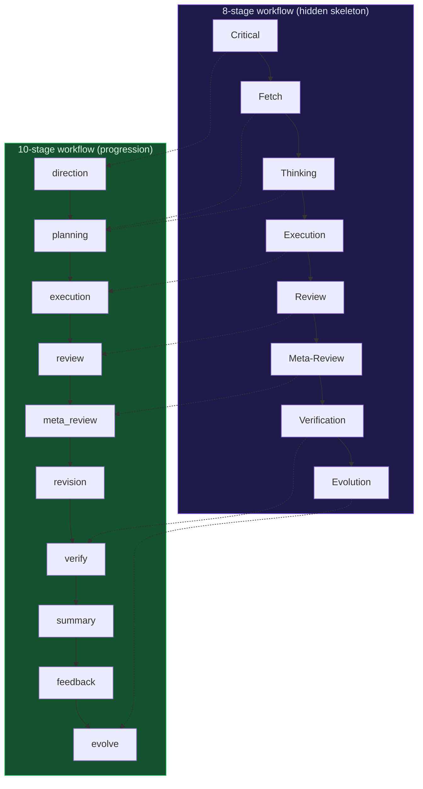
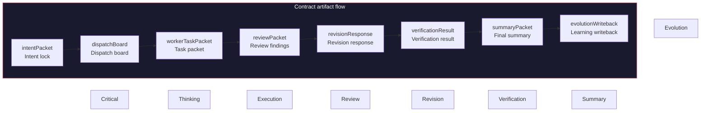
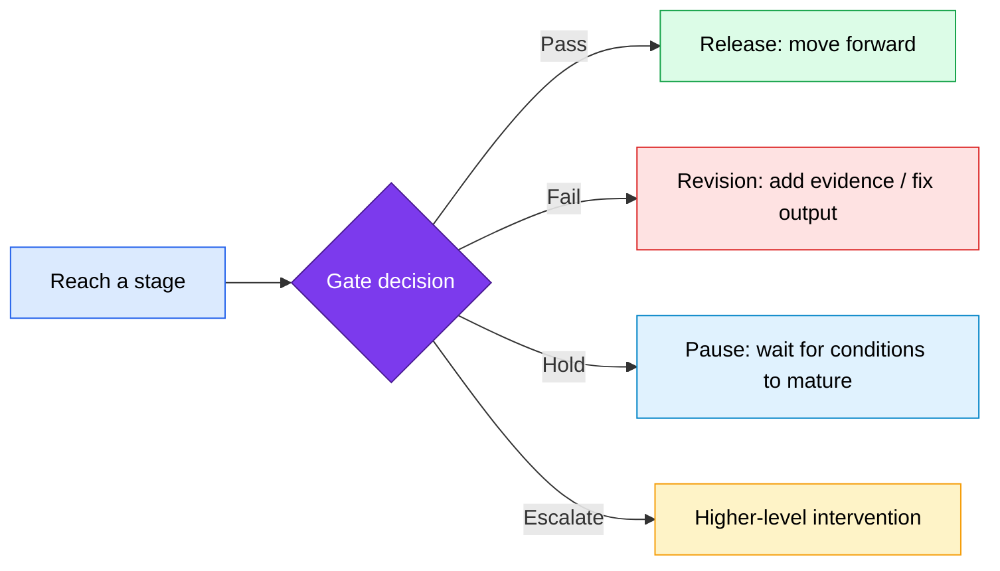
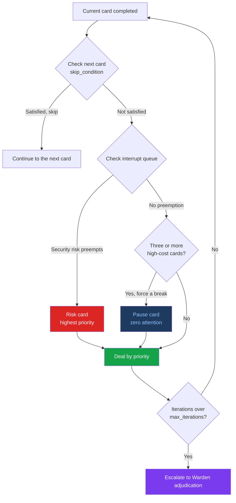
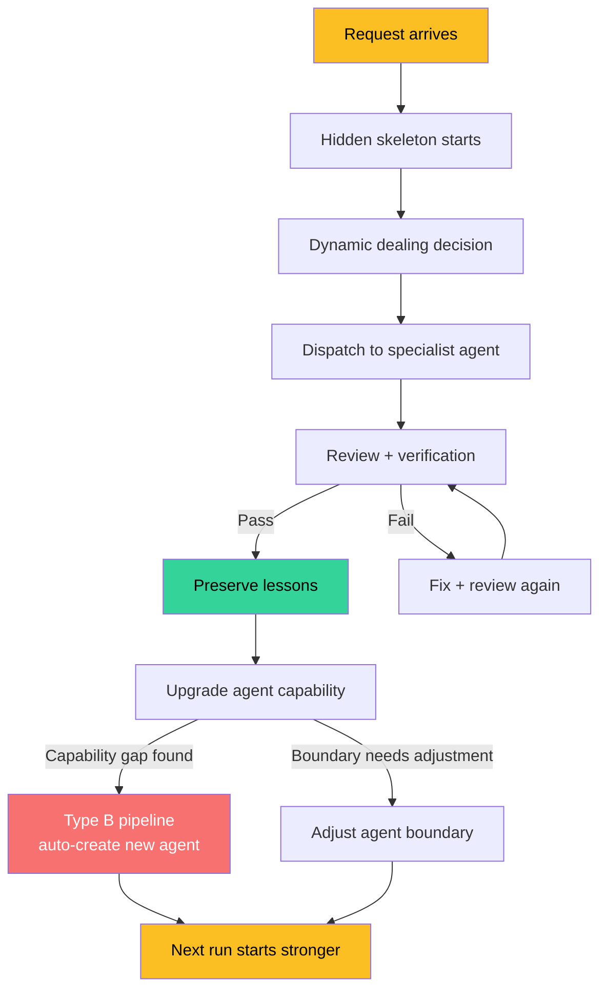
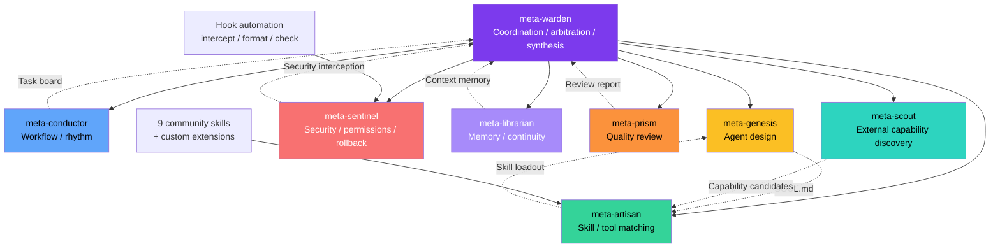
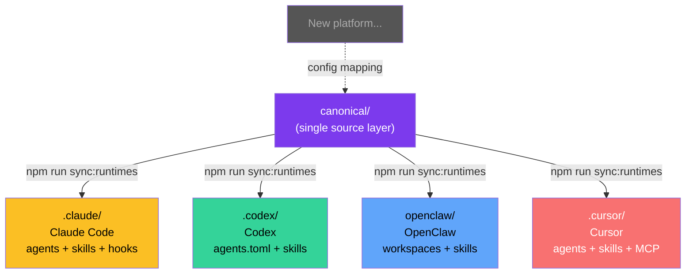
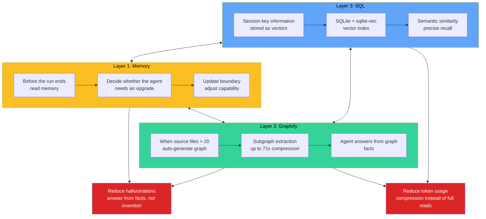

<div align="center">

<h1 style="font-size: 6em; font-weight: 900; margin-bottom: 0.2em; letter-spacing: 0.1em;">元</h1>
<p style="font-size: 1.2em; color: #7c3aed; font-weight: 600; margin-top: 0;">META_KIM</p>

<p>
  <a href="README.md">English</a> |
  <a href="README.zh-CN.md">简体中文</a> |
  <a href="README.ja-JP.md">日本語</a> |
  <a href="README.ko-KR.md">한국어</a>
</p>

<p>
  
  
  
</p>

</div>

## Overview

**Meta_Kim** is not another AI coding tool. It is a governance system that gives AI coding assistants a brain.

Claude Code, Codex, OpenClaw, and Cursor are all hands: they can write code and change files. But who decides which file to change first? Who reviews the result? Who fixes the problems that show up? And how do we make sure the same mistake does not repeat next time?

Meta_Kim is built for that. It is **AI above AI**: a unified governance layer that keeps complex work from turning into a mess.

### One-line summary

> **First clarify what needs to happen -> then decide who should do it -> review after execution -> preserve what was learned -> feed that back into the next run.**

This is not a new concept. Mature engineering teams already do this. Meta_Kim turns it into a runnable system instead of relying on human discipline alone.

## Quick Start

If you just want to try it quickly, run:

```bash
npx --yes github:KimYx0207/Meta_Kim meta-kim
```

Or install it the traditional way:

```bash
git clone https://github.com/KimYx0207/Meta_Kim.git
cd Meta_Kim
node setup.mjs
```

If you plan to maintain the repository, edit `canonical/` and `config/contracts/workflow-contract.json` first, then run:

```bash
npm run sync:runtimes
npm run validate
```

Recommended reading order:

1. This file, `README.md`
2. `AGENTS.md`
3. `docs/runtime-capability-matrix.md`

---

## Contact


GitHub <a href="https://github.com/KimYx0207">KimYx0207</a> |
X <a href="https://x.com/KimYx0207">@KimYx0207</a> |
Website <a href="https://www.aiking.dev/">aiking.dev</a> |
WeChat Official Account: <strong>老金带你玩AI</strong>

Feishu knowledge base:
<a href="https://my.feishu.cn/wiki/OhQ8wqntFihcI1kWVDlcNdpznFf">long-term updates</a>

### Buy me a coffee

If Meta_Kim has been useful, support the project with a coffee.

| WeChat Pay | Alipay |
| --- | --- |
|  |  |docs/images/wechat-pay.jpg) |  |

### Method basis

Meta_Kim’s methodological foundation comes from research on meta-based intent amplification, authored by this project’s maintainer (KimYx0207):

- Paper: <https://zenodo.org/records/18957649>
- DOI: `10.5281/zenodo.18957649`

---

## Architecture: Hidden Skeleton + Dynamic Dealing

This is the core design idea of Meta_Kim. If you only read one section, read this one.

### First, split the core terms so they do not get mixed up later

| Concept | What it is | What it is not |
| --- | --- | --- |
| **Hidden skeleton** | The backend framework that always exists under the visible workflow | A fixed list of responsibilities written in advance |
| **8-stage workflow** | The human-readable execution spine exposed by the hidden skeleton | The whole governance logic |
| **10-stage workflow** | A more complex progression layered on top of the 8 stages after classification | A replacement for the 8 stages |
| **Dealing** | Dynamic control built around the 8-stage workflow and agent units | Simple task assignment |
| **Gate** | A pass/fail condition | The stage itself |
| **Contract** | The structured output a node must produce | Slogans or abstract values |
| **Agent-unit governance** | A practical way to manage boundaries, capabilities, upgrades, and rollback | A role menu |
| **Three-layer memory** | Long-term memory split across memory / graphify / SQL | One mixed notebook |

If you only want one sentence to remember:

> **The 8-stage workflow moves execution forward, gates decide whether a stage can pass, contracts define the required outputs, and dealing adds dynamic intervention.**

### 8 stages = the hidden skeleton

Meta_Kim has 8 fixed execution stages. This is the **hidden skeleton**:

```mermaid
flowchart LR
    C[Critical<br/>Clarify the request] --> F[Fetch<br/>Search capabilities]
    F --> T[Thinking<br/>Plan the approach]
    T --> E[Execution<br/>Dispatch the work]
    E --> R[Review<br/>Inspect the result]
    R --> MR[Meta-Review<br/>Review the review]
    MR --> V[Verification<br/>Verify reality]
    V --> EV[Evolution<br/>Write back lessons]

    style C fill:#fbbf24,color:#000
    style F fill:#34d399,color:#000
    style T fill:#60a5fa,color:#000
    style E fill:#f87171,color:#fff
    style R fill:#a78bfa,color:#fff
    style MR fill:#a78bfa,color:#fff
    style V fill:#34d399,color:#000
    style EV fill:#fbbf24,color:#000
```



**Critical - pin down the real problem first**

When the request is vague, ask clarifying questions instead of guessing. This stage produces `intentPacket`, which locks down the real user intent, success criteria, and exclusions. If the request is already clear, the system records an explicit skip reason instead of quietly skipping.

**Fetch - search existing capabilities before inventing new ones**

Search whether existing agents, skills, tools, or MCP integrations already cover the need. The core idea here is **capability-first**: define the capability first, then search for the owner that declares it, then dispatch to the best match. Do not start by hardcoding a specific agent name.

**Thinking - define boundaries, owners, sequence, deliverables, risks, and stop conditions**

Break the task into subtasks, assign owners, and make dependencies and parallel groups explicit. This stage produces a `dispatchBoard`: who does what, what can run in parallel, and who is responsible for merging the result. At least two solution paths should be explored; do not lock into a single route too early.

**Execution - produce the actual work while still under governance**

Dispatch the subtasks to specialist agents. Each subtask is wrapped in a `workerTaskPacket`, including file context, constraints, review owner, and verification owner. Independent subtasks should run in parallel when possible. **Execution is not completion** - the output still has to pass review and verification.

**Review - check quality and boundary compliance**

Inspect code quality, security, architecture compliance, and boundary violations. Produce a structured `reviewPacket` with findings. Each finding has a severity from CRITICAL to LOW. This is not a formality - unresolved findings cannot move forward.

**Meta-Review - inspect whether the review standard itself is biased or too loose**

Review the review. If the review standard is too weak, the system is not really reviewing. If it is biased, it is reviewing the wrong thing. This stage protects the quality of the review system itself.

**Verification - confirm that reality matches the claim**

Verify whether the fixes really closed the review findings. This stage produces `verificationResult` and `closeFindings`. If the fix did not actually close the finding, go back and repair it before verifying again. This is the most honest gate in the system.

**Evolution - write capability gaps and reusable patterns back into the system**

Convert experience into structural upgrades: reusable patterns go into memory, failures become learning artifacts, capability gaps are handed to Scout, and agent boundaries are written back into canonical sources. Every run must end with a `writebackDecision`: either write back something concrete or explicitly explain why there is nothing to persist. **A run that does not preserve learning is wasted work.**

---

The 8 stages together form the execution spine.

Why are they only "relatively" fixed? Because some stages can be skipped in simple cases - but the system must explicitly record why they were skipped. Nothing is skipped silently.

### 10 stages = a progression workflow built on the skeleton

If the 8-stage workflow is the skeleton, then the 10-stage workflow is the **more complex progression** that grows on top of it:

```text
direction -> planning -> execution -> review -> meta_review -> revision -> verify -> summary -> feedback -> evolve
```

It is not a second system. It is derived from the 8-stage skeleton. The difference is:

- **The 8 stages** focus on execution logic - "what order should work happen in"
- **The 10 stages** focus on governance - "what each stage must deliver and how completion is defined"



The 10-stage workflow adds `revision`, `summary`, and `feedback`, so the process is not only about "getting it done" but also about getting it done well and closing the loop correctly.

### Contracts = what each node must deliver

Workflow alone is not enough. Each stage also needs to define **what it must output**. That is what the contracts do.

Meta_Kim contracts are not verbal agreements. They are **structured packets**:

| Contract artifact | Stage | Purpose |
| --- | --- | --- |
| `intentPacket` | Critical | Lock the real intent and prevent drift |
| `dispatchBoard` | Thinking | Define owners, dependencies, and parallel groups |
| `workerTaskPacket` | Execution | Carry the full context for each subtask |
| `reviewPacket` | Review | Record structured findings |
| `revisionResponse` | Revision | Respond to each review finding |
| `verificationResult` | Verification | Confirm whether the issue was actually closed |
| `summaryPacket` | Summary | Final summary before public release |
| `evolutionWriteback` | Evolution | Define what should be written back |



These artifacts are not optional documents. They are the system’s source of truth. Without contracts, the next node is not "handing off" - it is guessing what the previous node meant. That is why so much AI collaboration falls apart on complex work.

The current implementation carries these artifacts explicitly: `taskClassification` before execution, `cardPlanPacket` before dealing, `dispatchEnvelopePacket` before dispatch, `reviewPacket.findings` after review, `revisionResponses` + `verificationResults` + `closeFindings` between revision and verification, `summaryPacket` before external publication, and `writebackDecision` before evolution.

`npm run validate:run` checks whether these artifact chains close completely.

### Gates = stage reached does not mean stage passed

Contracts define what each node must deliver. Gates define whether that delivery is good enough to move forward.

In one sentence:

> **A stage tells you where you are; a gate tells you whether you are allowed to move on.**



Key gates in the system:

| Gate | What it blocks | Pass condition |
| --- | --- | --- |
| **planning gate** | Moving from planning into execution | Boundaries, owners, deliverables, and risks are defined |
| **metaReview gate** | Whether meta-review is strong enough | The review standard itself is not biased, missing, or too loose |
| **verify gate** | Whether the fix really closed the issue | `finding -> revision -> verification` closes cleanly |
| **summary gate** | Whether the result can be published | Verification passed + summary completed |
| **publicDisplay gate** | Whether the system can claim "done" | `verifyPassed + summaryClosed + singleDeliverableMaintained + deliverableChainClosed` |

The most important one is the **publicDisplay gate**. If verification has not passed, the summary is not closed, or the deliverable chain is broken, the system cannot pretend that the work is finished.

The relationship between gates and contracts:

- **Contracts** answer "what must this node deliver" - they are about delivery obligations
- **Gates** answer "is this good enough to move forward" - they are about release decisions
- Without contracts, gates have nothing to judge
- Without gates, contracts are just a ceremony

### Dynamic dealing = flexibility layered on top of the skeleton

The 8-stage skeleton is relatively fixed, but real tasks vary too much to be handled by one rigid path. That is why Meta_Kim introduces **dynamic dealing**.

Dealing corresponds to the 8 stages, but not as a simple 1:1 map. The 10 cards are:

| Card | Trigger condition | Attention cost |
| --- | --- | --- |
| **Clarify** | The request is vague | Low |
| **Shrink scope** | The repository is too large or has too many files | Low |
| **Options** | The request is clear but there are many possible paths | Medium |
| **Execute** | The plan is decided | High |
| **Verify** | Execution is complete | Medium |
| **Fix** | Verification failed | Medium |
| **Rollback** | Risk is spreading | High |
| **Risk** | Security, global, or multi-party impact is involved | High |
| **Nudge** | The user is stuck and needs a light push | Low |
| **Pause** | Three high-cost cards have been used in a row | Zero |

The important part is that some cards are dynamic:

- When three high-attention cards are dealt consecutively, the system forcibly inserts **Pause** - it does not wait for the user to notice
- When security risk appears, **Risk** preempts the current flow
- When the user already knows something, the corresponding card is skipped
- When task iteration exceeds the upper bound, the system escalates to **Warden adjudication**

Dynamic dealing gives the fixed skeleton some breathing room: strict where it must be strict, flexible where flexibility helps.



### Closed loop = iterate, generate, improve

Once the skeleton, progression workflow, contracts, and dynamic dealing are in place, the system forms a **closed loop**:

```text
Request arrives -> skeleton starts -> dealing decision -> dispatch execution -> review and verify -> preserve lessons -> upgrade agents -> next run starts stronger
```

The loop is not one-and-done. Each round can:

1. **Generate the missing agent** - if a capability gap appears, the system can create a new agent through the Type B pipeline
2. **Improve agent capability** - Evolution writes back changes to SOUL.md, skill loadouts, and toolchains
3. **Clarify every agent’s boundary** - each agent owns one class of work; boundary violations are intercepted by Sentinel



### Agent boundaries + skill integration

The 8 meta roles each own a different domain:

| Role | Responsibility | What it does not own |
| --- | --- | --- |
| **meta-warden** | Coordination, arbitration, final synthesis | Does not directly write code |
| **meta-conductor** | Workflow and rhythm control | Does not do security review |
| **meta-genesis** | Agent design and SOUL.md | Does not choose tools |
| **meta-artisan** | Skill, MCP, and tool matching | Does not define persona |
| **meta-sentinel** | Security, permissions, rollback | Does not choreograph rhythm |
| **meta-librarian** | Memory and continuity | Does not execute code |
| **meta-prism** | Quality review and anti-slop | Does not search for capabilities |
| **meta-scout** | External capability discovery | Does not coordinate internally |

Each agent can load powerful **skills** and **commands** as needed. Meta_Kim ships with 9 community skills and supports custom extension.



### Hook automation

In Claude Code, Meta_Kim uses **hooks** for automation:

- **Dangerous command blocking**: operations like `rm -rf` and `DROP TABLE` are blocked automatically
- **Git push reminder**: remind you to check before pushing
- **Formatting**: automatically format JS/TS files after edits
- **Type checking**: run TypeScript checks after edits
- **console.log warning**: remind you to remove `console.log`
- **Session-end audit**: check for leftover issues before the session ends
- **Subagent context injection**: automatically inject project context into subagents

These hooks are not optional polish. They are the execution-layer guardrails of the governance system.

### Cross-platform mapping

**The whole architecture can be mapped onto any project that supports agents and agent-to-agent communication.**

Meta_Kim currently maps to four platforms:

| Platform | Status | Mapping style |
| --- | --- | --- |
| **Claude Code** | Fully supported | `.claude/agents/*.md` + `SKILL.md` + hooks + MCP |
| **Codex** | Fully supported | `.codex/agents/*.toml` + skills + commands |
| **OpenClaw** | Fully supported | `openclaw/` directory structure + workspaces |
| **Cursor** | Fully supported | `.cursor/agents/*.md` + skills + MCP |

The core logic is the same (`canonical/`), and the repository projects it into different platform-specific file structures through `npm run sync:runtimes`.



You can keep adding platform mappings over time as long as the platform supports agents and agent communication.

But there is an important caveat: the four runtimes are not equal. Claude Code currently has the most complete execution surface and is the primary editing runtime.

| Capability surface | Claude Code | Codex | OpenClaw | Cursor |
| --- | --- | --- | --- | --- |
| **Agents** | Native agents/subagents, mature at both project and user scope | Strong custom agents/subagents | Workspace-style agents, supports agent-to-agent | Lightweight agent projection |
| **Skills / references** | Native skills, references, and a mature global ecosystem | `.agents/skills/` works well | Workspace skills and installable skills | Lighter skill/reference support |
| **Hooks / automation** | Project hooks + settings.json + plugin ecosystem | No repo-level native hook file surface | Workspace boot/hook-style capabilities | Weakest native governance hooks |
| **MCP / configuration** | Full native MCP and config surface | Can connect via runtime adapters and MCP | Clear workspace config | Can use MCP, but the surface is lighter |
| **Governance loop capacity** | **Highest** | High, but below Claude Code | High, but different in form | Lightest |

The reason is not sentiment. Claude Code natively supports agents, skills, references, hooks, settings, MCP, plugins, and global capability discovery, which makes the whole loop - dealing -> contracts -> gates -> automation guardrails -> writeback - easier to carry end to end.

### Four-layer repository structure

| Layer | Location | Purpose |
| --- | --- | --- |
| **Canonical source** | `canonical/`, `config/contracts/workflow-contract.json` | Preferred place for long-term edits |
| **Runtime projections** | `.claude/`, `.codex/`, `.agents/skills/`, `openclaw/`, `.cursor/` | Same capability projected into different runtimes |
| **Local state** | `.meta-kim/state/{profile}/`, `.meta-kim/local.overrides.json` | Profile-level state, run index, continuity |
| **Scripts and checks** | `scripts/`, `npm run *` | Sync, validate, discover, and accept |

### Three state layers (project / global / local)

These three layers are easy to mix up, so they must stay separate:

| Layer | Storage location | What it decides |
| --- | --- | --- |
| **Project-level** | Current repository `canonical/`, contracts, runtime projections, docs, scripts | What this project itself defines |
| **Global-level** | `~/.claude/`, `~/.codex/`, `~/.openclaw/`, `~/.cursor/`, `~/.meta-kim/global/` | What can still be discovered on this machine |
| **Local-level** | `.meta-kim/state/{profile}/run-index.sqlite`, `compaction/`, `profile.json` | What a run left behind for this profile |

#### What lives inside `.meta-kim/`?

`.meta-kim/` is Meta_Kim's local save file. It does three things:

**1. Remembers your choices** — `local.overrides.json`

When you run `node setup.mjs` for the first time and pick "I want Claude Code and Codex", that choice is saved here. Next time you run setup, you don't have to choose again.

*Example: You have Claude Code, Codex, and OpenClaw installed, but only want the first two. This file stores that preference — all scripts read it to know which runtimes to install skills for.*

**2. Records work history** — `state/{profile}/run-index.sqlite`

When you run a governed workflow (e.g. "use the 8-stage spine to review some code"), the result can be indexed into a SQLite database. Later you can query "what did I review last time, what was found, what's still unresolved?"

*Example: Last week you asked meta-prism to review the auth module. This week you changed the auth module again. The system checks `.meta-kim/state/` and finds "last review found 3 issues, 2 were fixed, 1 is still open" — you don't have to repeat yourself.*

**3. Cross-session recovery** — `state/{profile}/compaction/`

When you're halfway through a conversation and your token budget runs out, the compaction packet saves your current progress (which step you're on, what's still pending) so you can pick up where you left off in a new session.

*Example: You ask Meta_Kim to do a complex multi-file refactor. You get through step 6 before the session ends. Next session, the system reads the compaction packet: "at step 6, step 7 hasn't started" — picks up from step 7, no need to start over.*

**Other files:** `doctor-cache/` stores `npm run doctor:governance` results, `migrations/` tracks schema upgrades between Meta_Kim versions, `profile.json` stores profile metadata. All managed by scripts — you never edit them by hand.

**Quick reference:**

| Path | What it does | When written |
| --- | --- | --- |
| `local.overrides.json` | Remembers your runtime selection from `setup.mjs` | Auto — first `setup.mjs` run |
| `state/{profile}/profile.json` | Profile metadata (creation time, name) | Auto — `setup.mjs` creates the `default` profile |
| `state/{profile}/run-index.sqlite` | Indexed governed run records — who ran what, what was found, what's still open | On demand — `npm run index:runs -- <artifact>` |
| `state/{profile}/compaction/` | Cross-session handoff packets: unfinished steps, pending findings, open verification gates | On demand — governed run that needs to survive a session break |
| `state/{profile}/doctor-cache/` | Cached results from `npm run doctor:governance` | On demand — `doctor:governance` writes here |
| `state/{profile}/migrations/` | State migration tracking (schema upgrades between versions) | Auto — when state schema changes between versions |

### What works globally vs. in-repo only

Meta_Kim's gates and protocols work on three enforcement layers. After global installation (`node setup.mjs`), here is what works in any project versus what requires the Meta_Kim repo:

| Enforcement layer | Global install | Needs Meta_Kim repo |
| --- | --- | --- |
| **Prompt layer** (agents + skills enforce gates/protocols) | Works — installed to `~/.claude/skills/` and `~/.claude/agents/` | — |
| **Hook layer** (session-end gate checks, dangerous command blocking) | Works — configured in `.claude/settings.json` | — |
| **Config layer** (contract definitions are referenced in skill prompts) | Works — AI reads the rules from the installed skill | — |
| **Code validation** (`npm run validate:run` hard-checks packet chains) | — | Required — script lives in `scripts/validate-run-artifact.mjs` |

The first three layers are the primary defense and work everywhere. Code validation is a final safety net that requires running from the Meta_Kim repo (or pointing to its scripts).

---

## Three-Layer Memory

Meta_Kim does not use a single memory layer. It uses three, each with a different job, so agents can keep improving while becoming more familiar with the project.

Each layer has different activation requirements:
- **Layer 1** is built into Claude Code — requires Claude Code runtime (auto-memory at `~/.claude/projects/*/memory/`)
- **Layer 2** is installed automatically by `node setup.mjs`
- **Layer 3** is installed by `node setup.mjs` but requires manual server startup (see Layer 3 activation below)

### Layer 1: Memory (agent upgrade memory)

- **Responsibility**: agent upgrades and continuous learning
- **Storage**: `.claude/projects/*/memory/`
- **Mechanism**: before each run ends, the system reads memory and uses it to decide whether the agent should be upgraded or its boundary should change
- **Core value**: agents get smarter over time instead of restarting from zero each time
- **Activation**: automatic — AI reads and writes memory during each session
- **Query**: ask AI directly — "what did we learn from previous sessions about this project?"

### Layer 2: Graphify (project-level LLM wiki)

- **Responsibility**: project-level code knowledge graph
- **Storage**: `graphify-out/graph.json` (NetworkX node-link format)
- **Mechanism**: `node setup.mjs` installs graphify, registers git hooks (auto-rebuild on commit/checkout), and generates the initial graph — all automatic
- **Core value**:
  - Make memory increasingly familiar with the project - not by remembering raw code, but by understanding structure and relationships
  - **Reduce hallucinations** - agents answer from graph facts instead of guessing
  - **Cut token usage** - subgraph extraction replaces raw file reads, with up to 71x compression
- **Quality threshold**:
  - Fuzzy nodes > 30% -> mark the graph as low quality and fall back to direct file reads
  - Total nodes < 10 -> the graph is too sparse and should fall back to Glob/Grep
  - A "god node" with too many incoming edges -> mark as a serial bottleneck
- **Activation**: `node setup.mjs` handles everything — install, dependency check (networkx >= 3.4), git hooks, initial graph generation
- **Query**: `python -m graphify query "your question"` — natural language query against the code graph

### Layer 3: SQL (vector-level session retrieval)

- **Responsibility**: vector storage and retrieval for project sessions
- **Storage**: SQLite + vector extension (`sqlite-vec`)
- **Mechanism**: store key session information as vectors, then retrieve later by semantic similarity
- **Core value**:
  - Cross-session continuity - pick up where the last conversation left off
  - Vector-level retrieval - semantic understanding instead of keyword matching
  - Precise recall - find the most relevant context from historical sessions
- **Activation**: `node setup.mjs` installs and configures the MCP Memory Service (Layer 3); the server must be started manually after installation.
  - For **Claude Code**: SessionStart hooks are auto-registered during `node setup.mjs`
  - For **other tools** (Codex, OpenClaw, Cursor): check `mcp-memory-service/claude-hooks/` for manual hook setup
- **Start server**: `npm start` in the mcp-memory-service directory (or `python -m mcp_memory_service`), then access at `http://localhost:8888`
- **Hooks**: auto-registered for Claude Code; for other tools see the mcp-memory-service documentation
- **Query**: `npm run query:runs -- --owner <agent>` — find past runs by agent, or `npm run index:runs -- <artifact>` for manual indexing of validated run artifacts

### How the three layers work together



The three memory layers work together toward two core goals:

1. **Greatly reduce hallucinations** - agents answer from facts and context instead of inventing details
2. **Greatly reduce token usage** - use graph compression instead of full-file reads and vector retrieval instead of brute-force search

---

## Ops Command Quick Reference

### Daily use

| Command | Purpose |
| --- | --- |
| `node setup.mjs` | Interactive install / update / check wizard |
| `node setup.mjs --update` | Update all skills and dependencies |
| `node setup.mjs --check` | Environment check without writing |
| `node setup.mjs --lang zh-CN` | Force the Chinese UI |

### Sync and validation

| Command | Purpose |
| --- | --- |
| `npm run sync:runtimes` | Sync from canonical sources to all four runtimes |
| `npm run check:runtimes` | Check whether the four runtimes are in sync |
| `npm run validate` | Validate repository integrity |
| `npm run verify:all` | Full validation, including runtime smoke checks |
| `npm run doctor:governance` | Governance health check |

### Skills and dependencies

| Command | Purpose |
| --- | --- |
| `npm run deps:install` | Install the 9 community skills globally |
| `npm run deps:install:all-runtimes` | Install them into all runtimes |
| `npm run discover:global` | Scan global capabilities |
| `npm run sync:global:meta-theory` | Sync meta-theory to the user-level runtime |

### Advanced ops

| Command | Purpose |
| --- | --- |
| `npm run validate:run -- <file.json>` | Validate governed run artifacts |
| `npm run eval:agents` | Lightweight runtime smoke test |
| `npm run eval:agents:live` | Live prompt-backed acceptance |
| `npm run probe:clis` | Probe local CLI tools |
| `npm run test:mcp` | MCP self-test |
| `npm run index:runs -- <dir>` | Index validated run artifacts |
| `npm run query:runs -- --owner <agent>` | Query the run index |
| `npm run migrate:meta-kim -- <dir> --apply` | Import an older prompt pack |

---

## FAQ

### Q: What is different about Meta_Kim compared with a normal AI coding assistant?

A normal AI coding assistant does what you ask, with no governance layer in between. Meta_Kim inserts several layers between "ask" and "do": first it confirms what you actually want, then it plans who should do it, then it reviews the result, then it verifies the fix, and finally it preserves the lesson. **It is not another AI; it is engineering discipline for AI.**

### Q: I only need to change one file. Do I need Meta_Kim?

**No.** Meta_Kim is for cross-file, cross-module, and multi-capability tasks. If you are only changing one function inside one file, plain Claude Code is enough. Do not use a cannon to hit a mosquito.

### Q: What is the relationship between the 8-stage workflow and the 10-stage workflow?

The 8-stage workflow is the **execution skeleton** (`Critical -> Fetch -> Thinking -> Execution -> Review -> Meta-Review -> Verification -> Evolution`) and stays relatively fixed. The 10-stage workflow is a **governance workflow** derived from that skeleton (`direction -> planning -> execution -> review -> meta_review -> revision -> verify -> summary -> feedback -> evolve`) and focuses more on deliverable flow and closure. It does not replace the 8 stages; it adds governance depth on top.

### Q: What does dynamic dealing mean?

The 8-stage workflow is fixed, but real tasks vary too much. Dealing gives the system flexibility inside that fixed path - for example, after three high-intensity actions in a row, the system can auto-pause with **Pause**; when a security issue appears, **Risk** can preempt the current flow. **The fixed skeleton protects the baseline, and dynamic dealing provides adaptability.**

### Q: Will the three-layer memory be too heavy?

No. The three layers have separate jobs:

- Memory is very light - just a few markdown files
- Graphify only activates when source files exceed 20, and the graph can be reused after generation
- SQL uses local SQLite and does not require an extra database service

Together, they cost far less than asking AI to reread the entire project from scratch every time.

### Q: Which platforms are supported?

Claude Code, Codex, OpenClaw, and Cursor are all fully supported. The core logic lives in `canonical/` and is projected into each platform through sync scripts. In theory, any platform that supports agents and agent-to-agent communication can be mapped in.

### Q: Is the installation complicated?

One command is enough:

```bash
npx --yes github:KimYx0207/Meta_Kim meta-kim
```

Or clone the repository and run:

```bash
git clone https://github.com/KimYx0207/Meta_Kim.git
cd Meta_Kim
node setup.mjs
```

The wizard will guide you through language, platform, and installation scope.

### Q: Why is it called "Meta"?

In Meta_Kim, **meta means the smallest governable unit**. A valid meta unit must:

- Own one clear class of responsibility
- Define what it refuses
- Be reviewable on its own
- Be replaceable
- Be safe to roll back

Not everything deserves to be called meta. Only what meets that bar counts.

### Q: How does this project relate to MCP?

Meta_Kim uses MCP (Model Context Protocol) to expand the capability boundary of agents. Through the `.mcp.json` configuration, agents can call external tools and services. But Meta_Kim itself is not an MCP server - it is a governance framework, and MCP is only one of its integrated tools.

## Further Reading

- [README.zh-CN.md](README.zh-CN.md)
- [AGENTS.md](AGENTS.md)
- [config/contracts/workflow-contract.json](config/contracts/workflow-contract.json)
- [docs/runtime-capability-matrix.md](docs/runtime-capability-matrix.md)

---

## License

This project is licensed under the [MIT License](LICENSE).
