<div align="center">

<h1 style="font-size: 6em; font-weight: 900; margin-bottom: 0.2em; letter-spacing: 0.1em;">元</h1>
<p style="font-size: 1.2em; color: #7c3aed; font-weight: 600; margin-top: 0;">META_KIM</p>
<p style="color: #dc2626; font-weight: 700; margin-bottom: 0.5em;">⚠️ BETA VERSION — Work in Progress</p>

<p>
  <a href="README.md">English</a> |
  <a href="README.zh-CN.md">简体中文</a> |
  <a href="README.ja-JP.md">日本語</a> |
  <a href="README.ko-KR.md">한국어</a>
</p>

<p>
  
  
  
  
  
</p>

</div>

<!-- Maintainer: suggested GitHub About (avoid implying “only a mirror stack”). Example: Governance layer for AI coding: meta agents, workflow contract, meta-theory; canonical in .claude/, with generated companion assets for Codex and OpenClaw. -->

## At a Glance

Meta_Kim is a **governance layer for AI coding assistants**: one unified discipline on Claude Code, Codex, and OpenClaw so complex work is **done right before it is done fast**. Most tools jump straight to code; Meta_Kim inserts clarify → search capabilities → plan → execute → review → evolve.

- 8 specialized meta agents behind one public entry point
- **One unified governance discipline** projected across Claude Code, Codex, and OpenClaw
- Every complex task goes through: clarify -> search -> execute -> review -> evolve
- **Four iron rules**: Critical > Guessing, Fetch > Assuming, Thinking > Rushing, Review > Trusting
- Discipline: one department, one primary deliverable, one closed handoff chain
- The long-term source of truth mostly lives in `.claude/` and `contracts/workflow-contract.json`

## What This Project Is

Meta_Kim is not mainly about making AI write more code. It is about reducing the failure modes that show up when AI touches complex work:

- vague requests turn into guessing
- multi-file changes spill across boundaries
- the same agent / skill / config stack has to stay aligned across multiple runtimes
- nobody reviews, verifies, or captures what was learned

Meta_Kim solves that by doing **intent amplification before execution**.

In plain language, that means:

- turn a vague request into an executable task
- make scope, constraints, deliverables, and risks explicit
- route work to the right role instead of asking one giant context to brute-force everything

At the engineering level, it organizes:

- `agents`: responsibility boundaries and organizational roles
- `skills`: reusable capability blocks
- `MCP`: external capability interfaces
- `hooks`: runtime rules and automation interception
- `memory`: long-term continuity and context policy
- `workspaces`: local runtime operating spaces
- `sync / validate / eval`: synchronization, validation, and acceptance tooling

In one line:

**Meta_Kim cares less about whether a single answer looks right, and more about whether complex work can be sustained, stable, and governable.**

## Why It Gets Lighter Over Time

With that **problem framing** in mind, one of the most interesting things about Meta_Kim is not that it is cheapest on day one, but that:

**it gradually turns expensive temporary reasoning into reusable long-term capability assets.**

In practice that means:

- **the early phase is heavier**: you are still building agents, skills, hooks, tools, contracts, memory, and review / verification discipline
- **later runs get lighter**: repeated work no longer has to rediscover capabilities, redraw boundaries, or relearn the same lesson from scratch
- **what shrinks is not all token usage, but repeated token usage**: recurring or familiar task families become much cheaper on average

The more precise statement is:

**Meta_Kim is not trying to make every single run as cheap as possible. It is trying to convert temporary reasoning cost into one-time capability-building cost that can be reused later.**

## Meta Architecture View

The safest way to read this repository is not as “some prompts plus config files”, but as one governed system with layered responsibilities:

- **theory sources**: `.claude/skills/meta-theory/` and its `references/` define the method itself
- **organization sources**: `.claude/agents/*.md` define the 8 meta roles and their boundaries
- **contract sources**: `contracts/workflow-contract.json` and related contracts define run discipline, gates, and deliverable closure
- **runtime projections**: `.codex/`, `.agents/`, `openclaw/`, and `shared-skills/` are projections of the same system into different runtimes
- **tooling and verification**: `scripts/`, `validate`, `eval:agents`, and `tests/meta-theory/` keep those projections aligned with the sources

That means Meta_Kim is best understood as:

**one meta-theory source system -> one governed meta organization -> one workflow contract -> multiple runtime projections -> one synchronization and verification loop**

The default runtime path is also architectural, not accidental:

`user intent -> meta-warden -> Critical -> Fetch -> Thinking -> specialist execution -> Review -> Verification -> Evolution`

The maintenance rule follows directly from that design:

**edit `.claude/` and `contracts/` first, then sync and validate the runtime mirrors.**

Figures below sit **next to the concepts above**: sources, mirrors, and the default entry path. Per-stage detail, two-layer vocabulary, and task routing are under [Development Governance Spine](#complex-spine-en), [The 8-Stage Spine And The Business Workflow](#meta-kim-diagram-two-layers-en), and [Workflow Relation Map](#task-routing-en). [README.zh-CN.md](README.zh-CN.md) uses the same structure (Chinese node labels where applicable).

<a id="meta-kim-visual-maps-en"></a>

#### Diagram: Canonical sources, tooling, and runtime mirrors

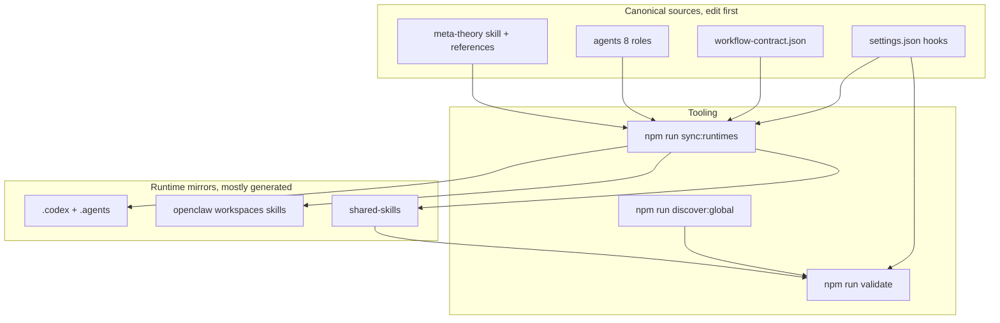

<a id="default-path-en"></a>

#### Diagram: Default path (entry, meta-theory skill, eight-stage spine overview)

`meta-theory` (skill) is the **method playbook** loaded on triggers; `meta-warden` (agent) is the **default public entry role** that validates dispatch decisions and coordinates gates and synthesis. The flow is: user intent → `meta-warden` entry → `meta-theory` classifies + plans dispatch → **`meta-warden` validates the dispatch plan (Gate 3, non-skippable)** → agent execution → review → verify → evolve. This is **not** the full per-stage chart — that is in [Development Governance Spine](#complex-spine-en).

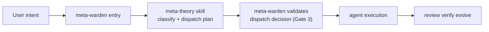

## Contact and support

<div align="center">
  
  <p>
    GitHub <a href="https://github.com/KimYx0207">KimYx0207</a> |
    𝕏 <a href="https://x.com/KimYx0207">@KimYx0207</a> |
    Website <a href="https://www.aiking.dev/">aiking.dev</a> |
    WeChat Official Account: <strong>老金带你玩AI</strong>
  </p>
  <p>
    Feishu knowledge base:
    <a href="https://my.feishu.cn/wiki/OhQ8wqntFihcI1kWVDlcNdpznFf">ongoing updates</a>
  </p>
</div>

<div align="center">
  <table align="center">
    <tr>
      <td align="center">
        
        <br/>
        <strong>WeChat Pay</strong>
      </td>
      <td align="center">
        
        <br/>
        <strong>Alipay</strong>
      </td>
    </tr>
  </table>
</div>

### Paper and method basis

The methodological foundation comes from evaluation work on meta-based intent amplification:

- Paper: [https://zenodo.org/records/18957649](https://zenodo.org/records/18957649)
- DOI: `10.5281/zenodo.18957649`

The paper explains the method. This repository turns that method into runtime-ready engineering assets.

## Who This Is For

### Good Fit

- You work on multi-file, cross-module, or cross-runtime tasks
- You maintain agents, skills, hooks, MCP integrations, or other AI engineering assets
- You want AI collaboration that is reviewable, rollback-friendly, and maintainable over time

### Not A Good Fit

- You only want a lightweight one-off assistant
- You mostly edit a single file at a time
- You want a plug-and-play SaaS product

## Runtime Entry Points

The most important sentence in this repository is:

**Meta_Kim is one method projected into three runtimes, not three separate projects.**

<div align="center">

| Runtime     | Entry point              | Main locations in this repo           | Role                                                  |
| ----------- | ------------------------ | ------------------------------------- | ----------------------------------------------------- |
| Claude Code | [CLAUDE.md](CLAUDE.md)      | `.claude/`, `.mcp.json`           | Canonical (primary editing / source-of-truth) runtime |
| Codex       | [AGENTS.md](AGENTS.md)      | `.codex/`, `.agents/`, `codex/` | Codex-native custom agent and skill projection        |
| OpenClaw    | `openclaw/workspaces/` | `openclaw/`                         | OpenClaw local workspace projection                   |

</div>

One figure for **one method, three landing points** (details: [Meta Architecture View](#meta-kim-visual-maps-en)):

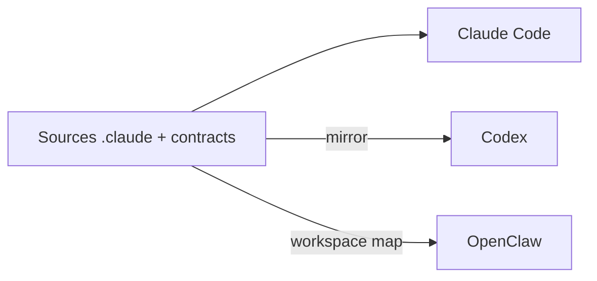

The practical takeaway is simple:

- **If you are maintaining the project, start from `.claude/` and `contracts/workflow-contract.json`.**
- Most content under `.codex/`, `.agents/`, and `openclaw/` is generated or runtime-specific.
- After editing canonical files, resync the runtime mirrors with the provided scripts.

### Per-Runtime Setup

#### In Claude Code

Claude Code automatically reads `CLAUDE.md`, `.claude/agents/`, `.claude/skills/`, and `.mcp.json`. Just open the project and talk.

<a id="meta-theory-skill-en"></a>

##### meta-theory skill

The **meta-theory** skill is the portable governance playbook ([`.claude/skills/meta-theory/SKILL.md`](.claude/skills/meta-theory/SKILL.md)). It is **user-invocable**: in Claude Code, type **`/meta-theory`** to load it. The skill separates **meta architecture** (agent boundaries, collaboration, governance) from **project technical architecture** (stack, modules, code layout), classifies the request into flows A–E, and routes work along the eight-stage spine (**Critical → Fetch → Thinking → Execution → Review → Meta-Review → Verification → Evolution**). It is a **dispatcher**, not a substitute for execution agents: substantive work goes to named agents, and **Gate 3 mandates that meta-theory must validate its dispatch decision with `meta-warden` before spawning any execution agents** — `meta-warden` is both the default public entry and the validator that enforces the dispatcher discipline.

#### In Codex

Codex reads `AGENTS.md`, `.codex/agents/`, `.agents/skills/`, and uses `codex/config.toml.example` as the MCP wiring example. Important: **Codex is a read / execute runtime, not the canonical editing runtime**. Edit `.claude/` first, then sync to Codex with `npm run sync:runtimes`.

#### In OpenClaw

```bash
npm install
npm run prepare:openclaw-local
```

Then you can call:

```bash
openclaw agent --local --agent meta-warden --message "I need a system to handle batch data exports with progress tracking." --json --timeout 120
```

## Meta_Kim(元)

In Meta_Kim:

**Meta (`元`) = the smallest governable unit that exists to support intent amplification**

A valid meta unit must be:

- independently understandable
- small enough to stay controllable
- explicit about what it owns and refuses
- replaceable without collapsing the whole system
- reusable across workflows

Meta is an architectural unit here, not decoration.

### Meta and engineering

A version that fits the actual project design more closely is:

**Engineering is one of the domains meta governs. The meta system can bring engineering work into a full closed loop, but meta itself is not the same thing as an all-powerful engineer.**

Broken down:

- **What engineering can do, the meta system can usually still get done**, because it can orchestrate execution-layer agents through `Critical / Fetch / Thinking / Execution / Review / Meta-Review / Verification / Evolution`.
- **But meta itself is not supposed to personally execute every engineering detail**. The canonical rules are explicit: meta-theory is the dispatcher, not the executor; executable work should belong to a named owner.
- **In the other direction, the governance actions meta performs are not things ordinary engineering flow naturally covers**, such as owner resolution, protocol-first dispatch, review-of-review, verification closure, and Evolution writeback.

If you want the shortest version, use this:

**Engineering is a governed domain of meta, not a lower substitute for it; meta is strongest at closing the loop around engineering, not at personally doing every part of engineering.**

## Core Method

Meta_Kim follows one chain:

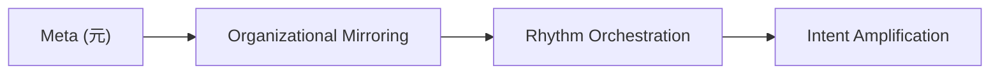

- `Meta (元)`: how to split
- `Organizational Mirroring`: how to structure
- `Rhythm Orchestration`: how to dispatch
- `Intent Amplification`: how to complete

Remove any one of these and the method is incomplete.

**Where the figures are:** sources and entry path — [Meta Architecture View](#meta-kim-visual-maps-en); per-stage spine and iron rules — this section; spine vs 10-phase contract — [The 8-Stage Spine And The Business Workflow](#meta-kim-diagram-two-layers-en); task routing map — [Workflow Relation Map](#task-routing-en).

<a id="complex-spine-en"></a>

## Development Governance Spine (The Core - Read This First)

For **complex work** (multi-file, cross-module, or requiring multiple capabilities), Meta_Kim follows an eight-stage spine. The early chain lines up with the **four iron rules**: clarify before guessing, search before assuming, plan before rushing, verify before trusting, with **Thinking** in the middle to shape the deck and delivery shell.

The eight stages read compactly as **two rows of four** (same order as the table below). (A single `flowchart TB` with two horizontal `subgraph` blocks is often laid out **side by side** by Mermaid; two stacked `LR` diagrams below guarantee a true top/bottom pair.)

**Row 1 — stages 1–4 (clarify → execute)**

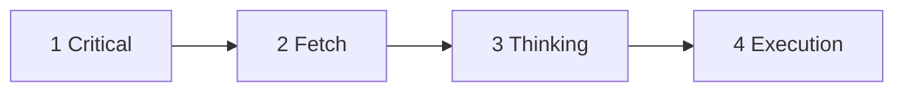

**Between rows:** stage 4 `Execution` → stage 5 `Review`

**Row 2 — stages 5–8 (review → evolve)**

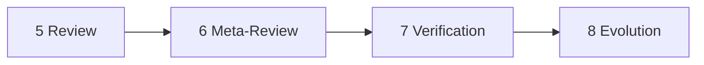

Full names: 1 scope (meta vs tech); 2 search agents/skills; 3 `dispatchBoard` / `mergeOwner`; 4 assign owners; 5 quality boundaries; 6 review standard; 7 verification gates; 8 patterns and writeback.

Iron rules alignment (stages 1–3 and review):

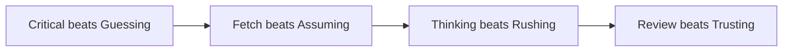

<div align="center">

| Stage            | Purpose           | Plain-English meaning                                            |
| ---------------- | ----------------- | ---------------------------------------------------------------- |
| `Critical`     | Clarify           | confirm what the user actually wants before guessing             |
| `Fetch`        | Search            | look for existing capabilities before assuming they do not exist |
| `Thinking`     | Plan              | shape sub-tasks, ownership, deliverables, and sequencing         |
| `Execution`    | Execute           | hand sub-tasks to the right agents                               |
| `Review`       | Review            | check code, boundaries, and quality                              |
| `Meta-Review`  | Review the review | make sure the review standard itself is sound                    |
| `Verification` | Close the loop    | confirm the fix really landed                                    |
| `Evolution`    | Learn             | keep patterns, scars, and reusable knowledge                     |

</div>

- `Critical > Guessing`
- `Fetch > Assuming`
- `Thinking > Rushing`
- `Review > Trusting`

Stage notes:

- **Stage 1 Critical**: clarify scope before guessing
- **Stage 2 Fetch**: search existing agents / skills before assuming they do not exist
- **Stage 3 Thinking**: plan sub-tasks, shape the deck, prepare the delivery shell
- **Stage 4 Execution**: route the work to the right roles instead of brute-forcing everything in one context
- **Stage 5 Review**: review every output against quality standards
- **Stage 6 Meta-Review**: review the review standard itself
- **Stage 7 Verification**: verify that fixes actually landed and close findings
- **Stage 8 Evolution**: capture patterns, scars, and reusable knowledge

There are 4 additional rules now enforced in the canonical sources:

- **Only pure `Q / Query` may bypass agents**: pure explanation / Q&A with no file change, no external side effect, and no handoff artifact
- **Every executable task needs an owner**: use an existing owner if one exists; otherwise resolve the owner first, then execute
- **Thinking is protocol-first**: `runHeader`, `dispatchBoard`, `workerTaskPacket`, `reviewPacket`, `verificationPacket`, and `evolutionWritebackPacket` must be defined before Execution starts
- **Parallelize when independence exists**: independent sub-tasks should declare `dependsOn`, `parallelGroup`, and `mergeOwner` rather than drifting into unnecessary serial execution

`meta-conductor` tracks `stageState` / `controlState` (including skip / interrupt / iteration). `meta-warden` and `meta-prism` own gates (`gateState`, verification closure). That hidden skeleton is not a second product UI; it keeps dealing rhythm and public-display discipline consistent.

## The 8-Stage Spine And The Business Workflow Are Not The Same Thing

This distinction matters because it is one of the easiest ways to misunderstand Meta_Kim.

There are two layers of workflow language in the project:

<div align="center">

| Layer                                | Defined in                              | Purpose                                                                                 |
| ------------------------------------ | --------------------------------------- | --------------------------------------------------------------------------------------- |
| **8-stage spine**              | `meta-theory` / `dev-governance.md` | canonical execution chain for complex development work                                  |
| **10-phase business workflow** | `contracts/workflow-contract.json`    | run-contract language, display language, and deliverable discipline for department runs |

</div>

<a id="meta-kim-diagram-two-layers-en"></a>

**Diagram:** top row is the **execution spine** (8-stage), bottom row is the **department run contract** (10 business phases). They are parallel vocabularies; business phases do not rename spine stages. (Same Mermaid caveat as elsewhere: `TB` + two horizontal `subgraph` blocks often render **side by side**; two stacked `LR` diagrams below fix that.)

**Row 1 — 8-stage spine (execution backbone)**

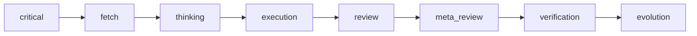

**Row 2 — 10-phase business contract (department run)**

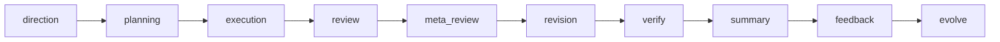

The 8-stage spine remains the underlying execution backbone (text shorthand):

<div align="center">

```text
Critical -> Fetch -> Thinking -> Execution -> Review -> Meta-Review -> Verification -> Evolution
```

</div>

The business workflow is a separate department-run vocabulary:

<div align="center">

```text
direction -> planning -> execution -> review -> meta_review -> revision -> verify -> summary -> feedback -> evolve
```

</div>

The key relationship is:

- **the business workflow does not replace the 8-stage spine**
- it is better understood as a run-contract and delivery-packaging layer
- real complex development governance still runs on the 8-stage backbone
- phases such as `summary / feedback / evolve` are about run management and closure, not about renaming the underlying execution stages

If you remember one sentence, make it this:

**the 8-stage spine is the execution backbone; the 10 phases are the department-level run contract.**

## Workflow Relation Map

<a id="task-routing-en"></a>

**Task routing (same graph as the prose below):** horizontal layout to save vertical space; see the table for branch meanings.

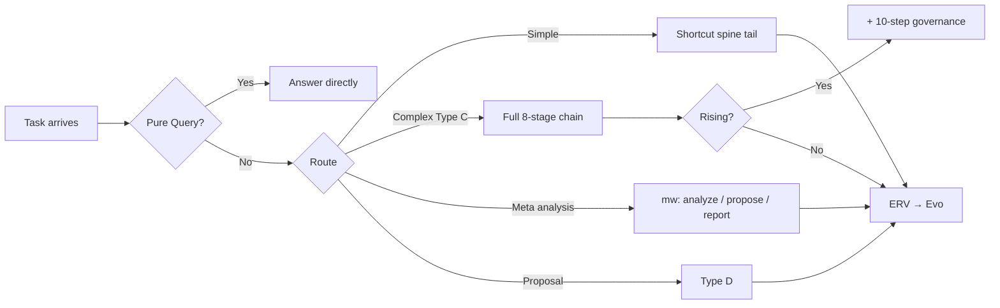

<div align="center">

| Branch | Meaning |
| --- | --- |
| Simple single-owner | Shortcut spine segment: Exec → Review → Verify → Evolution |
| Complex multi-file | Full `Critical`…`Evolution`; may add 10-step governance if complexity keeps rising |
| Meta department analysis | `metaWorkflow`: analyze → propose → report |
| Type D | Proposal, checklist, prism / scout / warden review report |

</div>

**Relationship to the diagram above:** this section collects **easy-to-misread implications** on that same graph; it does not re-explain every fork.

According to the actual project design, Meta_Kim does not have just one workflow. It has several paths layered together (same routing map as above).

The 4 easiest misunderstandings here are:

- **the simplest path is not naked direct execution**. Only pure `Q / Query` may answer directly. The moment work executes, writes, hands off, or produces durable artifacts, it needs an owner.
- **simple tasks still have a compressed governed path**. That shortcut is `Execution → Review → Verification → Evolution`, not “just do it and trust it”.
- **the 8-stage spine is the formal backbone for complex development work**, while the 10-step governance is an upgrade layer, not a replacement.
- **the real 3-phase flow does exist, but it means `metaWorkflow = analyze → propose → report`**, not a standalone “review output → verify fixes → evolution” pipeline.

### Can you handcraft something first and then only send it through the last few stages?

There are two different cases:

- **If what you already have is a proposal / design / agent definition document**, that is closer to `Type D`: read proposal → checklist → output review report.
- **If what you already have is written code or another executable artifact**, you can theoretically treat it as a pre-existing artifact and attach it to the later chain, but you cannot pretend the earlier governance never existed.

The canonical project rules are explicit:

- `Review` first checks owner coverage and protocol compliance
- if there is no owner, no `dispatchBoard`, no `workerTaskPacket`, and no `mergeOwner`, the run should be marked protocol-non-compliant even if the code looks workable
- so “handcraft it first, then only run an imagined 3-stage validation flow” is **not** a canonical default path in this project

The more accurate mapping is:

- **reviewing a document / proposal** → use `Type D`
- **retrospectively validating an existing code artifact** → you may attach it to the review-side tail chain, but only after backfilling owner + protocol packets
- **doing complex development the Meta_Kim way** → still starts from `Critical / Fetch / Thinking`

## Does It Still Carry A Chain-Law Bias?

Yes. **The current Meta_Kim still keeps an explicit chain-like spine.**

If you only look at the visible surface, you still see:

```text
Critical -> Fetch -> Thinking -> Execution -> Review -> Meta-Review -> Verification -> Evolution
```

So if someone says “this is still basically an upgraded pipeline”, that is not an unreasonable reading.

But the real project state is no longer “just a chain”. It is:

**chain on the surface, state/event/owner/protocol control underneath.**

More concretely:

- **the chain is still there**: the 8-stage spine remains the most readable execution backbone
- **state is now doing real control work**: `stageState`, `controlState`, `gateState`, `surfaceState`, `capabilityState`, and `agentInvocationState` keep the system from being just “step 1 then step 2 then step 3”
- **events can interrupt and reroute**: skip, interrupt, intentional silence, rollback, and owner-resolution branches actively change the path
- **parallelism weakens the single linear path**: independent work must declare `parallelGroup` and `mergeOwner` instead of defaulting to serial execution
- **the governance tail chain corrects the run**: `Review / Meta-Review / Verification / Evolution` are not decorative stages; they judge, repair, close, and write back

So the more accurate statement is not “Meta_Kim has escaped chain-law entirely”, but:

**Meta_Kim is currently a hybrid of chain spine + state skeleton + event control + owner protocol + parallel orchestration.**

If you want the shortest version:

**it is not yet a pure state-machine system, but it is no longer a pure chain-flow system either. The chain is the readable backbone, not the whole ontology of the system.**

## The Hidden State Skeleton And Public Display Gates

Meta_Kim is not only “a sequence of stages”.

Under the readable 8-stage flow, the project design also uses a hidden governance skeleton so a run cannot be treated as complete just because it looks complete.

Common state layers include:

<div align="center">

| State layer              | Typical values                                                      | Primary owner   | Why it exists                                                  |
| ------------------------ | ------------------------------------------------------------------- | --------------- | -------------------------------------------------------------- |
| `stageState`           | `Critical -> ... -> Evolution`                                    | Conductor       | track canonical stage progression                              |
| `controlState`         | `normal / skip / interrupt / intentional-silence / iteration`     | Conductor       | change dealing rhythm without inventing fake stages            |
| `gateState`            | `planning-open / verification-open / synthesis-ready`             | Warden + Prism  | separate stage completion from actual gate clearance           |
| `surfaceState`         | `debug-surface / internal-ready / public-ready`                   | Warden          | decide whether a run is displayable                            |
| `capabilityState`      | `covered / partial / gap / escalated`                             | Scout + Artisan | make capability coverage explicit                              |
| `agentInvocationState` | `idle / discovered / matched / dispatched / returned / escalated` | meta-theory     | enforce search-first delegation instead of lazy self-execution |

</div>

This skeleton is intentionally **hidden**:

- it is not a second UI
- it is not there to expose more labels to the user
- it exists to support gates, skips, interrupts, verification, and evolution logging

### What Counts As Publicly Displayable

In the project design, a run must satisfy all of these before entering public display:

- `verifyPassed`
- `summaryClosed`
- `singleDeliverableMaintained`
- `deliverableChainClosed`
- `consolidatedDeliverablePresent`

In practical terms:

- “it looks done” is not enough
- “there is something to show” is not enough
- if verification is still open, the deliverable chain is broken, or synthesis is not closed, the run should remain on the debug or internal surface

This is now treated as a hard release gate in the canonical contract:

- no `verifyPassed` -> no final public draft
- no `summaryClosed` -> no external-ready result
- no closed deliverable chain -> no completed status

## Rollback Protocol

The Verification stage does not only decide pass or fail. It also decides whether a rollback is necessary.

Meta_Kim treats rollback as a layered response:

<div align="center">

| Rollback level   | Trigger                                               | Action                                                                        |
| ---------------- | ----------------------------------------------------- | ----------------------------------------------------------------------------- |
| File-level       | a regression is isolated to one file                  | restore that file to the last known good state                                |
| Sub-task level   | one sub-task broke adjacent paths                     | rollback only that sub-task’s file set                                       |
| Partial rollback | some sub-tasks succeeded and some failed              | keep the successful work, rollback the failed portion, then re-enter Thinking |
| Full rollback    | cross-module contamination or invalidated assumptions | stash uncommitted changes and return to Stage 1 with a revised scope          |

</div>

The simple mental model is:

- small problem, small rollback
- cross-module damage, do not keep pushing forward blindly
- a governance system without rollback is not a complete governance system

The iron rule is:

**rollback is not failure; rollback is the system knowing when to stop making things worse.**

## Evolution Is Not “A Nice Retrospective” - It Must Be Persisted

In Meta_Kim, `Evolution` is not just a conversational summary. Structural learning is expected to be written back to disk.

Typical outputs and storage locations are:

<div align="center">

| Output                     | Storage location                                           | Meaning                                       |
| -------------------------- | ---------------------------------------------------------- | --------------------------------------------- |
| Reusable patterns          | `memory/patterns/{pattern-name}.md`                      | preserve repeatable solutions                 |
| Scars                      | `memory/scars/{scar-id}.yaml`                            | turn failures into future prevention rules    |
| New skills                 | `.claude/skills/{skill-name}/SKILL.md`                   | convert learning into callable capability     |
| Agent boundary adjustments | `.claude/agents/{agent}.md`                              | usually followed by `npm run sync:runtimes` |
| Rhythm optimizations       | `contracts/workflow-contract.json` or Conductor defaults | improve the next dispatch cycle               |
| Capability gap records     | `memory/capability-gaps.md`                              | keep unresolved gaps visible to Scout         |

</div>

If an Evolution artifact has no explicit storage location, it does not count as captured learning.

The canonical rules now also require one extra owner question after each run:

- does the current owner still fit?
- should the owner boundary be adjusted?
- if a temporary `generalPurpose` owner was used, should it now become a real maintained capability?

Each run must now also emit an explicit `writebackDecision`:

- `writeback` -> list the concrete targets
- `none` -> explain why no durable writeback is justified for this run

## When You Need This

<div align="center">

| Your situation                                    | Without Meta_Kim                                           | With Meta_Kim                                                                                    |
| ------------------------------------------------- | ---------------------------------------------------------- | ------------------------------------------------------------------------------------------------ |
| “Refactor the auth module across 6 files”       | AI jumps in, changes files, breaks things in other modules | clarifies scope first, assigns the right roles, reviews cross-module impact                      |
| “Design a new agent for my project”             | you get a generic template that does not fit your domain   | the system asks what you need, checks existing agents first, and only creates one when necessary |
| “My agents keep stepping on each other’s toes” | confusion, duplicated work, nobody knows who owns what     | clear ownership boundaries, governance flow, quality gates                                       |

</div>

**If you mostly edit one file at a time, you probably do not need this.** Meta_Kim helps when work spans files, modules, or capability boundaries.

## What It Does

1. **Clarifies before executing**: asks follow-up questions when the request is vague instead of guessing
2. **Searches before assuming**: checks whether an existing agent / skill already covers the job
3. **Establishes an owner before execution**: except for pure queries, every executable task needs an explicit owner
4. **Classifies before it routes**: `taskClass + requestClass + governanceFlow + trigger/upgrade/bypass reasons` are expected before execution starts
5. **Deals cards instead of only routing**: `meta-conductor` is the primary dealer, `meta-warden` is the escalation owner, and `cardPlanPacket` records what to deal, suppress, defer, skip, or interrupt
6. **Separates intent core from delivery shell**: the same intent can surface through different `deliveryShell` objects without changing the underlying fact or action
7. **Defines the protocol before work starts**: task classification, card plan, task packets, summary packet, handoff chain, review packet, and verification packet come first
8. **Closes review findings explicitly**: review findings, revision responses, verification results, and `closeFindings` must line up
9. **Parallelizes when safe**: independent tasks should not be serialized by default
10. **Reviews every output**: code quality, safety, architecture compliance, protocol compliance, and boundary violations
11. **Validates real runs, not just the contract**: `validate:run` checks whether a recorded run artifact actually satisfies the full packet chain
12. **Writes learning back into the system**: reusable patterns, scars, and owner / skill / contract adjustments are persisted

> **Reader note:** the following is for **complex tasks**, JSON **run artifacts**, and contract-field validation. Skip if you only use chat-style workflows.

## Governed run artifacts (complex work)

For runs where `governanceFlow` is `complex_dev` or `meta_analysis`, treat a **single JSON run artifact** as the source of truth alongside chat:

1. During Thinking, capture **`intentPacket`** (`trueUserIntent`, `successCriteria`, `nonGoals`, `intentPacketVersion: v1`) — intent lock-in before heavy execution (see `protocols.intentPacket` and `intentPacketRequiredWhenGovernanceFlows`).
2. Capture **`intentGatePacket`** (`ambiguitiesResolved`, `requiresUserChoice`, `defaultAssumptions`, `intentGatePacketVersion: v1`; if `requiresUserChoice` is true, add `pendingUserChoices[]`) — structured ambiguity gate (see `protocols.intentGatePacket` and `intentGatePacketRequiredWhenGovernanceFlows`).
3. Keep the full packet chain required by `runDiscipline.protocolFirst.requiredPackets` in that file (or merge incrementally each round).
4. Before claiming **public-ready** or **done**, run:

```bash
npm run validate:run -- path/to/your-run.json
```

5. If validation fails or findings are still open, get a concrete next-iteration checklist:

```bash
npm run prompt:next-iteration -- path/to/your-run.json
```

Optional **Stop hook** guard (off by default): set `META_KIM_STOP_COMPLETION_GUARD=hint` for stderr-only reminders, or `=block` to force another turn when the last assistant text claims completion without governance cues. See `.claude/hooks/stop-completion-guard.mjs`.

**`npm run doctor:governance`** runs a narrow health check: contract readable, Claude hook command set matches expectations, `npm run check:runtimes`, and `validate:run` on the sample fixture.

Optional **soft todo gate** during `validate:run`: set `META_KIM_SOFT_PUBLIC_READY_GATES=1`. When `summaryPacket.publicReady` is true, no `workerTaskPacket` may have `taskTodoState: "open"`. Omit `taskTodoState` if you are not tracking todos. See `runDiscipline.runArtifactValidation.softPublicReadyTodoGate` in the contract.

Optional **soft comment-review gate**: set `META_KIM_SOFT_COMMENT_REVIEW=1`. When `summaryPacket.publicReady` is true, `summaryPacket.commentReviewAcknowledged` must be `true`. See `softCommentReviewGate` in the contract.

## The eight meta agents

<div align="center">

| Agent              | Main job                                          | Human shorthand               |
| ------------------ | ------------------------------------------------- | ----------------------------- |
| `meta-warden`    | default entry, arbitration, final synthesis       | project manager / coordinator |
| `meta-conductor` | sequencing and rhythm control                     | dispatcher                    |
| `meta-genesis`   | `SOUL.md`, persona, cognitive structure         | prompt and role architect     |
| `meta-artisan`   | skills, MCP, tool fit                             | capability engineer           |
| `meta-sentinel`  | safety, permissions, hooks, rollback              | security guardrail            |
| `meta-librarian` | memory and continuity                             | knowledge keeper              |
| `meta-prism`     | quality review, drift detection, anti-slop checks | quality forensic reviewer     |
| `meta-scout`     | external capability discovery and evaluation      | scout and evaluator           |

</div>

If you are a normal user, remember just one thing:

**the public front door is `meta-warden`.**

Organization (remember the **front door** first; you do not need the full table on day one):

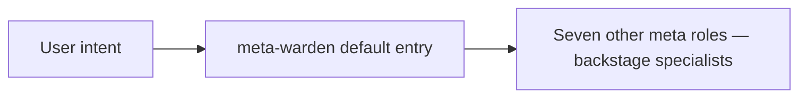

Entry vs skill vs spine overview: [Meta Architecture View → Default path](#default-path-en).

## How the System Works

You do not need to know the internals. But if you are curious:

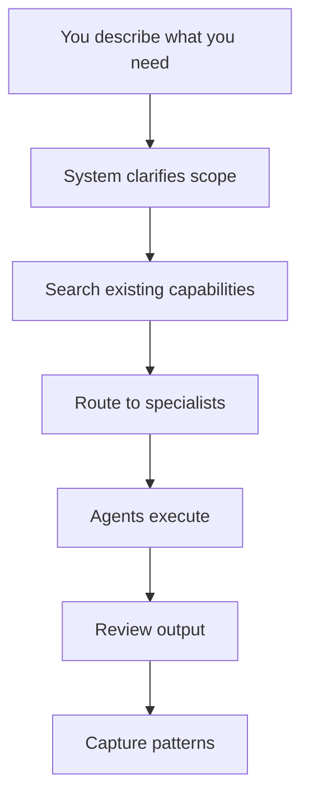

For routing and stacked paths, see [Workflow Relation Map](#task-routing-en).

Every valid business run must keep a single organizing thread:

- one department
- one primary deliverable
- one closed handoff chain

If a run bundles unrelated goals into the same thread, `meta-conductor` should reject it and `meta-warden` should keep it out of public display.

## How To Use It

### Auto Mode (just talk normally)

For complex work, just describe what you need. The governance flow activates automatically when the system detects multi-file or cross-module work.

```text
Build a notification system - email, SMS, and in-app - with a shared queue and retry logic.
```

```text
The checkout flow is broken across 3 services. Fix the race condition and add proper error handling.
```

The system will: ask clarifying questions if needed -> search existing agents -> route to the right specialist -> execute -> review -> capture patterns.

If Fetch discovers that no clean owner exists, the normal path is not “just do it directly.” The project now distinguishes:

- durable / recurring gap -> create or compose the owner first (Type B), then execute
- one-off low-risk gap -> allow a temporary `generalPurpose` owner, then review that choice during Evolution

When you record a real governed run as JSON, validate it directly:

```bash
npm run validate:run -- tests/fixtures/run-artifacts/valid-run.json
```

That validator checks more than field presence. It verifies finding lineage, close-state flow, delivery-shell references, deliverable-chain closure, and whether `publicReady` was set truthfully.

### Manual Mode (when you know what you want)

If you specifically want to design, review, or audit agents:

```text
Design an agent for handling data export jobs in this project.
```

```text
Audit my agent definitions - are the boundaries clean?
```

```text
My agents keep overlapping responsibilities. Fix the organizational structure.
```

## Repository Structure

(Tree-style ASCII can misalign in some viewers; this table matches the repo layout.)

<div align="center">

| Path | Description |
| --- | --- |
| `.claude/` | Canonical source: agents, skills, hooks, settings |
| `.codex/` | Codex custom agent mirrors |
| `.agents/` | Codex project-level skill mirror |
| `codex/` | Codex global config example |
| `openclaw/` | OpenClaw workspaces, skills, config templates |
| `contracts/` | Runtime governance contracts |
| `docs/` | Internal/private notes plus selected tracked runtime docs |
| `scripts/` | Sync, validation, discovery, MCP, health scripts |
| `shared-skills/` | Shared skill mirrors across runtimes |
| `README.md` | English primary README (many anchor links assume this file) |
| `README.zh-CN.md` | Simplified Chinese |
| `README.ja-JP.md` | Japanese |
| `README.ko-KR.md` | Korean |
| `CLAUDE.md` | Claude Code project entry |
| `AGENTS.md` | Codex project entry |
| `CHANGELOG.md` | Changelog |

</div>

### Files You Should Usually Edit

If you are maintaining Meta_Kim, start with these:

- `.claude/agents/*.md`
- `.claude/skills/meta-theory/SKILL.md`
- `.claude/skills/meta-theory/references/*.md`
- `contracts/workflow-contract.json`
- `README.md`
- `README.zh-CN.md`
- `README.ja-JP.md`
- `README.ko-KR.md`
- `CLAUDE.md`
- `AGENTS.md`

### Files You Usually Should Not Edit By Hand

Unless you know exactly why, do not treat these as the long-term maintenance source:

- `.codex/agents/*.toml`
- `.agents/skills/meta-theory/`
- `.codex/skills/meta-theory.md`
- `shared-skills/meta-theory.md`
- `openclaw/skills/meta-theory.md`
- `openclaw/workspaces/*`
- `openclaw/openclaw.local.json`

Those are normally maintained by:

- `npm run sync:runtimes`
- `npm run prepare:openclaw-local`

### Why There Is a `codex/` Folder

Codex uses two configuration layers:

- repo-local assets, which live in `.codex/` and `.agents/`
- user-global configuration, which cannot live directly inside the repository root

So:

- `.codex/` is the repo content Codex reads directly
- `codex/` is only the example directory for wiring `~/.codex/config.toml`

## Hooks (Claude Code)

Meta_Kim ships 8 hook command scripts in `.claude/settings.json` (the `Stop` event runs two of them in sequence):

<div align="center">

| Hook                           | Type                   | Purpose                                                             |
| ------------------------------ | ---------------------- | ------------------------------------------------------------------- |
| `block-dangerous-bash.mjs`   | PreToolUse/Bash        | block destructive commands (`rm -rf`, `DROP TABLE`, force-push) |
| `pre-git-push-confirm.mjs`   | PreToolUse/Bash        | remind to review before `git push`                                |
| `post-format.mjs`            | PostToolUse/Edit,Write | auto-format JS/TS files with prettier                               |
| `post-typecheck.mjs`         | PostToolUse/Edit,Write | run type checks after editing `.ts` / `.tsx`                    |
| `post-console-log-warn.mjs`  | PostToolUse/Edit,Write | warn about `console.log` in edited files                          |
| `subagent-context.mjs`       | SubagentStart          | inject project context into spawned subagents                       |
| `stop-console-log-audit.mjs` | Stop                   | audit modified files for `console.log` before the session ends    |
| `stop-completion-guard.mjs`  | Stop                   | optional weak guard against premature “done” (off unless env set)   |

</div>

Codex and OpenClaw use their own native mechanisms for equivalent behavior.

## Code Knowledge Graph (graphify) (advanced)

Meta_Kim can leverage [graphify](https://github.com/safishamsi/graphify) (`pip install graphifyy`) to generate compressed code knowledge graphs for **target projects** — not Meta_Kim itself. This provides up to **71x token compression** via subgraph extraction instead of raw file reading.

### How It Works

1. **graphify** generates `graphify-out/graph.json` in the target project root (NetworkX node-link JSON with nodes, edges, and confidence scores)
2. Meta_Kim's Fetch stage auto-detects the graph — no manual intervention needed
3. All dispatched agents receive graph context via the `subagent-context.mjs` hook
4. For complex projects (>50 graph nodes), a **project-level conductor** can be auto-created via the Type B pipeline

### Auto-Trigger Conditions

Graph context is used automatically when **all** conditions are met:
- Source files > 20 (excluding `node_modules/`, `.git/`, `dist/`)
- Python 3.10+ installed
- graphify installed (`pip install graphifyy`)
- Current project is NOT Meta_Kim itself

### Installation

```bash
# Via setup.mjs (interactive, auto-detects Python)
node setup.mjs

# Via install-deps.sh
npm run deps:install

# Manual
pip install graphifyy && graphify claude install

# Check status
npm run graphify:check
```

### Quality Gate

- AMBIGUOUS nodes > 30% → graph marked low-quality, agents use direct `Read` as primary
- Total nodes < 10 → graph too sparse, fall back to `Glob`/`Grep`
- God nodes (high in-degree) → flagged as serial bottlenecks for `meta-conductor`

## Quick Start (Clone to Working in 5 Minutes)

**How to read on from here:** complete **One-Click / Manual Setup** below, then follow [Runtime Entry Points](#runtime-entry-points) → [How To Use It](#how-to-use-it) → [Commands](#commands). Everything **before** this Quick Start section explains product intent, [Meta Architecture diagrams](#meta-kim-visual-maps-en), and the governance spine; for deeper charts use [Development Governance Spine](#complex-spine-en) and [Workflow Relation Map](#task-routing-en). **In Claude Code**, invoke the governance playbook with **`/meta-theory`** ([meta-theory skill](#meta-theory-skill-en)).

### Prerequisites

- **Node.js** v18+ (for sync, validate, and OpenClaw scripts)
- **Git** (to clone)
- **Python** 3.10+ (optional, for graphify code knowledge graph)
- **Claude Code CLI** (optional, only needed for `eval:agents`)
- **Codex CLI** (optional, only needed for `eval:agents`)
- **OpenClaw CLI** (optional, only needed for `npm run prepare:openclaw-local`)

### One-Click Setup (Recommended)

**Without cloning first** (`npx` fetches the repo temporarily and runs the same wizard as `setup.mjs`):

```bash
npx --yes github:KimYx0207/Meta_Kim meta-kim
```

**UI language + check only (no writes, no install):** `--lang` matches `setup.mjs`: `en`, `zh-CN`, `ja-JP`, `ko-KR`.

<div align="center">

| UI language | Command |
| --- | --- |
| English | `npx --yes github:KimYx0207/Meta_Kim meta-kim -- --lang en --check` |
| 简体中文 | `npx --yes github:KimYx0207/Meta_Kim meta-kim -- --lang zh-CN --check` |
| 日本語 | `npx --yes github:KimYx0207/Meta_Kim meta-kim -- --lang ja-JP --check` |
| 한국어 | `npx --yes github:KimYx0207/Meta_Kim meta-kim -- --lang ko-KR --check` |

</div>

**Classic flow** (clone, then enter the directory):

```bash
git clone https://github.com/KimYx0207/Meta_Kim.git
cd Meta_Kim
node setup.mjs
```

<div align="center">

| Usage                              | Description                                              |
| ---------------------------------- | -------------------------------------------------------- |
| `npx --yes github:KimYx0207/Meta_Kim meta-kim` | Same as `node setup.mjs`; skips manual `git clone` / `cd` |
| `node setup.mjs`                   | Interactive setup (language → install / update / check)  |
| `node setup.mjs --lang en`         | Skip language selection, English UI                      |
| `node setup.mjs --lang zh-CN`      | Skip language selection, Chinese UI                      |
| `node setup.mjs --lang ja-JP`      | Skip language selection, Japanese UI                     |
| `node setup.mjs --lang ko-KR`      | Skip language selection, Korean UI                       |
| `node setup.mjs --update`          | Update all skills and dependencies                       |
| `node setup.mjs --check`           | Environment + dependency + cross-runtime sync check      |
| `node setup.mjs --silent`          | Non-interactive (CI / scripts)                           |

</div>

Wizard flow and `--check` behavior are summarized in the table above; for the full narrative see [Manual setup (step by step)](#manual-install-en) below.

> **Third-party meta-skill `findskill`:** treat **Meta_Kim as canonical**. `setup.mjs` installs **`KimYx0207/findskill`** into `~/.claude/skills/findskill/`. **Agents and docs in this repo use the name `findskill` only** — do not mix legacy spellings. Avoid parallel duplicate installs from other channels.

> Pure Node.js script — works on Windows / macOS / Linux without bash.

---

<a id="manual-install-en"></a>

### Manual Setup (Step by Step)

The following is the fuller maintainer flow. It covers the core work `node setup.mjs` does, and also adds runtime-mirror sync, global capability discovery, and optional portable global `meta-theory` sync.

#### 1. Clone and install dependencies

```bash
git clone https://github.com/KimYx0207/Meta_Kim.git
cd Meta_Kim
npm install
```

#### 2. Sync the runtime mirrors

```bash
npm run sync:runtimes
```

This rebuilds the Codex, OpenClaw, and shared-skill projections from the canonical `.claude/` source.

If you only want to check whether they are already in sync, use:

```bash
npm run check:runtimes
```

#### 3. Install meta-skill dependencies (optional, but recommended)

```bash
npm run deps:install
```

This installs the 9 community skills Meta_Kim depends on into `~/.claude/skills/`.

Notes:

- this is a **global Claude Code ecosystem install**, not a repo-local install
- the script runs through `bash install-deps.sh`
- **Windows users need `bash` available**, typically via Git Bash or WSL

To update those dependencies later:

```bash
npm run deps:update
```

#### 4. Discover global capabilities

```bash
npm run discover:global
```

This scans your machine and generates:

```text
.claude/capability-index/meta-kim-capabilities.json
.claude/capability-index/global-capabilities.json   # compatibility mirror
```

It covers:

- `~/.claude/`: agents, skills, hooks, plugins, commands
- `~/.openclaw/`: agents, skills, hooks, commands
- `~/.codex/`: agents, skills, commands

If you want to inspect CLI detection first, run:

```bash
npm run probe:clis
```

#### 5. Optional: sync the portable global `meta-theory` skill

```bash
npm run show:global:meta-theory-targets
npm run sync:global:meta-theory
```

This syncs the canonical `.claude/skills/meta-theory/` into your user-level runtime homes:

- `~/.claude/skills/meta-theory`
- `~/.openclaw/skills/meta-theory`
- `~/.codex/skills/.disabled/meta-theory` (standby by default, not directly active)

If you only want to check for drift, use:

```bash
npm run check:global:meta-theory
```

If you want the Codex global `meta-theory` skill active instead of parked under `.disabled/`, use:

```bash
npm run sync:global:meta-theory:codex-active
```

If you need to override the resolved runtime homes explicitly, set:

- `META_KIM_CLAUDE_HOME` or `CLAUDE_HOME`
- `META_KIM_OPENCLAW_HOME` or `OPENCLAW_HOME`
- `META_KIM_CODEX_HOME` or `CODEX_HOME`

#### 6. Run the integrity validation

```bash
npm run validate
```

This checks:

- required files
- workflow contract integrity
- Claude agent definitions
- OpenClaw workspaces
- cross-runtime `SKILL.md` sync
- Codex agent definitions
- hooks, MCP config, and package scripts

#### 7. Run the MCP self-test

```bash
npm run test:mcp
```

This self-tests `meta-runtime-server`, and it is also part of what `node setup.mjs` runs by default.

#### 8. Run runtime smoke only when you need it

```bash
npm run eval:agents
```

Default `eval:agents` is the lightweight, no-LLM runtime smoke step:

- installed and healthy runtimes report `passed`
- optional runtimes that are missing or unavailable may report `skipped`
- broken config or registry wiring report `failed`
- it does **not** open live prompt sessions with Claude / Codex / OpenClaw

If you explicitly want the slower live runtime check that talks to the runtimes:

```bash
npm run eval:agents:live
```

Run the full maintenance stack with:

```bash
npm run verify:all
```

And the full live stack with:

```bash
npm run verify:all:live
```

If you have a recorded run artifact and want to validate the actual packet chain:

```bash
npm run validate:run -- tests/fixtures/run-artifacts/valid-run.json
```

#### 9. Prepare OpenClaw locally only if you plan to use it

```bash
npm run prepare:openclaw-local
```

You only need this when you want to run the OpenClaw side on your own machine.

#### 10. Run a health check

```bash
node scripts/agent-health-report.mjs
```

This gives you a quick view of version, frontmatter completeness, boundary definitions, workspace files, and skill sync status across all 8 agents.

#### 11. Start using it (in Claude Code)

You can simply say:

```text
I need to refactor the authentication system - it is spread across 5 files and nobody knows which one handles token refresh anymore.
```

```text
Design me an agent that can handle data export jobs for this project.
```

```text
Something is wrong - my agents keep writing code that conflicts with each other.
```

The system routes each request through the matching governance stage.

## Commands

<div align="center">

| Command                                  | When to use it                                   | What it does                                                          |
| ---------------------------------------- | ------------------------------------------------ | --------------------------------------------------------------------- |
| `npx --yes github:KimYx0207/Meta_Kim meta-kim` | **without cloning first**                  | same as `node setup.mjs` (`npx` fetches this repo)                    |
| `node setup.mjs`                       | **first setup**                            | interactive wizard: language → install / update / check        |
| `node setup.mjs --update`              | when skills/deps need updating                   | update all skills + optional runtime sync                      |
| `node setup.mjs --check`               | when you want an environment preflight          | env + dependency + cross-runtime sync verification             |
| `npm install`                          | manual setup                                     | installs Node dependencies                                            |
| `npm run sync:runtimes`                | after editing canonical source                   | rebuilds runtime mirrors                                              |
| `npm run check:runtimes`               | when you only want a diff check                  | verifies mirrors are current without rewriting                        |
| `npm run show:global:meta-theory-targets` | before touching user-level runtime homes       | prints the resolved global `meta-theory` sync targets and Claude hook paths |
| `npm run sync:global:meta-theory`      | after changing canonical `meta-theory` or `.claude/hooks` | syncs global Claude/OpenClaw `meta-theory`, copies hooks to `~/.claude/hooks/meta-kim/`, merges hook entries into `~/.claude/settings.json`, parks Codex in standby |
| `npm run sync:global:meta-theory -- --skip-global-hooks` | when you must not touch user `settings.json`/hooks | same as above but skips Claude global hooks merge |
| `npm run check:global:meta-theory`     | when you want a read-only drift check            | verifies global `meta-theory` mirrors and Claude `hooks/meta-kim` copy without rewriting |
| `npm run sync:global:meta-theory:codex-active` | when you want Codex global `meta-theory` active | writes the Codex global skill into the active path instead of `.disabled/` |
| `npm run deps:install`                 | first Claude ecosystem setup                     | installs 9 global meta-skills                                         |
| `npm run deps:update`                  | when skill dependencies need updating            | updates installed meta-skills                                         |
| `npm run deps:install:all-runtimes`    | Windows or when you use Codex/OpenClaw globally too | clones the same 9 skill repos into `~/.claude/skills`, `~/.codex/skills`, `~/.openclaw/skills`; runs `claude plugin install superpowers@claude-plugins-official` if `claude` is on PATH |
| `npm run deps:update:all-runtimes`     | refresh all three skill trees                    | same as above with `--update`                                         |
| `npm run deps:install:claude-plugins`  | only official CC plugin bundles                | runs `claude plugin install …` only (no git clones)                  |
| `npm run graphify:check`              | check graphify availability                     | verifies Python 3.10+ and graphify CLI                               |
| `npm run graphify:install`            | install graphify                                | `pip install graphifyy` + register Claude skill                      |
| `npm run graphify:update`             | update project graph                            | incremental `graphify --update` on target project                    |
| `npm run discover:global`              | first setup and after adding global capabilities | rebuilds `.claude/capability-index/meta-kim-capabilities.json` (and the compatibility mirror `global-capabilities.json`) |
| `npm run index:runs -- <dir-or-file>`  | after recording governed runs                    | validates artifacts first, then indexes only valid runs into `.meta-kim/state/{profile}/run-index.sqlite` |
| `npm run query:runs -- --owner meta-warden` | when you want continuity / retrieval fast     | queries the local run index by flow, owner, publicReady, and open findings |
| `npm run rebuild:run-index -- <dir-or-file>` | when you want to reset the local index       | clears and rebuilds the profile-local SQLite run index |
| `npm run migrate:meta-kim -- <source-dir> --apply` | when importing a prompt pack / single-agent repo | stages persona / skill / contract-adjacent assets into local migration state and refuses unverified run state |
| `npm run probe:clis`                   | when CLI availability is unclear                 | probes Claude / Codex / OpenClaw CLIs                                 |
| `npm run test:mcp`                     | after changing MCP-related code                  | self-tests `meta-runtime-server`                                    |
| `npm run test:meta-theory`             | after changing `meta-theory`, contracts, or its tests | runs `tests/meta-theory/*.test.mjs`                               |
| `npm run validate`                     | before committing                                | runs static integrity validation                                      |
| `npm run validate:run -- <run.json>`   | when you want to verify a recorded real run      | validates packet lineage, summary/public-ready truthfulness, and finding closure |
| `npm run doctor:governance`            | before release or when mirrors/hooks drift       | layered health check: canonical contract + mirror parity + runtime hooks + local profile/run-index health |
| `npm run prompt:next-iteration -- <run.json>` | when a run failed validation or findings are open | prints the next closure checklist from the artifact                         |
| `npm run check`                        | when you want a quick static pass                | runs `check:runtimes + validate`                                    |
| `npm run eval:agents`                  | for fast runtime smoke                           | runs CLI/config/hook/runtime-registry smoke without LLM prompt checks |
| `npm run eval:agents:live`             | when you want live runtime acceptance            | runs the slower Claude / Codex / OpenClaw prompt-backed evaluation    |
| `npm run verify:all`                   | before release or after bigger changes           | runs `check + check:global:meta-theory + lightweight eval + tests` |
| `npm run verify:all:live`              | before runtime-sensitive releases                | runs `check + check:global:meta-theory + live eval + tests`        |
| `node scripts/agent-health-report.mjs` | when you want an overview                        | generates a health report for all 8 agents                            |

</div>

**Windows / PATH:** a Node process started from a GUI app or editor task may inherit a shorter `PATH` than your terminal. If `eval:agents` cannot find a CLI, first check `%APPDATA%\\npm\\`, then `where.exe`, and if needed set absolute paths through:

- `META_KIM_CLAUDE_BIN`
- `META_KIM_CODEX_BIN`
- `META_KIM_OPENCLAW_BIN`

## A Safe Maintenance Loop

If you are changing agents, skills, README files, or runtime-facing config, the safest loop is:

1. edit canonical `.claude/` sources or shared documentation
2. if the change affects run discipline, gates, or deliverable policy, update `contracts/workflow-contract.json`
3. run `npm run sync:runtimes`
4. if you changed canonical `meta-theory` and you maintain user-level runtime homes, run `npm run sync:global:meta-theory`
5. run `npm run discover:global`
6. run `npm run validate`
7. if MCP runtime wiring changed, run `npm run test:mcp`
8. run `npm run eval:agents` when smoke-level runtime acceptance matters
9. only run `npm run eval:agents:live` when you truly need live prompt-backed acceptance

That keeps the three runtime projections aligned.

## Newcomer FAQ

### 1. Do I need Claude Code, Codex, and OpenClaw all installed?

No. Meta_Kim is cross-runtime by design, but you do not have to use all three.

### 2. Can I maintain this by editing only `.codex/` or `openclaw/`?

Technically yes, but that is not the intended maintenance path. In most cases, edit `.claude/` first and then sync.

### 3. Should I commit the `discover:global` output?

Usually no. `meta-kim-capabilities.json` and the compatibility mirror `global-capabilities.json` are machine-local capability inventories with local absolute paths.

### 4. How do I migrate an older prompt pack or single-agent repo?

Use the local migration helper:

```bash
npm run migrate:meta-kim -- ../old-agent-repo --apply
```

It stages only persona / skill / contract-adjacent assets into `.meta-kim/state/{profile}/migrations/...` and explicitly blocks unverified run state, SQLite caches, logs, and artifacts. Review the generated `manifest.json` before moving anything into canonical `.claude/` or `contracts/`.

### 4. If `eval:agents` says `skipped`, is the project broken?

Not necessarily. `skipped` usually means a runtime is optional and currently unavailable or not installed. Real failures are reported as `failed`.

### 5. What is the difference between `eval:agents` and `eval:agents:live`?

`eval:agents` is lightweight runtime smoke. It checks CLI availability, registry/config wiring, and runtime-specific scaffolding without opening LLM-backed prompt sessions.

`eval:agents:live` is the heavier live acceptance step. It opens real Claude / Codex / OpenClaw runtime interactions and is slower by design.

### 6. Why is the default front door not a menu of 8 agents?

Because Meta_Kim is designed to receive one user request through one public entry point, then do specialization backstage.

### 7. When can a task skip agents entirely?

Only for pure `Q / Query` work: explanation or Q&A with no code change, no external side effect, and no deliverable / handoff chain. Once the task executes, produces artifacts, or enters review / verification, it needs an owner.

### 8. Is `.claude/skills/meta-theory/references/meta-theory.md` required reading?

No. It is the long-form theory manuscript mirrored from the canonical skill references. Start with this README instead.

### 9. I only want the directory map. What should I read?

Use the repository tree section in this README.

### 10. I want the runtime differences. What should I read?

Internal note: runtime parity reference lives under `docs/` and is not part of the public surface.

## Simplest Starting Path

The [Quick Start section](#quick-start-clone-to-working-in-5-minutes) above already takes you from clone to working.

If this is your first time here, the lowest-friction order is:

1. start with `README.md`
2. then read [CLAUDE.md](CLAUDE.md) or [AGENTS.md](AGENTS.md)
3. then review the repository tree section above
4. only read `.claude/skills/meta-theory/references/meta-theory.md` when you want the deeper theory

Contact links, payment QR codes, and paper / DOI are in [Contact and support](#contact-and-support) above (no second copy here).

## License

This project is licensed under the [MIT License](LICENSE).
