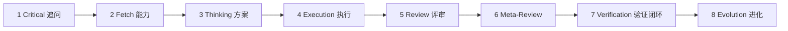
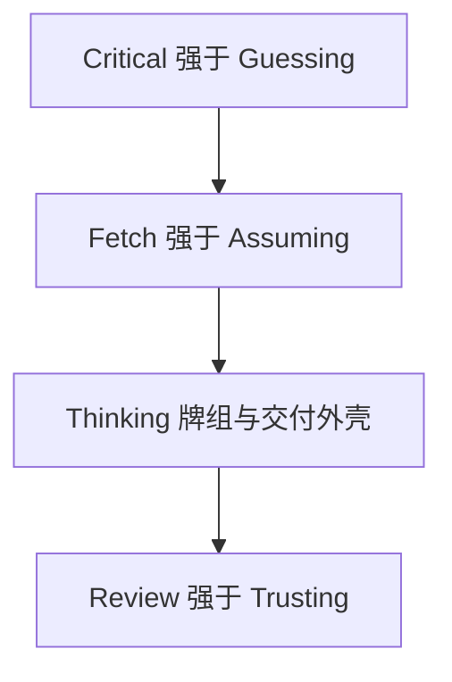
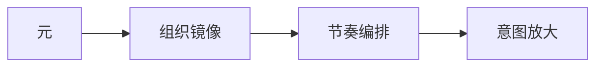
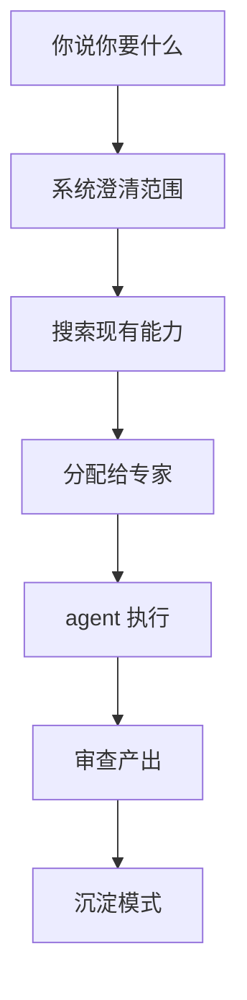

span


<h1 style="font-size: 6em; font-weight: 900; margin-bottom: 0.2em; letter-spacing: 0.1em;">元</h1>
<p style="font-size: 1.2em; color: #7c3aed; font-weight: 600; margin-top: 0;">META_KIM</p>
<p style="color: #dc2626; font-weight: 700; margin-bottom: 0.5em;">⚠️ BETA VERSION — Work in Progress</p>


<p>
  
  
  
  
  
</p>

**跨 Claude Code / Codex / OpenClaw 的 AI 编码助手治理层——让复杂任务做对了再做。**

多数 AI 编码工具上来就写代码。Meta_Kim 在中间加了一步：先搞清楚你到底要什么，再计划谁干什么，最后才执行并审查。

结果：跨文件改动少翻车，agent 职责更清晰，沉淀可复用模式而不是一次性 hack。

</div>

## 作者与支持

<div align="center">
  
  <p>
    GitHub <a href="https://github.com/KimYx0207">KimYx0207</a> |
    𝕏 <a href="https://x.com/KimYx0207">@KimYx0207</a> |
    官网 <a href="https://www.aiking.dev/">aiking.dev</a> |
    微信公众号：<strong>老金带你玩AI</strong>
  </p>
  <p>
    飞书知识库：
    <a href="https://my.feishu.cn/wiki/OhQ8wqntFihcI1kWVDlcNdpznFf">长期更新入口</a>
  </p>
</div>

<div align="center">
  <table align="center">
    <tr>
      <td align="center">
        
        <br/>
        <strong>微信支付</strong>
      </td>
      <td align="center">
        
        <br/>
        <strong>支付宝</strong>
      </td>
    </tr>
  </table>
</div>

## 什么时候需要它


| 你的场景                              | 没有 Meta_Kim                           | 有 Meta_Kim                                    |
| --------------------------------------- | ----------------------------------------- | ------------------------------------------------ |
| "帮我把认证模块重构了，横跨 6 个文件" | AI 直接上手改，改着改着把别的模块搞崩了 | 先确认范围，分配给合适的 agent，审查跨模块影响 |
| "帮我设计一个新 agent"                | 拿到一个通用模板，跟你的业务对不上      | 系统先问你需求，检查现有 agent，必要时才创建   |
| "我的 agent 老是互相打架"             | 职责混乱，重复劳动，没人知道谁该干什么  | 清晰的职责边界，治理流程，质量关卡             |

**如果你每次只改一个文件，不需要它。** Meta_Kim 帮的是跨文件、跨模块、需要多种能力协作的复杂任务。

## 它干了什么

1. **先追问再执行** — 需求模糊时追问澄清，而不是猜
2. **先搜索再假设** — 先检查现有 agent/skill 能不能干，不假设不存在就从头搞
3. **分配给对的 agent** — 把复杂任务拆成可治理的单元，各有明确归属
4. **每个产出都要审查** — 代码质量、安全性、架构合规、边界越界检测
5. **每次都沉淀经验** — 捕获可复用模式，记录失败防止再犯

## 一眼看懂

- 8 个专业元 agent，统一走一个默认入口
- 同时支持 Claude Code、Codex、OpenClaw，同一套治理逻辑
- 每个任务走：追问澄清 → 搜索能力 → 执行 → 审查 → 沉淀进化
- 纪律：一个部门、一个主交付物、一条闭合交付链

## 快速上手（克隆后 5 分钟跑起来）

### 环境要求

- **Node.js** v18+（用于 sync、validate、OpenClaw 脚本）
- **Git**（用于克隆项目）
- **Claude Code CLI**（可选，仅在运行 `eval:agents` 时需要）
- **OpenClaw CLI**（可选，仅在运行 `npm run prepare:openclaw-local` 时需要）

### 第一步：克隆并安装

```bash
git clone <仓库地址>
cd Meta_Kim
npm install
```

### 第二步：同步三端

```bash
npm run sync:runtimes
```

这步把 `.claude/agents/` 里的 8 个 agent 同步到 Claude Code / Codex / OpenClaw 三端镜像。**每次改了 agent 定义或 SKILL.md 后都要跑。**

### 第三步：安装元技能依赖

```bash
npm run deps:install
```

安装 Meta_Kim 依赖的 9 个社区元技能（`agent-teams-playbook`、`findskill`、`hookprompt`、`superpowers`、`everything-claude-code`、`planning-with-files`、`cli-anything`、`gstack`、`skill-creator`）到 `~/.claude/skills/`。**首次安装必须运行。**

**更新**所有依赖到最新版：

```bash
npm run deps:update
```

### 第四步：发现全局能力

```bash
npm run discover:global
```

扫描并索引你全局安装的能力（Claude Code、OpenClaw、Codex 三端），生成统一的能力索引。**安装后首次必须运行，之后安装新全局能力时需重新运行。**

扫描范围：

- **Claude Code** (`~/.claude/`): agents、skills、hooks、plugins、commands
- **OpenClaw** (`~/.openclaw/`): agents、skills、hooks、commands
- **Codex** (`~/.codex/`): agents、skills、commands

### 第五步：验证完整性

```bash
npm run validate
```

校验 frontmatter 格式、SKILL.md 同步状态、OpenClaw/Codex 配置完整性。

**期望输出：** `Validation passed for 8 agents.`

### 第六步：快速健康度检查

```bash
node scripts/agent-health-report.mjs
```

查看 8 个 agent 的状态：版本号、frontmatter 完整性、边界定义、workspace 文件、skill 同步情况，综合健康分。

### 第七步：开始使用（Claude Code）

用 Claude Code 打开仓库，直接说你想要什么：

```text
认证系统要重构——散在5个文件里，没人知道 token 刷新到底是哪个文件在处理。
```
→ **Critical**（明确范围）→ **Fetch**（查各文件归属）→ **Thinking**（规划改动）→ **Review**（检查跨模块影响）

```text
帮我设计一个 agent，处理这个项目的数据导出任务。
```
→ **Critical**（确认意图）→ **Fetch**（检索现有 agent）→ **Thinking**（设计边界）→ **Review**（验证 SOUL.md 质量）

```text
有问题——我的 agent 写的代码老是互相冲突。
```
→ **Critical**（定位冲突类型）→ **Fetch**（扫描 agent 边界）→ **Thinking**（分析组织镜像）→ **Review**（检测跨污染）

系统把每条需求路由到匹配的治理阶段。你只管描述需求，流程自动适配任务类型。

## 这是什么项目

Meta_Kim 不是聊天产品，不是 SaaS，不是一个”大 prompt”，也不是把很多 agent 文件堆在一起。

它是一套跨运行时的工程化方法：

- 用户先给出原始意图
- 系统先做意图放大，而不是直接急着回答
- 系统按元架构决定该拆给谁、该跳过什么、该先做什么
- 最后在 Claude Code、Codex、OpenClaw 三个运行时里保持同一套底层规矩

一句话说：

**Meta_Kim 关心的不是”单次答得像不像”，而是”复杂任务能不能被持续、稳定、可治理地完成”。**

工程上它同时组织这些层：

- `agent`：职责边界和组织角色
- `skill`：可复用能力块
- `MCP`：外部能力接口
- `hook`：运行时约束和自动化拦截
- `memory`：长期上下文与连续性
- `workspace`：运行时本地工作空间
- `sync / validate / eval`：同步、校验、验收工具链

在底层，Meta_Kim 也可以维护一层**隐形状态骨架**，用来承接阶段推进、闸门、中断和展示就绪状态。它不是第二套用户界面，而是保证 `Critical / Fetch / Thinking / Review` 和发牌纪律一致的隐藏治理骨架。

## 复杂任务治理主轴（八阶段 + 铁律）

**C 类开发治理**（多文件 / 跨层）走八阶段脊柱；前半段对应三条铁律：**先追问再猜、先搜索再假设、先验证再信任**，中间由 **Thinking** 产出牌组与交付外壳计划。

**八阶段脊柱**（下图从左到右；兼容 Mermaid 8.x 预览器）：



**铁律与前半段**（下图自上而下；标签避免 `>` 等特殊符号以免旧版解析失败）：



**meta-conductor** 维护 `stageState` / `controlState`（含跳过、中断、迭代）；**meta-warden** 与 **meta-prism** 负责闸门与验证闭环（`gateState` 等）。隐形骨架不是第二套产品界面。细则见 `.claude/skills/meta-theory/references/dev-governance.md`。

### 回滚协议（v1.4.4 新增）

当验证阶段发现修复引入了更多问题时，系统支持四级回滚：


| 回滚级别 | 触发条件                 | 动作                                              |
| ---------- | -------------------------- | --------------------------------------------------- |
| 文件级   | 单文件回归               | 从上一个已知好的状态恢复该文件                    |
| 子任务级 | 某个子任务改崩了相邻路径 | 只回滚该子任务的文件集                            |
| 部分回滚 | 部分子任务成功、部分失败 | 保留成功的，回滚失败的，重新进入 Thinking 分解    |
| 全量回滚 | 跨模块污染、原始假设失效 | `git stash` 全部未提交变更，退回 Stage 1 Critical |

**铁律**：回滚不是失败——回滚是系统知道什么时候该停下来，不再让事情变得更糟。

### 进化产出物存储（v1.4.4 新增）

进化阶段的输出必须持久化到明确位置，不能只留在对话上下文里：


| 产出物            | 存储位置                                          |
| ------------------- | --------------------------------------------------- |
| 可复用模式        | `memory/patterns/`                                |
| 伤疤记录（Scars） | `memory/scars/`                                   |
| 新技能            | `.claude/skills/`                                 |
| Agent 边界调整    | `.claude/agents/`（触发 `npm run sync:runtimes`） |
| 能力缺口记录      | `memory/capability-gaps.md`                       |

## 元的理念

在 Meta_Kim 里：

**元 = 为了支持意图放大而存在的最小可治理单元。**

它至少要满足五个条件：

- 能独立理解
- 足够小，便于控制
- 边界清晰，知道自己不负责什么
- 可替换，不会一换就让系统整体塌掉
- 可复用，能被重复编排

Meta_Kim 不把“元”当修辞，而是把它当架构粒度。

## 方法主线

Meta_Kim 的核心链路只有一条：



- `元`：怎么拆
- `组织镜像`：怎么组
- `节奏编排`：怎么发
- `意图放大`：怎么成

缺任何一段，这套方法都不完整。

具体来说：

- `元（拆解）`：把工作拆成最小的可治理单元
- `组织镜像（结构）`：定义谁管什么、谁不碰什么
- `节奏编排（时机）`：控制什么时候做什么、什么能并行、什么时候该停
- `意图放大（完备）`：把"我要X"变成完整可执行的规格

## 系统怎么工作

你不需要知道内部机制。但如果你好奇：



默认前门只有一个：`meta-warden`。其它 7 个元 agent 是后台结构，不是面向用户的菜单。

每一条有效的业务 run，都必须保持一条唯一主线：

- 一个部门
- 一个主交付物
- 一条闭合交付链

如果同一轮里塞进多个互不相干的目标，`meta-conductor` 应该直接打回，`meta-warden` 也不应让它进入公开展示态。

## 8 个元 agent

- `meta-warden`：统一入口、统筹、仲裁、最终汇总
- `meta-conductor`：编排、调度、节奏控制
- `meta-genesis`：人格、提示词、`SOUL.md`
- `meta-artisan`：skill、MCP 配置治理、工具与能力匹配
- `meta-sentinel`：hook、安全（含供应链 + 跨 agent 污染防御）、权限、回滚
- `meta-librarian`：记忆、知识连续性、上下文策略、Claude Code auto-memory 整合
- `meta-prism`：质量审查、漂移检测、反 AI 套话
- `meta-scout`：外部能力发现与评估

如果你第一次接触这个项目，只需要先记住：

**默认入口是 `meta-warden`。**

## 三个运行时怎么承接

Meta_Kim 不是强行把三个运行时做成一模一样。

它做的是：

- 保持同一套底层方法
- 用每个运行时自己的原生结构去承接它


| 运行时      | 用户入口               | 仓库落点                                           | 作用                                       |
| ------------- | ------------------------ | ---------------------------------------------------- | -------------------------------------------- |
| Claude Code | `CLAUDE.md`            | `.claude/`、`.mcp.json`                            | 元 agent、skill、hook、MCP 的主源运行时    |
| Codex       | `AGENTS.md`            | `.codex/`、`.agents/`、`codex/config.toml.example` | Codex 原生 agent / skill 镜像              |
| OpenClaw    | `openclaw/workspaces/` | `openclaw/`                                        | OpenClaw 的本地 workspace agent 和模板配置 |

## 怎么用

### 自动模式（正常聊天就行）

复杂任务直接描述你的需求。系统检测到跨文件或跨模块的工作时，治理流程自动激活。

```text
"帮我搞一个通知系统——邮件、短信、站内信都要，带共享队列和重试逻辑。"
```

```text
"支付流程在3个服务之间有竞态条件，修一下，加上错误处理。"
```

系统会：追问澄清（如果需要）→ 搜索现有 agent → 路由给对的人 → 执行 → 审查 → 沉淀模式。

### 手动模式（你知道你要什么的时候）

如果你明确要设计、审查、审计 agent：

```text
"帮我设计一个 agent，处理这个项目的数据导出任务。"
```

```text
"审查一下我的 agent 定义——边界干不干净？"
```

```text
"我的 agent 职责老是重叠，帮我修正组织结构。"
```

### 各运行时怎么接

#### 在 Claude Code 里

Claude Code 自动读取 `CLAUDE.md`、`.claude/agents/`、`.claude/skills/`、`.mcp.json`。打开项目直接聊。

#### 在 Codex 里

Codex 读取 `AGENTS.md`、`.codex/agents/`、`.agents/skills/`。接 MCP 看 `codex/config.toml.example`。

#### 在 OpenClaw 里

```bash
npm install
npm run prepare:openclaw-local
```

然后直接跟 agent 聊：

```bash
openclaw agent --local --agent meta-warden --message "帮我搞一个批量数据导出的系统，要带进度跟踪。" --json --timeout 120
```

## 项目结构

```text
Meta_Kim/
├─ .claude/        Claude Code 主源：agents、skills、hooks、settings
├─ .codex/         Codex 仓库内 agents 与 skills 镜像
├─ .agents/        Codex 项目级 skills 镜像
├─ codex/          Codex 全局配置示例
├─ openclaw/       OpenClaw workspace、模板配置、运行时镜像
├─ contracts/      运行时治理合约
├─ images/         README 使用的公开图片资源
├─ scripts/        同步、校验、MCP、自检、OpenClaw 准备、agent 健康度报告脚本
├─ shared-skills/  跨运行时共享技能镜像
├─ AGENTS.md       Codex / 跨运行时入口说明
├─ CLAUDE.md       Claude Code 入口说明
├─ .mcp.json       Claude Code 项目级 MCP 配置
├─ README.md       英文主 README
└─ README.zh-CN.md 中文 README
```

### 为什么会有 `codex/`

Codex 的配置分两层：

- 仓库内资产：放在 `.codex/` 和 `.agents/`
- 用户电脑里的全局配置：不能直接写进仓库根部

所以：

- `.codex/` 是 Codex 真正会直接读取的仓库内内容
- `codex/` 只是一个配置示例目录，用来说明 `~/.codex/config.toml` 应该怎么接

## Hooks（Claude Code）

Meta_Kim 在 `.claude/settings.json` 中内置了 7 个项目级 hooks：


| Hook                         | 类型                   | 用途                                           |
| ------------------------------ | ------------------------ | ------------------------------------------------ |
| `block-dangerous-bash.mjs`   | PreToolUse/Bash        | 阻止危险命令（rm -rf、DROP TABLE、force-push） |
| `pre-git-push-confirm.mjs`   | PreToolUse/Bash        | git push 前提醒检查                            |
| `post-format.mjs`            | PostToolUse/Edit,Write | 自动 prettier 格式化 JS/TS 文件                |
| `post-typecheck.mjs`         | PostToolUse/Edit,Write | 编辑 .ts/.tsx 后自动 tsc 类型检查              |
| `post-console-log-warn.mjs`  | PostToolUse/Edit,Write | 编辑后检测 console.log 并警告                  |
| `subagent-context.mjs`       | SubagentStart          | 给子 agent 注入项目上下文                      |
| `stop-console-log-audit.mjs` | Stop                   | 会话结束前审计所有改动文件的 console.log       |

Codex 和 OpenClaw 使用各自的原生机制（developer_instructions 和 SOUL.md）实现等效行为。

## 这些命令什么时候要跑

### `npm install`

第一次拉项目到本地，准备使用或验证时执行。

### `npm run sync:runtimes`

你改了主源 agent、skill、运行时配置之后执行。
作用是把主源重新同步成 Claude Code / Codex / OpenClaw 三端镜像。

### `npm run discover:global`

扫描并索引你全局安装的能力（跨三个运行时）：

- **Claude Code** (`~/.claude/`): agents、skills、hooks、plugins、commands
- **OpenClaw** (`~/.openclaw/`): agents、skills、hooks、commands
- **Codex** (`~/.codex/`): agents、skills、commands

生成 `.claude/capability-index/global-capabilities.json`，供 meta-theory skill 的 Fetch 阶段使用。这样元架构就能看到并整合你的全局能力。

### `npm run deps:install`

安装 Meta_Kim 依赖的 9 个社区元技能。底层运行 `install-deps.sh`。

### `npm run deps:update`

更新所有已安装的元技能依赖到最新版。等同于 `bash install-deps.sh --update`。

### `npm run validate`

校验主源文件、agent 定义、SKILL.md 同步状态，以及 OpenClaw/Codex 配置完整性。

### `npm run eval:agents`

在运行时级别做验收测试。它会检查当前可用运行时，并用预设测试用例验证边界行为。

- 当前机器可用且通过 smoke test 的运行时会标记为 `passed`
- 未安装或暂时不可达的可选运行时会标记为 `skipped`
- 真正的运行时回归会标记为 `failed`

**Windows / PATH：**从图形界面或编辑器里启动任务时，Node 子进程继承到的 **`PATH` 有时比你单独开的终端更短**（终端里能跑 `claude`，`npm run eval:agents` 却找不到）。脚本会先在 `%APPDATA%\npm\` 下找 `{name}.cmd`，再用**补全过的 PATH**（常见安装目录前置）调用 `where.exe`。仍找不到时请设绝对路径：

- `META_KIM_CLAUDE_BIN`
- `META_KIM_CODEX_BIN`
- `META_KIM_OPENCLAW_BIN`

### `npm run verify:all`

准备发布、提交、开源，或者刚改完运行时资产时执行。
作用是统一做校验和验收（`validate` + `eval:agents`）。

现在 `verify:all` 只会在真实校验/运行时失败时返回失败；缺少可选 CLI 会在验收报告里明确标成 `skipped`，而不是被误报成硬失败。

### `npm run prepare:openclaw-local`

只有你准备在本机真正跑 OpenClaw 时才需要。
作用是补 OpenClaw 本地授权和状态准备。

### `node scripts/agent-health-report.mjs`

快速健康度检查，输出 markdown 报告，覆盖版本号、frontmatter 完整性、边界定义、workspace 文件状态、skill 同步状态和综合健康分。

## 最简单的开始方式

上面的 [快速上手章节](#快速上手克隆后-5-分钟跑起来) 已经包含了从克隆到跑起来的完整步骤。

如果只是了解项目，读这三个文件的顺序：

1. `README.zh-CN.md`（本文件）——从这里开始
2. `CLAUDE.md` ——Claude Code 专用指南
3. `AGENTS.md` ——Codex 和跨运行时指南

## 方法依据与论文

Meta_Kim 的方法依据来自“基于元的意图放大”评测与方法沉淀。

- 论文页面：[https://zenodo.org/records/18957649](https://zenodo.org/records/18957649)
- DOI：`10.5281/zenodo.18957649`

论文负责解释方法论基础。
本仓库负责把这套方法落成可运行的工程资产。

## License

本项目采用 [MIT 许可协议](LICENSE)。
