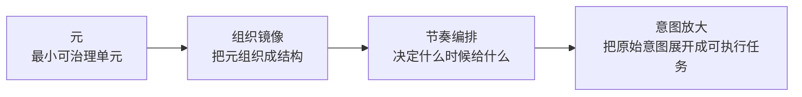
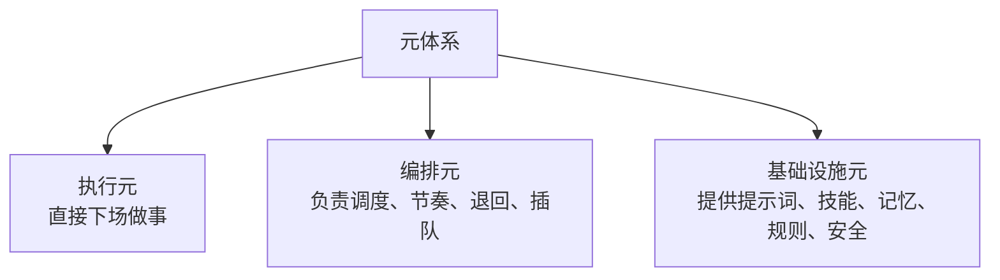
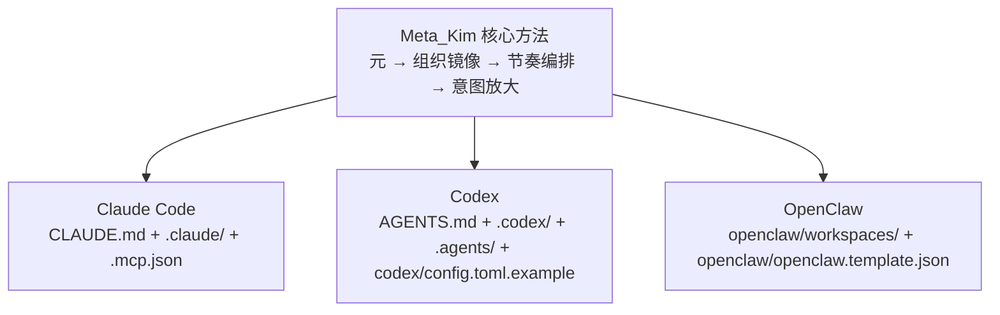

# Meta_Kim

[English](README.md) | [简体中文](README.zh-CN.md)


<div align="center">

**跨 Claude Code / Codex / OpenClaw 的意图放大元架构工程**

论文评测、三端适配、元 agent 组织体系，统一落在一个可开源、可复用、可演化的仓库里。

</div>

**Meta_Kim 不是一个“多放几个 agent 文件”的仓库。**

**它是一套试图在 Claude Code、Codex、OpenClaw 三个运行时里，建立同一套意图放大规矩的元架构工程。**

这个项目背后的判断很明确：

**AI 时代真正的分水岭，不只是模型，而是你会不会组织复杂问题。**

今天很多人用 AI 的方式，其实不是在做系统，而是在许愿：

- 扔一句大需求进去
- 等一个完整世界吐出来
- 这次刚好能跑，就以为方法成立

Meta_Kim 不站这个方向。

它要立的是另一套东西：

- 用户说的是原始意图，不是完整任务
- 系统不能急着答，必须先做结构化理解
- 复杂问题不能一口吞，必须先拆、先组、先编排
- 一次生成成功不值钱，能反复稳定做出来才值钱
- 这套规矩不能只在一个软件里成立，而要在三个运行时里都成立

这就是 Meta_Kim 的出发点。

* * *

## 这项目到底在立什么

Meta_Kim 想建立的，不是一个“更会说话”的 AI。

它想建立的是一套更成熟的工作方式：

**先把人的原始意图看清、补全、组织起来，再开始执行。**

所以这个仓库不是聊天产品，不是网页，不是 SaaS，也不是一个大 prompt。

它更像一个 AI 助手的内核工程，里面会同时出现：

- agent
- skill
- MCP
- hook
- memory
- workspace
- 配置模板
- 同步脚本
- 校验脚本

因为 Meta_Kim 不是在做“回答器”，而是在做“组织器”。

## Meta_Kim 的四条主线

Meta_Kim 真正的主线，不是只讲“元”。

它讲的是一整条链：

**元 → 组织镜像 → 节奏编排 → 意图放大**



这四个词分别解决四个不同的问题：

- `元`：解决“怎么拆”
- `组织镜像`：解决“怎么组”
- `节奏编排`：解决“怎么发”
- `意图放大`：解决“怎么成”

如果少一段，这套方法都不完整。

### 1. 元

**元 = 系统里最小的可治理单元。**

注意，不是“最小零件”，也不是“最小执行块”，而是：

**最小可治理单元。**

一个东西想配叫“元”，至少要满足五个标准：

- 独立：能单独被理解、讨论、调用
- 足够小：粒度合适，再往下拆就开始反噬
- 边界清晰：知道自己负责什么，不负责什么
- 可替换：换掉它，系统不至于整体塌掉
- 可复用：不是只活一次的临时拼装件

所以 Meta_Kim 讲“元”，不是为了把事情拆碎，而是为了把复杂重新变得可控。

### 2. 组织镜像

**组织镜像不是修辞，不是比喻，它是一种架构方法。**

它的意思是：

把真实组织里的这些机制，映射进 AI 系统：

- 层级委派
- 职责分工
- 独立工作空间
- 评审反馈
- 持续进化

这样一来，系统就不再像一堆插件或一锅共享上下文，而开始像一个真正能运转的组织。

组织镜像主要解决三个老问题：

- 串味：A 角色的判断跑进 B 角色的工作空间
- 协调爆炸：角色一多，链路迅速打结
- 认知过载：设计者要手搓所有关系，最后人在伺候系统

Meta_Kim 要的不是“agent 多”，而是“agent 被组织成结构”。

### 3. 节奏编排

只有“拆”和“组”还不够。

成熟系统还得会出牌。

**节奏编排解决的不是“谁先谁后”这么简单，而是系统该在什么时机，给什么、不给什么、跳过什么、插队什么。**

这部分非常关键，但以前 README 没写出来。

它至少包括这些能力：

- 什么时候给用户内容
- 什么时候不给
- 哪些内容先给，哪些晚给
- 哪些步骤应该跳过
- 哪些风险需要插队处理
- 哪些时刻应该留白，而不是继续输出

所以 Meta_Kim 不是只关心“流程编排”，还关心“节奏编排”。

它强调：

- 系统不只要会做事
- 系统还要会出牌
- 系统不只要会推动
- 系统还要知道什么时候沉默

### 4. 意图放大

**意图放大 = 高层意图被结构性展开后的结果。**

这不是把一句话说得更长，而是把一句话里原本缺失的关键部分补出来。

比如用户说：

> 帮我做一个项目。

在 Meta_Kim 看来，这根本还不算任务，因为它至少缺：

- 真实目标
- 范围边界
- 风险约束
- 受众对象
- 成功标准
- 交付形态
- 执行顺序

所以 Meta_Kim 的第一步不是回答，而是把这些缺口补出来。

这就叫意图放大。

## 为什么这套方法不是空话

Meta_Kim 反对一个很常见的幻觉：

**很多人把“一次生成成功”，误以为“系统已经成立”。**

不是。

一次生成成功，只能说明这次运气还行。

真正成熟的系统，至少得有治理链路。

这条成熟链路至少包含十步：

1. 方向
2. 规划
3. 执行
4. 评审
5. 元评审
6. 修订
7. 验证
8. 汇总
9. 反馈
10. 进化

这十步的重要性在于，它把系统从“会动”拉向“可靠、可复用、可演化”。


所以 Meta_Kim 真正在意的，不是第一次能写多好，而是：

- 会不会判断
- 会不会纠偏
- 会不会验证
- 会不会回滚
- 会不会把这一轮经验变成下一轮能力

换句话说：

**Meta_Kim 不是在追求一次漂亮结果，而是在追求一条可持续的自我校正链路。**

## 元不是一层，它至少有三层

README 以前也没把这个讲清楚。

“元”至少分三层：



### 执行元

直接下场干业务活的元。

比如：

- 写
- 查
- 分析
- 审校
- 修订

执行元最重要的不是“全能”，而是“职责纯”。

### 编排元

不一定自己下场写内容，但负责调度整个系统的元。

它要决定：

- 谁先上
- 谁后上
- 谁依赖谁
- 哪一步必须线性
- 哪一步可以并行
- 出错退回哪一步
- 什么时候跳过
- 什么时候插队

编排元是系统的大脑，不是系统的喇叭。

### 基础设施元

它本身未必直接产出业务结果，但没有它，系统就做不起来。

比如：

- 提示词体系
- skill 体系
- 工具体系
- 知识体系
- 记忆体系
- 工作流体系
- 规则基线
- 权限控制
- 安全与回滚机制

有些元不是做事的元，而是造能力的元。

这就是基础设施元的意义。

## Meta_Kim 在工程上怎么落地

Meta_Kim 做的不是“理论展示”。

它做的是把这条主线真正压进三个运行时里：

- Claude Code
- Codex
- OpenClaw

重点不是让三家看起来长得一模一样。

重点是让三家都遵守同一套底层规矩。



| 运行时 | 用户看到的入口 | 仓库里的主要落点 | 作用 |
| --- | --- | --- | --- |
| Claude Code | `CLAUDE.md` | `.claude/`、`.mcp.json` | 让 Claude Code 按 Meta_Kim 的元职责、治理规则和上下文约束工作 |
| Codex | `AGENTS.md` | `.codex/`、`.agents/`、`codex/config.toml.example` | 让 Codex 使用同一套元结构、技能映射和项目约束 |
| OpenClaw | `openclaw/workspaces/` | `openclaw/` | 让 OpenClaw 的本地 workspace agent 也进入同一套组织结构和节奏逻辑 |

也就是说：

- 外层壳可以不同
- 运行时入口可以不同
- 配置格式可以不同

但底层核必须一致。

这正是“同一意图，多种交付壳”的工程化版本。

## 8 个元 agent 不是菜单，而是组织结构

这 8 个元 agent 是 Meta_Kim 当前的组织骨架。

- `meta-warden`：总入口、统筹、仲裁、最终整合
- `meta-conductor`：编排、调度、节奏控制
- `meta-genesis`：人格、提示词、`SOUL.md`
- `meta-artisan`：skill、MCP、工具能力匹配
- `meta-sentinel`：hook、安全、权限、回滚
- `meta-librarian`：记忆、知识、连续性
- `meta-prism`：质量审查、漂移检测、反 AI 套话
- `meta-scout`：外部工具发现与评估

如果只从结构上看，它们大致可以理解成：

- 编排层：`meta-warden`、`meta-conductor`
- 基础设施层：`meta-genesis`、`meta-artisan`、`meta-sentinel`、`meta-librarian`
- 治理与发现层：`meta-prism`、`meta-scout`

如果你第一次接触这个项目，先记住一句就够：

**`meta-warden` 是总入口，其他元 agent 是它背后的组织结构。**

## 仓库怎么读

正确读法不是一上来钻脚本。

正确顺序是：

1. 先看 `README.md`
作用：理解项目立场、主线、概念、落地方式。

2. 再看 `CLAUDE.md` 和 `AGENTS.md`
作用：理解 Claude Code 和 Codex 怎么承接这套体系。

3. 再看 `.claude/agents/`
作用：看 8 个元 agent 的职责定义。

4. 最后再看 `.codex/`、`.agents/`、`openclaw/`
作用：理解这些职责是怎么被投影到不同运行时里的。

一句话说：

**先理解它立什么规矩，再看它怎么把规矩做成工程。**

## 仓库结构

```text
Meta_Kim/
├─ .claude/        Claude Code 主源，包括 agents、skills、hooks、settings
├─ .codex/         Codex 会直接读取的仓库内 agents 与 skills
├─ .agents/        Codex 项目级 skills 目录
├─ codex/          Codex 全局配置示例，不是另一套运行时
├─ openclaw/       OpenClaw workspace、模板配置、运行时镜像
├─ factory/        部门级行业 agent 工厂层：100 个部门种子、1000 specialist、20 个手工旗舰、协议文件、运行时包
├─ scripts/        同步、校验、MCP、自检、OpenClaw 本地准备脚本
├─ shared-skills/  跨运行时共享的技能镜像
├─ AGENTS.md       Codex / 通用运行时入口说明
├─ CLAUDE.md       Claude Code 入口说明
├─ .mcp.json       Claude Code 项目级 MCP 配置
├─ README.md       英文主 README
└─ README.zh-CN.md 中文 README
```

### 为什么会有 `codex/`

这点最容易让人误会。

因为 Codex 的配置模型分成两部分：

- 一部分是仓库内资产，所以放在 `.codex/` 和 `.agents/`
- 一部分是用户电脑里的全局配置，所以仓库里只能放一个示例文件

因此：

- `.codex/` 是 Codex 真正会直接读取的仓库内内容
- `codex/` 只是一个配置示例目录，用来告诉你怎么写 `~/.codex/config.toml`

它不是重复目录，也不是偏心 Codex，只是 Codex 的配置方式和另外两家不一样。

## 这些命令什么时候才需要跑

不是每个看这个仓库的人，都需要把所有命令跑一遍。

### `npm install`

作用：安装这个仓库依赖的 Node 包。

什么时候需要：
- 第一次把项目下载到本地，准备真正使用或验证它

什么时候不需要：
- 只是看文档
- 只是改纯文字

### `npm run sync:runtimes`

作用：把主源同步成三端真正要吃的运行时文件。

你可以把它理解成“重新生成三端产物”。

什么时候需要：
- 你改了 agent
- 你改了 skill
- 你改了运行时配置
- 你想确保 Claude Code / Codex / OpenClaw 三端重新对齐

什么时候不需要：
- 你只改了 README
- 你只改了许可证

### `npm run prepare:openclaw-local`

作用：给 OpenClaw 做本机准备。

OpenClaw 除了读仓库文件，还依赖你电脑用户目录下的本地授权和 agent 状态。

什么时候需要：
- 你准备在自己电脑上真正跑 OpenClaw

什么时候不需要：
- 你不用 OpenClaw
- 你只是看项目结构

### `npm run verify:all`

作用：做总验收。

它会统一检查三端资产有没有漏、有没有坏、能不能对上。

什么时候需要：
- 你准备提交
- 你准备发布
- 你准备开源
- 你改了一批运行时资产，想确认没配坏

什么时候不需要：
- 你只是看说明
- 你只是小改一段文档

### `npm run build:agent-foundry`

作用：批量生成行业 agent 工厂层产物。

它现在会做两件事：

- 先把行业蓝图、部门模板、专家思维参考和工具建议组合成结构化的部门种子与 specialist briefs，生成 `20 行业 x 5 部门 x 10 specialist = 1000 agent` 的工厂层产物
- 再把这些产物编译成 Claude Code、Codex、OpenClaw 三端可导入的运行时包，输出到 `factory/runtime-packs/`
- 同时重建 `20` 个手工强化旗舰 agent，输出到 `factory/flagship-batch-1` 到 `factory/flagship-batch-4`

什么时候需要：
- 你要开始批量生产行业 agent
- 你改了工厂层目录或模板

什么时候不需要：
- 你只是改运行时 agent
- 你只是改 README

### `npm run check:agent-foundry`

作用：只检查工厂层产物和三端运行时包是否同步。

什么时候需要：
- 你改了工厂层目录或模板
- 你想单独验证 foundry 没漂移

什么时候不需要：
- 你准备直接全量跑 `npm run check`
- 你只是看文档

### `npm run build:flagships`

作用：只重建 20 个手工强化旗舰 agent，不重跑整个工厂矩阵。

什么时候需要：
- 你只想继续打磨旗舰层
- 你要看 20 个更强的行业 agent，而不是先看 1000 个工厂版 specialist

## 最简单的使用方式

### 如果你只是第一次看项目

你什么命令都不用跑。

先把这份 README 看完，再去看 `CLAUDE.md`、`AGENTS.md`、`.claude/agents/`。

### 如果你第一次把它拉到本地，想确认它不是空壳

在仓库根目录执行：

```bash
npm install
npm run sync:runtimes
npm run verify:all
```

### 如果你还要在本机跑 OpenClaw

再补一条：

```bash
npm run prepare:openclaw-local
```

### 如果你要构建 100 个部门种子、1000 个 specialist，以及三端运行时包

再补一条：

```bash
npm run build:agent-foundry
```

### 如果你只想检查工厂层有没有失同步

```bash
npm run check:agent-foundry
```

## 方法依据与论文

这个仓库的方法依据来自作者关于“基于元的意图放大”的详细评测。

- 论文页面：<https://zenodo.org/records/18957649>
- DOI：`10.5281/zenodo.18957649`

论文负责回答：

- 为什么是“元”
- 为什么不是只靠模型
- 为什么组织镜像和节奏编排是必要层
- 为什么意图放大是结果层，而不是起点层

仓库负责回答：

- 怎么把这套东西做成三端都能跑的工程资产

## 作者与联系

<div align="center">
  
  <p><strong>获取更多 AI 资讯、项目更新和技术交流入口</strong></p>
  <p>
    🌐 <a href="https://www.aiking.dev/">aiking.dev</a> |
    GitHub <a href="https://github.com/KimYx0207">KimYx0207</a> |
    𝕏 <a href="https://x.com/KimYx0207">@KimYx0207</a> |
    微信公众号：<strong>老金带你玩AI</strong>
  </p>
  <p>
    开源知识库与长期更新入口：
    <a href="https://my.feishu.cn/wiki/OhQ8wqntFihcI1kWVDlcNdpznFf">飞书知识库</a>
  </p>
</div>

## 支持作者

<div align="center">
  <p><strong>如果这套方法、仓库结构或文档对你有帮助，欢迎支持作者继续迭代。</strong></p>
  <table align="center">
    <tr>
      <td align="center">
        
        <br/>
        <strong>微信支付</strong>
      </td>
      <td align="center">
        
        <br/>
        <strong>支付宝</strong>
      </td>
    </tr>
  </table>
</div>

## 适合谁

这个项目适合下面这几类人：

- 想把一套 agent 方法同时落到多个 AI 运行时的人
- 不满足于堆 prompt，而是想做可治理 agent 架构的人
- 想把 skill、MCP、hook、memory、workspace 一起纳入工程治理的人
- 想让同一套方法在 Claude Code、Codex、OpenClaw 三端都成立的人
- 想做的不只是“能跑的 demo”，而是“有组织能力的系统”的人

## License

本项目采用 [CC BY 4.0](https://creativecommons.org/licenses/by/4.0/) 许可协议。

你可以分享、改编、再发布，但需要保留署名并标注修改。

## 一句话总结

**Meta_Kim 不是在教 AI 多说话，而是在教 AI 先学会组织复杂问题。**
