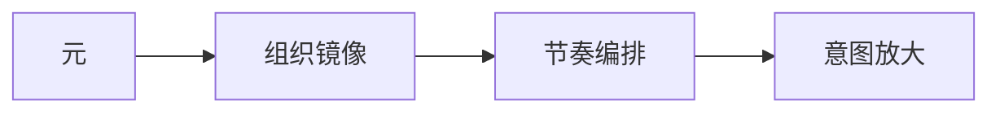
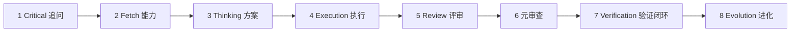
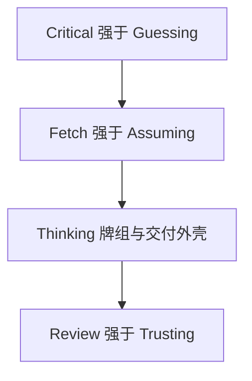
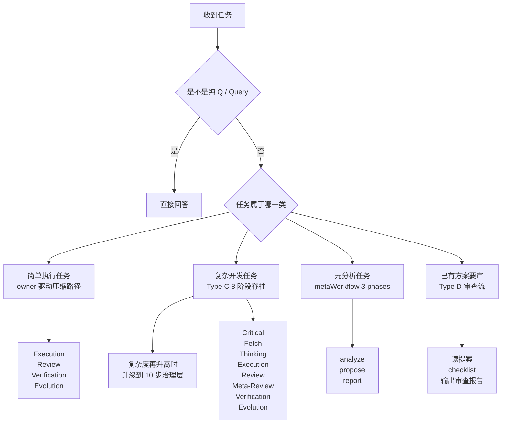
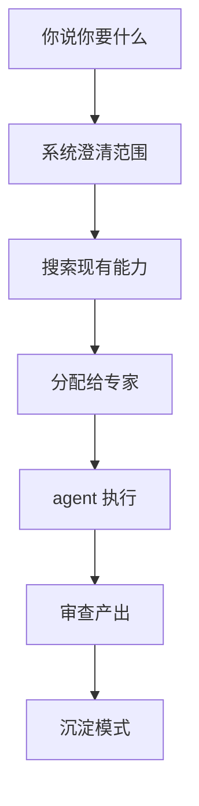

<div align="center">

<h1 style="font-size: 6em; font-weight: 900; margin-bottom: 0.2em; letter-spacing: 0.1em;">元</h1>
<p style="font-size: 1.2em; color: #7c3aed; font-weight: 600; margin-top: 0;">META_KIM</p>
<p style="color: #dc2626; font-weight: 700; margin-bottom: 0.5em;">⚠️ BETA VERSION — Work in Progress</p>

<p>
  <a href="README.md">English</a> |
  <a href="README.zh-CN.md">简体中文</a>
</p>

<p>
  
  
  
  
  
</p>

**AI 编码助手的治理层——一套统一的治理逻辑，同时在 Claude Code、Codex、OpenClaw 三个运行时上工作，让复杂任务做对了再做。**

多数 AI 编码工具上来就写代码。Meta_Kim 在中间加了一步：先搞清楚你到底要什么，再计划谁干什么，最后才执行并审查。

结果：跨文件改动少翻车，agent 职责更清晰，沉淀可复用模式而不是一次性 hack。

</div>

## 一眼看懂

- 8 个专业元角色，统一走一个默认公开入口
- **一套统一的治理逻辑**，投影到 Claude Code、Codex、OpenClaw 三个运行时
- 每个复杂任务走：追问澄清 → 搜索能力 → 执行 → 审查 → 沉淀进化
- **四条铁律**：追问强于猜测、搜索强于假设、计划强于冲动、验证强于信任
- 纪律：一个部门、一个主交付物、一条闭合交付链
- 长期主源主要在 `.claude/` 和 `contracts/workflow-contract.json`

## 这是什么项目

Meta_Kim 不是“让 AI 多写点代码”的项目，它解决的是另一类问题：

- 需求是模糊的，AI 容易乱猜
- 改动跨多个文件或模块，AI 容易串改
- 同一套 agent / skill / 配置要同时跑在多个运行时里，容易越改越乱
- 改完之后没人做统一审查、验证和经验沉淀

Meta_Kim 的核心思路是：先做 **意图放大**，再做执行。

这里的“意图放大”，用人话说就是：

- 把一句模糊的话补成可执行任务
- 把任务边界、约束、交付物和风险说清楚
- 把工作分给合适的角色，而不是让一个大上下文硬扛到底

工程上它同时组织这些层：

- `agent`：职责边界和组织角色
- `skill`：可复用能力块
- `MCP`：外部能力接口
- `hook`：运行时约束和自动化拦截
- `memory`：长期上下文与连续性
- `workspace`：运行时本地工作空间
- `sync / validate / eval`：同步、校验、验收工具链

一句话说：

**Meta_Kim 关心的不是“单次答得像不像”，而是“复杂任务能不能被持续、稳定、可治理地完成”。**

## 作者与支持

<div align="center">
  
  <p>
    GitHub <a href="https://github.com/KimYx0207">KimYx0207</a> |
    𝕏 <a href="https://x.com/KimYx0207">@KimYx0207</a> |
    官网 <a href="https://www.aiking.dev/">aiking.dev</a> |
    微信公众号：<strong>老金带你玩AI</strong>
  </p>
  <p>
    飞书知识库：
    <a href="https://my.feishu.cn/wiki/OhQ8wqntFihcI1kWVDlcNdpznFf">长期更新入口</a>
  </p>
</div>

<div align="center">
  <table align="center">
    <tr>
      <td align="center">
        
        <br/>
        <strong>微信支付</strong>
      </td>
      <td align="center">
        
        <br/>
        <strong>支付宝</strong>
      </td>
    </tr>
  </table>
</div>

## 方法依据与论文

Meta_Kim 的方法依据来自“基于元的意图放大”评测与方法沉淀：

- 论文页面：<https://zenodo.org/records/18957649>
- DOI：`10.5281/zenodo.18957649`

论文负责解释方法论基础。本仓库负责把这套方法落成可运行的工程资产。

## 它适合谁

### 适合

- 你要处理多文件、跨模块、跨运行时的复杂任务
- 你在维护一套 agent / skill / hook / MCP 的工程资产
- 你希望 AI 协作是可审查、可回滚、可持续维护的

### 不适合

- 你只想临时问几个简单问题
- 你平时只改单个文件，不需要分工和治理
- 你想把它当成一个即装即用的 SaaS 产品

## 三个运行时怎么承接

最重要的一句：

**Meta_Kim 只有一套方法，不是三个独立项目。**

| 运行时 | 入口 | 仓库里的主要落点 | 角色 |
| --- | --- | --- | --- |
| Claude Code | [CLAUDE.md](CLAUDE.md) | `.claude/`、`.mcp.json` | 规范主源和默认编辑运行时 |
| Codex | [AGENTS.md](AGENTS.md) | `.codex/`、`.agents/`、`codex/` | Codex 原生 custom agents / skills 映射 |
| OpenClaw | `openclaw/workspaces/` | `openclaw/` | OpenClaw 本地 workspace 映射 |

关键点：

- **Claude Code 是 canonical 编辑运行时。**
- 长期主源主要在 `.claude/` 和 `contracts/workflow-contract.json`。
- `.codex/`、`.agents/`、`openclaw/` 里大多数内容是同步产物或运行时适配层。
- 改完主源以后，再用脚本把三端重新对齐。

### 各运行时怎么接

#### 在 Claude Code 里

Claude Code 自动读取 `CLAUDE.md`、`.claude/agents/`、`.claude/skills/`、`.mcp.json`。打开项目直接聊。

#### 在 Codex 里

Codex 读取 `AGENTS.md`、`.codex/agents/`、`.agents/skills/`，MCP 接法见 `codex/config.toml.example`。注意：**Codex 是读取 / 执行运行时，不是主编辑运行时**。你应该先在 `.claude/` 改，再通过 `npm run sync:runtimes` 同步到 Codex。

#### 在 OpenClaw 里

```bash
npm install
npm run prepare:openclaw-local
```

然后可直接调用：

```bash
openclaw agent --local --agent meta-warden --message "帮我搞一个批量数据导出的系统，要带进度跟踪。" --json --timeout 120
```

## 元的理念

在 Meta_Kim 里：

**元 = 为了支持意图放大而存在的最小可治理单元。**

它至少要满足五个条件：

- 能独立理解
- 足够小，便于控制
- 边界清晰，知道自己不负责什么
- 可替换，不会一换就让系统整体塌掉
- 可复用，能被重复编排

Meta_Kim 不把“元”当修辞，而是把它当架构粒度。

## 方法主线

Meta_Kim 的核心链路只有一条：



- `元`：怎么拆
- `组织镜像`：怎么组
- `节奏编排`：怎么发
- `意图放大`：怎么成

缺任何一段，这套方法都不完整。

## 复杂任务治理主轴（核心必读）

**复杂任务**（多文件 / 跨模块 / 需要多种能力协作）走八阶段脊柱。前半段对应四条铁律：**先追问再猜、先搜索再假设、先计划再冲动、先验证再信任**，中间由 **Thinking** 产出牌组与交付外壳计划。



| 阶段 | 作用 | 用人话解释 |
| --- | --- | --- |
| `Critical` | 澄清 | 先确认你到底要什么，不猜 |
| `Fetch` | 检索 | 先找现成能力，不假设不存在 |
| `Thinking` | 规划 | 设计拆分方式、交付物和顺序 |
| `Execution` | 执行 | 把子任务派给合适的 agent |
| `Review` | 审查 | 审代码、审边界、审质量 |
| `Meta-Review（元审查）` | 审查审查本身 | 检查审查标准有没有偏 |
| `Verification` | 验证闭环 | 确认修复真的生效 |
| `Evolution` | 沉淀 | 把模式、伤疤、经验留下来 |

配套的四条铁律是：



- `Critical > Guessing`
- `Fetch > Assuming`
- `Thinking > Rushing`
- `Review > Trusting`

各阶段说明：

- **Stage 1 Critical**：明确范围，不猜
- **Stage 2 Fetch**：搜索现有 agent / skill，不假设不存在
- **Stage 3 Thinking**：规划子任务，设计牌组，准备交付外壳
- **Stage 4 Execution**：通过分派机制把工作交给合适角色，而不是一股脑自己硬做
- **Stage 5 Review**：对每个产出做质量审查
- **Stage 6 Meta-Review（元审查）**：审查审查标准本身
- **Stage 7 Verification**：验证修复已实际应用，关闭发现项
- **Stage 8 Evolution**：捕获模式，更新伤疤记录，反哺系统

这里还有 4 条容易被忽略、但现在已经写入主源规则的补充：

- **只有纯 `Q / Query` 可以不走 agent**：也就是纯解释、纯问答、没有改文件、没有外部副作用、没有交付物交接
- **任何可执行任务都必须有 owner**：能直接找到就用现成 owner；找不到就先补 owner，再执行
- **Thinking 必须协议先行**：`runHeader`、`dispatchBoard`、`workerTaskPacket`、`reviewPacket`、`verificationPacket`、`evolutionWritebackPacket` 没定出来，Execution 不应开始
- **能并行就并行**：独立子任务必须声明 `dependsOn`、`parallelGroup`、`mergeOwner`，不应该无故串行

`meta-conductor` 维护 `stageState` / `controlState`（含跳过 / 中断 / 迭代）；`meta-warden` 与 `meta-prism` 负责闸门与验证闭环（`gateState` 等）。隐形骨架不是第二套用户界面。细则见 `.claude/skills/meta-theory/references/dev-governance.md`（元理论治理参考）。

## 8 阶段脊柱和 business workflow 不是一回事

这块很重要，因为它是 Meta_Kim 最容易被误读的地方。

Meta_Kim 里同时存在两层流程语言：

| 层级 | 定义位置 | 作用 |
| --- | --- | --- |
| **8 阶段脊柱** | `meta-theory` / `dev-governance.md` | 元理论定义的复杂开发任务标准执行链 |
| **business workflow 10 phases** | `contracts/workflow-contract.json` | 部门 run 的合约语言、展示语言、交付纪律 |

8 阶段脊柱始终是底层执行骨架：

```text
Critical -> Fetch -> Thinking -> Execution -> Review -> Meta-Review（元审查） -> Verification -> Evolution
```

business workflow 则是另一套“业务 run 词汇”：

```text
direction -> planning -> execution -> review -> meta_review -> revision -> verify -> summary -> feedback -> evolve
```

重点不是背两套名词，而是理解关系：

- **business workflow 不会替代 8 阶段脊柱**
- 它更像“部门级 run contract 和交付包装层”
- 真正的复杂开发治理，底层还是走 8 阶段
- `summary / feedback / evolve` 这些更偏 run 管理和展示闭环，不等于把底层阶段改名

如果你只记一句：

**8 阶段是执行骨架，10 phases 是部门级运行合约。**

## 项目里的流程关系总图

如果按主项目真实设计来讲，Meta_Kim 不是“只有一条流程”，而是几条路径叠在一起：



这里最容易误解的 4 件事：

- **最简单路径不是“裸执行”**。只有纯 `Q / Query` 才能直答；只要任务会执行、会落盘、会交接，就仍然需要 owner。
- **简单任务有压缩路径**，但它也不是跳过治理，而是走 `Execution → Review → Verification → Evolution` 这条 owner-driven shortcut。
- **8 阶段才是复杂开发任务的正式主骨架**，10 步治理是它的升级层，不是替代品。
- **3 phases 真正存在，但它指的是 `metaWorkflow = analyze → propose → report`**，不是“审查输出 → 验证修复 → evolution”这条你想象中的独立验证流。

### 那能不能“先手搓完，再交给后三段做验证”？

可以分两种情况看：

- **如果你手里的是一个现成方案 / 提案 / agent 定义文档**，那更接近 `Type D`，也就是“读提案 → checklist → 输出审查报告”。
- **如果你手里的是已经写好的代码或可执行产物**，理论上可以把它当成“外部先做完的产物”接进后半段，但不能假装前面流程不存在。

项目主源的真实要求是：

- `Review` 会先检查 owner coverage 和 protocol compliance
- 没有 owner、没有 `dispatchBoard`、没有 `workerTaskPacket`、没有 `mergeOwner`，即使代码看起来能跑，也应该先记为协议不合规
- 所以不能把“手搓完 → 只走一个想象中的 3 阶段验证流”当成项目里的正式默认路径

更准确地说：

- **审文档 / 审方案** → 走 `Type D`
- **补验已有代码产物** → 可以接入 Review 之后的尾链，但必须补齐 owner 和协议包
- **真正按项目做复杂开发** → 仍然应从 `Critical / Fetch / Thinking` 开始

## 隐形状态骨架和公开展示闸门

Meta_Kim 不只是“按顺序走完几个阶段”。

在 8 阶段表层下面，还有一层隐形治理骨架，用来保证 run 没有假完成、假通过、假展示。

常见状态层包括：

| 状态层 | 典型值 | 主要责任方 | 作用 |
| --- | --- | --- | --- |
| `stageState` | `Critical -> ... -> Evolution` | Conductor | 当前处在哪个标准阶段 |
| `controlState` | `normal / skip / interrupt / intentional-silence / iteration` | Conductor | 控制发牌节奏，而不是乱加伪阶段 |
| `gateState` | `planning-open / verification-open / synthesis-ready` | Warden + Prism | 区分“阶段走完了”与“真的过闸了” |
| `surfaceState` | `debug-surface / internal-ready / public-ready` | Warden | 决定这轮结果能不能被当成正式输出展示 |
| `capabilityState` | `covered / partial / gap / escalated` | Scout + Artisan | 显式记录能力覆盖情况 |
| `agentInvocationState` | `idle / discovered / matched / dispatched / returned / escalated` | `meta-theory`（元理论） | 约束系统先搜索再分派，不要偷懒自干 |

这层骨架是**隐形的**：

- 它不是第二套 UI
- 它不是给用户多看几层状态名
- 它的作用是支撑 skip / interrupt / gate / verification / evolution 这些治理动作

### 什么叫“可以公开展示”

项目设计里，run 要进入 public display，至少要同时满足这些条件：

- `verifyPassed`
- `summaryClosed`
- `singleDeliverableMaintained`
- `deliverableChainClosed`
- `consolidatedDeliverablePresent`

这意味着：

- 不是“看起来做完了”就算完成
- 不是“有内容可看了”就能展示
- 只要交付链断了、验证没关、总结没闭环，就应该继续留在 debug / internal surface

## 回滚协议

Verification 阶段不是只负责说“过 / 不过”，还负责判断要不要回滚。

Meta_Kim 的设计里，回滚不是一刀切，而是分层处理：

| 回滚级别 | 触发条件 | 动作 |
| --- | --- | --- |
| 文件级 | 单文件回归 | 回退这个文件到上一个已知正常状态 |
| 子任务级 | 某个子任务改崩了相邻路径 | 只回滚该子任务相关文件集 |
| 部分回滚 | 一部分子任务成功、一部分失败 | 保留成功部分，失败部分回滚后重新进入 Thinking |
| 全量回滚 | 跨模块污染、原始假设失效 | 暂存未提交改动，回到 Stage 1 重新定义范围 |

简单理解：

- 问题小，就小范围回滚
- 问题跨模块，就不要硬顶着往前推
- 一套没有回滚能力的治理系统，不算完整系统

铁律是：

**回滚不是失败，回滚是系统知道什么时候该停。**

## Evolution 不只是“复盘一下”，而是要落盘

Meta_Kim 的 `Evolution` 不是聊天式总结，而是明确要求把结构性学习写回磁盘。

典型产出物和落点如下：

| 产出物 | 存储位置 | 说明 |
| --- | --- | --- |
| 可复用模式 | `memory/patterns/{pattern-name}.md` | 给以后复用 |
| 伤疤记录 | `memory/scars/{scar-id}.yaml` | 让失败变成下一轮的预防规则 |
| 新技能 | `.claude/skills/{skill-name}/SKILL.md` | 沉淀成真正可调用能力 |
| Agent 边界调整 | `.claude/agents/{agent}.md` | 改完后通常要跑 `npm run sync:runtimes` |
| 节奏优化 | `contracts/workflow-contract.json` 或 Conductor 默认配置 | 让下一轮调度更稳 |
| 能力缺口记录 | `memory/capability-gaps.md` | 给 Scout 持续追踪 |

如果一轮 Evolution 没有明确落盘位置，就不算真正“捕获了经验”。

现在主源还额外要求问一句：

- 这轮用的 owner 还够不够？
- 是继续沿用、调整边界、还是应该新建 owner？
- 如果这轮用了临时 `generalPurpose` owner，是否已经值得升级成正式能力？

## 什么时候需要它

| 你的场景 | 没有 Meta_Kim | 有 Meta_Kim |
| --- | --- | --- |
| “帮我把认证模块重构了，横跨 6 个文件” | AI 直接上手改，改着改着把别的模块搞崩了 | 先确认范围，分配给合适的 agent，审查跨模块影响 |
| “帮我设计一个新 agent” | 拿到一个通用模板，跟你的业务对不上 | 系统先问你需求，检查现有 agent，必要时才创建 |
| “我的 agent 老是互相打架” | 职责混乱，重复劳动，没人知道谁该干什么 | 清晰的职责边界，治理流程，质量关卡 |

**如果你每次只改一个文件，不需要它。** Meta_Kim 帮的是跨文件、跨模块、需要多种能力协作的复杂任务。

## 它干了什么

1. **先追问再执行**：需求模糊时追问澄清，而不是猜
2. **先搜索再假设**：先检查现有 agent / skill 能不能干，不假设不存在就从头搞
3. **先确定 owner 再执行**：除了纯问答，任何可执行任务都必须有明确 owner
4. **先定协议再开工**：任务包、交付链、审查包、验证包先说清楚，再分派
5. **能并行就并行**：独立子任务不应该被无意义串行拖慢
6. **每个产出都要审查**：代码质量、安全性、架构合规、协议合规、边界越界检测
7. **每次都沉淀经验**：捕获可复用模式，记录失败，并把经验回写到 agent / skill / contract

## 8 个元角色

| Agent | 主要职责 | 你可以怎么理解 |
| --- | --- | --- |
| `meta-warden` | 默认入口、仲裁、最终汇总 | 项目经理 / 总协调 |
| `meta-conductor` | 编排阶段、控制节奏 | 调度员 |
| `meta-genesis` | 设计 `SOUL.md`、人格和认知结构 | 提示词 / 角色架构师 |
| `meta-artisan` | skill、MCP、工具装配 | 工具与能力工程师 |
| `meta-sentinel` | 安全、权限、hook、回滚 | 安全与守卫 |
| `meta-librarian` | 记忆、上下文、连续性 | 知识管理员 |
| `meta-prism` | 质量审查、漂移检测、反 AI 套话 | 质量法医 |
| `meta-scout` | 外部能力发现与评估 | 侦察与选型 |

如果你是普通使用者，只需要记住一件事：

**默认公开前门是 `meta-warden`。**

## 系统怎么工作

你不需要知道内部机制。但如果你好奇：



每一条有效的业务 run，都必须保持一条唯一主线：

- 一个部门
- 一个主交付物
- 一条闭合交付链

如果同一轮里塞进多个互不相干的目标，`meta-conductor` 应该直接打回，`meta-warden` 也不应让它进入公开展示态。

## 怎么用

### 自动模式（正常聊天就行）

复杂任务直接描述你的需求。系统检测到跨文件或跨模块的工作时，治理流程自动激活。

```text
帮我搞一个通知系统，邮件、短信、站内信都要，带共享队列和重试逻辑。
```

```text
支付流程在 3 个服务之间有竞态条件，修一下，再补上错误处理。
```

系统会：追问澄清（如果需要）→ 搜索现有 agent → 路由给对的人 → 执行 → 审查 → 沉淀模式。

如果 Fetch 发现没有合适 owner，正常路径不是“直接硬做”，而是：

- 先判断这是长期缺口还是一次性缺口
- 长期缺口：先走 Type B 补 owner，再执行
- 一次性低风险缺口：允许临时 `generalPurpose` owner 兜底，但必须在 Evolution 里复盘是否要升格

### 手动模式（你知道你要什么的时候）

如果你明确要设计、审查、审计 agent：

```text
帮我设计一个 agent，处理这个项目的数据导出任务。
```

```text
审查一下我的 agent 定义，边界干不干净？
```

```text
我的 agent 职责老是重叠，帮我修正组织结构。
```

## 项目结构

```text
Meta_Kim/
├─ .claude/        主源：agents、skills、hooks、settings
├─ .codex/         Codex custom agents 镜像
├─ .agents/        Codex 项目级 skills 镜像
├─ codex/          Codex 全局配置示例
├─ openclaw/       OpenClaw workspaces、skills、配置模板
├─ contracts/      运行时治理合约
├─ docs/           方法文档、仓库地图、能力矩阵
├─ scripts/        同步、校验、探测、MCP、自检脚本
├─ shared-skills/  跨运行时共享 skill 镜像
├─ README.md
├─ README.zh-CN.md
├─ CLAUDE.md
├─ AGENTS.md
└─ CHANGELOG.md
```

### 你应该优先改哪里

长期维护时，优先编辑这些文件：

- `.claude/agents/*.md`
- `.claude/skills/meta-theory/SKILL.md`
- `contracts/workflow-contract.json`
- `docs/meta.md`
- `README.md`
- `README.zh-CN.md`
- `CLAUDE.md`
- `AGENTS.md`

### 哪些文件通常不要手改

除非你很清楚自己在做什么，否则不要把这些当主源：

- `.codex/agents/*.toml`
- `.agents/skills/meta-theory/`
- `.codex/skills/meta-theory.md`
- `shared-skills/meta-theory.md`
- `openclaw/skills/meta-theory.md`
- `openclaw/workspaces/*`
- `openclaw/openclaw.local.json`

这些通常由脚本维护：

- `npm run sync:runtimes`
- `npm run prepare:openclaw-local`

### 为什么会有 `codex/`

Codex 的配置分两层：

- 仓库内资产：放在 `.codex/` 和 `.agents/`
- 用户电脑里的全局配置：不能直接写进仓库根部

所以：

- `.codex/` 是 Codex 真正会直接读取的仓库内内容
- `codex/` 只是一个配置示例目录，用来说明 `~/.codex/config.toml` 应该怎么接

## Hooks（Claude Code）

Meta_Kim 在 `.claude/settings.json` 中内置了 7 个项目级 hooks：

| Hook | 类型 | 用途 |
| --- | --- | --- |
| `block-dangerous-bash.mjs` | PreToolUse/Bash | 阻止危险命令（rm -rf、DROP TABLE、force-push） |
| `pre-git-push-confirm.mjs` | PreToolUse/Bash | `git push` 前提醒检查 |
| `post-format.mjs` | PostToolUse/Edit,Write | 自动 prettier 格式化 JS/TS 文件 |
| `post-typecheck.mjs` | PostToolUse/Edit,Write | 编辑 `.ts` / `.tsx` 后自动做类型检查 |
| `post-console-log-warn.mjs` | PostToolUse/Edit,Write | 编辑后检测 `console.log` 并警告 |
| `subagent-context.mjs` | SubagentStart | 给子 agent 注入项目上下文 |
| `stop-console-log-audit.mjs` | Stop | 会话结束前审计改动文件里的 `console.log` |

Codex 和 OpenClaw 使用各自原生机制实现等效行为。

## 快速上手（克隆后 5 分钟跑起来）

### 环境要求

- **Node.js** v18+（用于 sync、validate、OpenClaw 脚本）
- **Git**（用于克隆项目）
- **Claude Code CLI**（可选，仅在运行 `eval:agents` 时需要）
- **Codex CLI**（可选，仅在运行 `eval:agents` 时需要）
- **OpenClaw CLI**（可选，仅在运行 `npm run prepare:openclaw-local` 时需要）

### 第一次上手，按这个顺序来

#### 1. 克隆并安装依赖

```bash
git clone <repo-url>
cd Meta_Kim
npm install
```

#### 2. 同步三端镜像

```bash
npm run sync:runtimes
```

作用：

- 从 `.claude/` 主源重新生成 Codex / OpenClaw / shared-skills 镜像
- 检查主源和派生产物是否一致

如果你只是想确认有没有不同步，也可以用：

```bash
npm run check:runtimes
```

#### 3. 安装元技能依赖（可选，但推荐）

```bash
npm run deps:install
```

这一步会把 Meta_Kim 依赖的 9 个社区 skill 安装到 `~/.claude/skills/`。

注意：

- 这是 **Claude Code 生态** 的全局安装，不是安装到当前仓库里
- 这个脚本通过 `bash install-deps.sh` 运行
- **Windows 用户请确保机器上有 `bash`**，通常用 Git Bash 或 WSL 即可

更新这些依赖时用：

```bash
npm run deps:update
```

#### 4. 扫描全局能力

```bash
npm run discover:global
```

这一步会扫描你电脑里的全局能力，并生成：

```text
.claude/capability-index/global-capabilities.json
```

扫描范围包括：

- `~/.claude/`：agents、skills、hooks、plugins、commands
- `~/.openclaw/`：agents、skills、hooks、commands
- `~/.codex/`：agents、skills、commands

如果你想先看 CLI 探测结果，可以先跑：

```bash
npm run probe:clis
```

#### 5. 做项目完整性校验

```bash
npm run validate
```

这会检查：

- 必要文件是否存在
- workflow contract 是否完整
- 8 个 Claude agents 是否合规
- OpenClaw workspaces 是否齐全
- `SKILL.md` 多端镜像是否同步
- Codex agents 是否有效
- hooks / MCP / package scripts 是否配置正确

#### 6. 需要验收时再跑运行时测试

```bash
npm run eval:agents
```

这一步是真实运行时验收：

- 可用且通过的运行时会显示 `passed`
- 没装、不可达或暂时超时的可选运行时可能显示 `skipped`
- 真的回归或配置错误会显示 `failed`

全部一起跑：

```bash
npm run verify:all
```

#### 7. OpenClaw 本地运行前，额外准备一次

```bash
npm run prepare:openclaw-local
```

只有你准备在本机真正跑 OpenClaw 时才需要这一步。

#### 8. 快速健康度检查

```bash
node scripts/agent-health-report.mjs
```

可以快速看 8 个 agent 的版本号、frontmatter 完整性、边界定义、workspace 文件和 skill 同步状态。

#### 9. 开始使用（Claude Code）

你可以直接说：

```text
认证系统要重构，散在 5 个文件里，没人知道 token 刷新到底是哪个文件在处理。
```

```text
帮我设计一个 agent，处理这个项目的数据导出任务。
```

```text
有问题，我的 agent 写的代码老是互相冲突。
```

系统会根据任务类型，把请求路由到匹配的治理阶段。

## 这些命令什么时候要跑

| 命令 | 什么时候用 | 作用 |
| --- | --- | --- |
| `npm install` | 首次拉仓库 | 安装 Node 依赖 |
| `npm run sync:runtimes` | 改完主源后 | 重建三端镜像 |
| `npm run check:runtimes` | 不想写文件时 | 只检查镜像是否最新 |
| `npm run deps:install` | 第一次配置 Claude 生态 | 安装 9 个全局元技能 |
| `npm run deps:update` | 依赖需要更新时 | 更新已安装的元技能 |
| `npm run discover:global` | 首次安装后、装了新全局能力后 | 生成全局能力索引 |
| `npm run probe:clis` | 怀疑 CLI 没配好时 | 探测 Claude / Codex / OpenClaw CLI |
| `npm run test:mcp` | 改了 MCP 相关逻辑时 | 自测 `meta-runtime-server` |
| `npm run validate` | 每次准备提交前 | 做静态完整性校验 |
| `npm run check` | 想快速做一轮静态检查 | `check:runtimes + validate` |
| `npm run eval:agents` | 要验收真实运行时时 | 运行 Claude / Codex / OpenClaw 验收 |
| `npm run verify:all` | 发布前 / 大改后 | `check + eval:agents` |
| `node scripts/agent-health-report.mjs` | 想看总体健康度时 | 生成 8 个 agent 的健康报告 |

**Windows / PATH：** 从图形界面或编辑器里启动任务时，Node 子进程继承到的 `PATH` 有时比你单独开的终端更短。遇到 `eval:agents` 找不到 CLI 时，优先检查 `%APPDATA%\\npm\\`、`where.exe` 结果，仍不行就设置绝对路径环境变量：

- `META_KIM_CLAUDE_BIN`
- `META_KIM_CODEX_BIN`
- `META_KIM_OPENCLAW_BIN`

## 一个安全的维护流程

如果你要改 agent、skill、README 或运行时配置，推荐始终按这个顺序做：

1. 改 `.claude/` 主源或公共说明文件
2. 如果改动涉及调度纪律、闸门或交付合约，同时更新 `contracts/workflow-contract.json`
3. 跑 `npm run sync:runtimes`
4. 跑 `npm run discover:global`
5. 跑 `npm run validate`
6. 需要运行时验收时，再跑 `npm run eval:agents`

这样最不容易把三端镜像改乱。

## 新手最常见的 9 个问题

### 1. 我必须同时安装 Claude Code、Codex、OpenClaw 吗？

不用。你可以只用其中一个运行时。Meta_Kim 设计成跨运行时兼容，但不是强制三端全装。

### 2. 我能不能只改 `.codex/` 或 `openclaw/`？

技术上可以，长期维护上不推荐。大多数情况下，你应该改 `.claude/` 主源，再同步。

### 3. `discover:global` 生成的索引要提交吗？

通常不用。它是本机能力索引，带本地路径，按机器重新生成。

### 4. `eval:agents` 里看到 `skipped` 是不是就说明项目坏了？

不一定。`skipped` 常见原因是对应 CLI 没装、暂时不可用，或者运行时超时。真正的硬失败会标成 `failed`。

### 5. 为什么默认入口不是 8 个 agent 直接给用户选？

因为 Meta_Kim 的设计目标不是“给你一排角色菜单”，而是先用统一前门接住需求，再在后台做分工。

### 6. 什么情况下可以不走 agent？

只有纯 `Q / Query`。也就是纯解释、纯问答、没有改代码、没有外部副作用、没有交付链要求。只要任务会执行、会产生产物、会进入审查或验证，就必须有 owner。

### 7. `docs/meta.md` 是不是必读？

不是。它更像方法长文和研究稿。第一次上手先读本 README 即可。

### 8. 我只想看仓库地图，应该读什么？

读 `docs/repo-map.md`。

### 9. 我想看三端能力差异，应该读什么？

读 `docs/runtime-capability-matrix.md`。

## 最简单的开始方式

上面的 [快速上手章节](#快速上手克隆后-5-分钟跑起来) 已经包含了从克隆到跑起来的完整步骤。

如果你是第一次接触这个项目，按下面顺序最省力：

1. 先读本文件 `README.zh-CN.md`
2. 再读 [CLAUDE.md](CLAUDE.md) 或 [AGENTS.md](AGENTS.md)
3. 再读 `docs/repo-map.md`
4. 需要方法细节时再读 `docs/meta.md`

## 作者与资料

- GitHub: <https://github.com/KimYx0207>
- X: <https://x.com/KimYx0207>
- Website: <https://www.aiking.dev/>
- WeChat Official Account: `老金带你玩AI`
- Feishu knowledge base: <https://my.feishu.cn/wiki/OhQ8wqntFihcI1kWVDlcNdpznFf>
- Paper: <https://zenodo.org/records/18957649>
- DOI: `10.5281/zenodo.18957649`

## License

本项目采用 [MIT License](LICENSE)。
